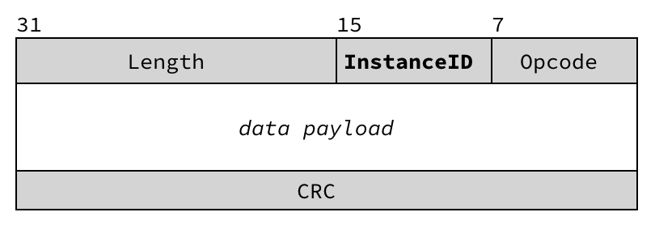

# Multicore Support In Audio Weaver 8

## Introduction

Audio Weaver 8 brings a streamlined approach to performing audio processing on multiple processors in an embedded system. It does this by enabling multiple instances of the AWE Core processing engine to be instantiated in a product. This support is delivered through a new UI features in AWE Designer 8, and a simplified API and integration model for AWE Core 8.

## Background

AWE Core is a data-driven, cross-platform audio processing engine. It includes over 400 different audio building blocks that can be linked together at run-time to implement a unique audio processing pipeline. This audio processing pipeline \(an Audio Weaver “layout”\), including the sequence of modules and their parameters, is described by a block diagram in AWE Designer.

Based on the block diagram, AWE Designer generates a set of configuration data \(“tuning data”\) the AWE Core uses to self-configure and implement the desired processing pipeline. During development time, this data is sent in real-time via the AWE Server \(and tuning interface, e.g. USB, UART, etc\), which allows live modification of the Audio Layout, without needing to reflash or even reboot the board.


## Multicore Overview

For Audio Weaver 8, the platform architecture was expanded to allow _multiple_ AWE Designer windows to simultaneously connect to an embedded target through AWE Server, with each configuring a unique AWE Core instance.

To enable this, a drop-down menu was added to AWE Designer, allowing the user to select which endpoint \(AWE Core instance\) should run the given block-diagram. \(Note: This dropdown is only visible when connected to a multi-instance target.\)

Now, when one presses ‘Play’, the configuration data \(that corresponds to the block-diagram\) is sent to the target in a series of packets, each including an `Instance ID` parameter – which the application can use to route the packet to the appropriate AWE Core instance.


## Packet Format

As shown in the [Audio Weaver Tuning Command Syntax Guide](https://dspconcepts.com/sites/default/files/audio-weaver-tuning-command-syntax.pdf)[,](https://dspconcepts.com/sites/default/files/audio-weaver-tuning-command-syntax.pdf) Audio Weaver packets include a 32-bit header word that includes the Packet Length \(16-bits\), InstanceID \(8-bits\), and Opcode \(8-bits\).



## AWE Core Instance Information

For AWE Designer on the PC to know what’s happening in the product, it always starts by sending a packet with an Opcode of `GetInstanceTable`. The AWE instance table is simply an array containing the valid ID’s for a given product. For example:

```cpp
unsigned int g_InstanceIDs[NUM_INSTANCES] = {M4_AWE_INST_ID, M7_AWE_INST_ID};
```

Unlike all other packets, the user application responds to this request. This can be done using helper-code in AWECoreUtils.c and AWECoreUtils.h:

```cpp
//If PC looking for AWE Instance Table:
if (PACKET_OPCODE(TuningBuffer) == PFID_GetInstanceTable)
{
 GenerateInstanceTableReply(TuningBuffer, NUM_INSTANCES, g_InstanceIDs);
 USBSendReply(&g_AWEInstance); //Send reply packet back to the PC
}
```

## Packet Routing

The packet routing code should use the InstanceID parameter to determine where in the system to send the data. Note: The means of this data-transfer will be application specific, based on the unique system architecture of the product – some may use a shared memory buffer, while others might use transport like SPI to send the packet from one processor to another.

```c
/*---------------- PACKET ROUTING MACROS - MULTI-INSTANCE ONLY ----------------*/
/* This will determine the length of a packet */
#define PACKET_LENGTH_WORDS(x) (x[0]>>16)
#define PACKET_LENGTH_BYTES(x) ((x[0]>>16) * sizeof(x[0]))

/* This will get the instance ID of a packet. */
#define PACKET_INSTANCEID(x) (x[0] >> 8) & 0xff

/* Get the OPCODE of the packet. All opcodes are defined in ProxyIDs.h. */
#define PACKET_OPCODE(x) ((INT32)x[0] & 0xffU)
```

## SMP / OS Support

At the time of writing, a single AWE Core instance will not distribute it’s processing load across multiple physical cores in an SMP system \(such as Linux running on a Quad-core Cortex-A53 complex\). Currently, to use more than one core, an application will simply instantiate multiple AWE Core instances – one for each physical core to be used for audio processing.

New AWE Core variants are planned which will further streamline integration in Linux and Android environments. These variants will take advantage of Embedded-OS resources, including the ability to run sections of the audio pipeline on different physical cores.

## Appendix: Packet Routing Example Code

The following C-code example illustrates how packet routing code works in the multicore STM32H747 sample application:

```c
//-----------------------------------------------------------------------------
// METHOD: AWEpacketRouting
// PURPOSE: Called from while(1) loop in background thread. Checks to see
// if a tuning packet has come in, and if so, handles it appropriately
//-----------------------------------------------------------------------------
unsigned int g_InstanceIDs[2] = {
    M4_AWE_INST_ID,
    M7_AWE_INST_ID
};
void AWEpacketRouting(void) {
    if (g_bPacketReceived) //check flag set by USB RX handler
    {
        g_bPacketReceived = FALSE; //reset flag
        if (PACKET_OPCODE(TuningBuffer) == PFID_GetInstanceTable) {
            //PC tools will ask for the product's AWE_Instance_Table (essentially
            //an array of valid InstanceID's. This array resides in the application
            //code of the processor running the tuning interface (here the M4), so
            //the reply can be generated locally, with help from AWECoreUtils.c and
            //AWECoreUtils.h
            GenerateInstanceTableReply(TuningBuffer, NUM_INSTANCES, g_InstanceIDs);
            USBSendReply( & g_AWEInstance); //Send reply packet back to the PC
        } else //Ensure the packet is processed by the correct AWE Core instance
        {
            //Packets for M4 instance. Process locally.
            if (PACKET_INSTANCEID(TuningBuffer) == M4_AWE_INST_ID) {
                awe_packetProcess( & g_AWEInstance);
                USBSendReply( & g_AWEInstance);
            }
            //Packets for M7 instance. Process remotely.
            else if (PACKET_INSTANCEID(TuningBuffer) == M4_AWE_INST_ID) {
                IPCSend(); //Send the packet to the M7 via shared memory,
                IPCWaitForReply(); //wait for the reply,
                USBSendReply( & g_AWEInstance); //and then send the M7's reply back to the PC.
            }
        }
    }
}
```

