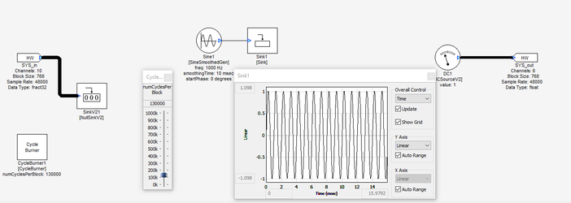
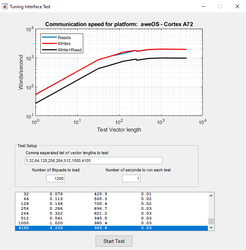

# Target Tuning Interface Test Procedure

One of the primary difficulties of creating an audio product is the design and tuning stage, where frequent changes to the layout and its internal parameters are necessary to meet the system requirements. The Tuning Interface design feature allows for this data, in the form of tuning commands, to be communicated to and from any application with awareness of AWE Core tuning protocols.

Most often, the application that communicates with the target running AWE Core is the AWE Server, which is a component of the PC-based Audio Weaver Designer. When used with AWE Server and Audio Weaver Designer, the tuning interface allows for live tuning of audio system variables by sending set and query commands to the layout on the target. This allows for running automated tests and performing profiling on the target device.

Tuning interface is one of the most important parts of the Audio Weaver integration. While there are many ways to connect target device to PC-based Audio Weaver Server, it is important for system integrator to verify that the tuning interface is properly implemented, stable, and fast.

Below is our recommended test procedure to stress test target device tuning interface.

## Stability test:

Stability test aims to test system’s stability in handling tuning messages under high CPU load from audio processing.

1. Create a dummy design with Audio Weaver similar to Figure 1. Correctly configure the input/output of the design as the target system requires. If a passthrough design is already available, that may be used as well.

1. Add “Sine Smoothed Gen” and “Sink Display” modules to the design. Leave the Sink window open to increase data exchange while it runs.
2. Add a “Cycle Burner” module to the design. Set numCyclesPerBlock to 1000 and run the design on the target.
3. Gradually increase numCyclesPerClock while monitoring through the AWE Server. Stop once the CPU load reaches at least 75% \(Figure 2\).
4. Allow AWE Designer to continue running the design for at least 1 hour.

There should be no crashes or server disconnection during the stability test. If any occur, debugging is needed to address the issue.

## Speed Test:

Speed test aims to verify system responsiveness of the tuning commands. It tests the read/write speed for different vector sizes to simulate what an actual running system may deal with, depending on the design and the number of inspector window opened. Slow response from target can result in a communication timeout and can impact tuning capability.

This test only applies to AWECore and AWECoreOS system.

1. Launch Audio Weaver and connect server to the target device.
2. Navigate to Tools → Tuning Interface Test.
3. Change biquad count to 1000. Click “Start Test”. Note: a standard 2-channel in, 2-channel out design with 768 block size at 48khz sampling rate will be loaded to the target during the test. Layout I/O check in the target application, if any, needs to be disabled before the test to prevent assertion.
4. Monitor the CPU load in the server window during the run. Adjust biquad count to reach at least 75% CPU load in Audio Weaver Server window.

Test result may vary depending on the interface used for tuning. TCP/IP is the recommended interface if the target platform supports. TCP/IP normally offers sufficient bandwidth for the tuning traffic \(Figure 3\). AWECoreOS also provides APIs to directly enable TCP/IP interface for easy integration \(Figure 4\). Other interfaces are also supported such as USB HID and Serial UART but the interface bandwidth may differ. When UART is used, the baud rate should be at least 115200 \(Figure 5\).

If the test result on the target platform is slower with the corresponding interface than what is shown above, it should be investigated. Please reach out to the DSP Concepts support team for assistance if needed.

