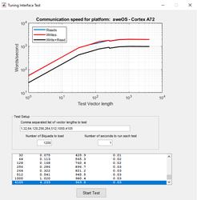
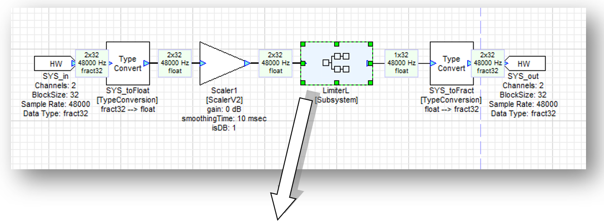
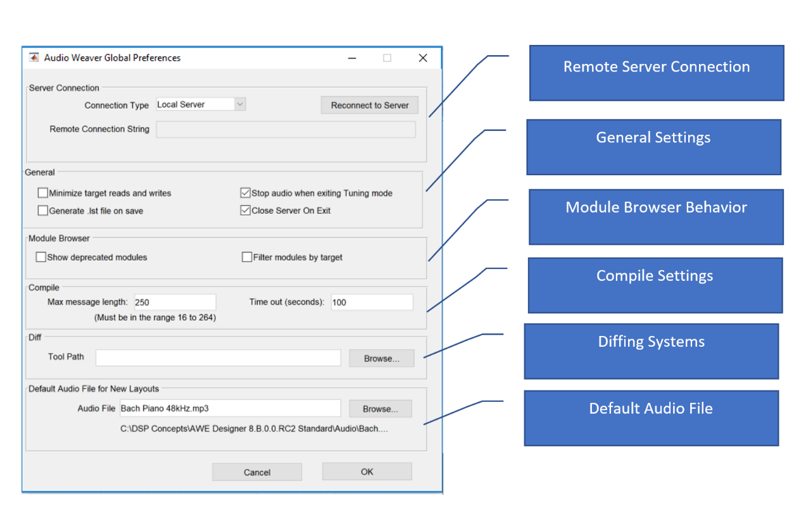
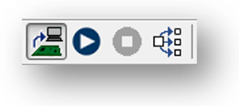
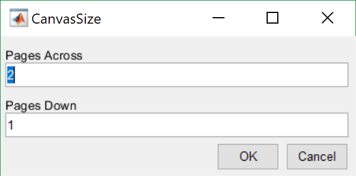
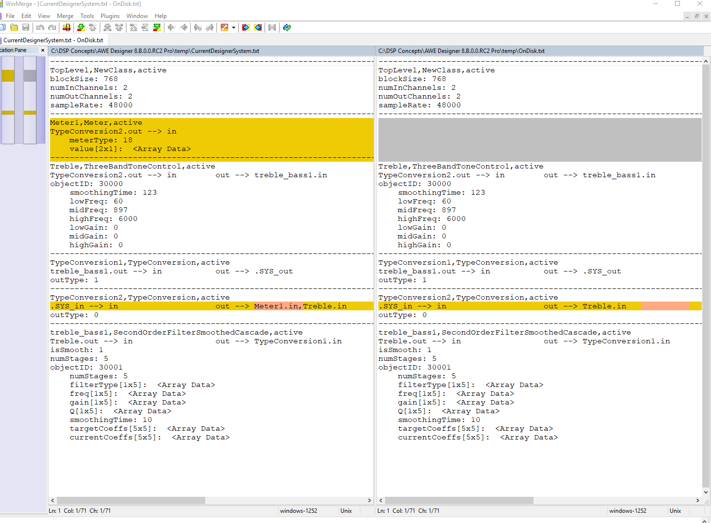
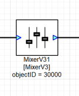
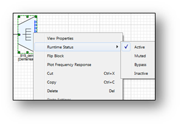

# User's Guide

## Audio Weaver Overview

AWE Designer is a Windows-based, graphical IDE for the AWE Core embedded processing engine. AWE Designer is used to easily design, debug, and tune audio processing flows in real time. Unlike other graphical tools, Audio Weaver does not generate code; instead, it generates run-time configurations for the data-driven AWE Core. Using a palette of over 400 optimized processing modules, complex audio processing chains can be quickly designed, run, profiled and tuned on hardware without writing any DSP software.

### Audio Weaver Editions

Audio Weaver comes in two different editions: Standard Edition, and Pro Edition. Standard Edition runs as a stand-alone application, while \(Pro\) runs as an application launched from MATLAB. The editions differ in the stand-alone editions of AWE Designer require the MATLAB Compiler Runtime \(MCR\), which will be downloaded during the install process. The Pro edition requires that the user have an installed version of MATLAB \(R2017b or later recommended\).

The summary of features available for the different editions of Audio Weaver are listed in the table below.

| Feature | Standard Edition | Pro Edition |
| ---: | :---: | :---: |
| Graphical Interface | ✔️ | ✔️ |
| Real-time Tuning | ✔️ | ✔️ |
| Control Wires | ✔️ | ✔️ |
| Flash / File Management | ✔️ | ✔️ |
| Cycle-Accurate Layout Profiling | ✔️ | ✔️ |
| Windows Native AWE Core | ✔️ | ✔️ |
| Real-time Waveform Debug | ✔️ | ✔️ |
| Hierarchical Subsystems | ✔️ | ✔️ |
| Configure any version of AWE Core | ✔️ | ✔️ |
| Per-Module Layout Profiling | ✔️ | ✔️ |
| Inspector Groups | ✔️ | ✔️ |
| Point-to-Point Layout Measurements | ✔️ | ✔️ |
| Diff Layouts | ✔️ | ✔️ |
| File Processing for Rapid Iteration | ✔️ | ✔️ |
| Attach to Running Targets | ✔️ | ✔️ |
| Requires Matlab  \(R2013b or later\) |  | ✔️ |
| Matlab Automation API |  | ✔️ |
| Regression Testing Scripts |  | ✔️ |
| Use and tune Custom Modules |  | ✔️ |
| Supports Custom Module SDK |  | ✔️ |

Each edition of Audio Weaver has an associated license type. Once an account has been created on the DSP Concepts website, users can acquire evaluation licenses for the Standard edition of Audio Weaver from the [downloads page](https://dspconcepts.com/downloads). For questions or purchase information for non-evaluation licenses, please contact [info@dspconcepts.com](mailto:info@dspconcepts.com).

### Additional Documentation

This document describes the features and usage of the Audio Weaver Design graphical tool. For documentation regarding other parts of the Audio Weaver ecosystem, see the following files available in the ‘Docs’ folder of the Audio Weaver installation:

* \_\_[Audio Weaver Module User's Guide](../audio-weaver/module-users-guide/) __– Describes how the audio modules are used in practice. Very important!
* [Audio Weaver Matlab API ](../matlab-api.md) – Describes Audio Weaver’s MATLAB interface, available only with the Pro edition of Audio Weaver.
* _Audio-Weaver—Module-Developers-Guide.pdf_ – Documents the process of creating new custom audio modules. This feature is only available to users with the Pro edition of Audio Weaver and the additional Custom Module Creator feature license.
* _Audio-Weaver—Tuning-Command-Syntax.pdf_ – Documents the commands sent between MATLAB and the AWE Server. For advanced users only.

For documentation regarding integrating AWE Core into target hardware see the _AWE-Core—Integration-Guide.pdf_ delivered as part of the AWE Core package.

The DSP Concepts web forum is a good place to collaborate and find solutions to common \(and uncommon!\) problems that arise while using Audio Weaver. Feel free to post any new questions or ideas that have not already been discussed at: [https://dspconcepts.com/forum](https://dspconcepts.com/forum)

## Initial Setup

### Installation Steps

Once an Audio Weaver installer executable has been downloaded, double click on it and click ‘Accept’ when Windows asks if you want to allow the program to make changes to your computer. The first installation screen will look like this:

Once all other applications are closed, click ‘Next’ to continue to the license agreement step.

Read over the terms in the Audio Weaver license agreement and click ‘I Agree’ to accept and continue with the installation.

Two third-party components are required for the Standard and STMicro editions. The installer will check for preinstalled versions of Matlab Runtime and Microsoft Visual Studio C++ redistributable libraries. The checkbox will be set for any library that is needed. Manually select the appropriate checkbox to force a reinstall if desired. The appropriate libraries will be downloaded and installed during the Audio Weaver installation process. This may take a few minutes and of course, internet access is required. The MATLAB can also be installed directly by the user from: [https://www.mathworks.com/products/compiler/matlab-runtime.html](https://www.mathworks.com/products/compiler/matlab-runtime.html)

For the next step, it is recommended that you install Audio Weaver in the default location of `C:\DSP Concepts\<Audio Weaver Version>` to allow modification of local files and examples. Click ‘Install’ to begin the Audio Weaver installation process.

### Launching AWE Designer Standard \(or STMicro\) Edition

To launch the STMicro or Standard editions of Audio Weaver, simply double click the icon that the installer created on your Desktop:

This may take several minutes to launch for the first time since it must unpack the entirety of the compiled MATLAB application – future launches will be much faster. Once the DSP Concepts splash screen appears, you will likely be asked to allow several Audio Weaver executables that rely on TCP/IP to communicate between themselves to pass through your firewall.

Once the DSP Concepts splash screen appears, you may be asked to allow Audio Weaver executables to communicate between themselves or pass through your firewall. This is normal.

Next, in the user authentication window, fill in the email address and password associated with your DSP Concepts account. Once your account is authorized to use the running edition of Audio Weaver, the graphical Audio Weaver tool will launch. See the ‘Getting Started with AWE Designer’ section below for instructions on how to get started using Audio Weaver Designer.

### Launching AWE Designer Pro Edition with MATLAB

To launch the Pro edition of Audio Weaver, the MATLAB path variable must first be updated to point to the ‘matlab’ folder of the current installation of Audio Weaver. To add to the MATLAB path, click the ‘Set Path’ icon in the ENVIRONMENT section of the MATLAB banner.

In the next window, click ‘Add Folder’ and navigate to the _&lt;Audio Weaver Pro Install Dir&gt;\matlab_ folder. Note that if you have used an earlier version of Audio Weaver Pro before, you must remove all the paths for the previous installation before launching the updated version. Your updated MATLAB path should look something like this:

Click ‘Save’, and in the MATLAB command window, type ‘awe\_designer’ to launch the Audio Weaver application.

Once the DSP Concepts splash screen appears, you may be asked to allow Audio Weaver executables to communicate between themselves or pass through your firewall. This is normal.

Next, in the user authentication window, fill in the email address and password associated with your DSP Concepts account. Once your account is authorized to use the running edition of Audio Weaver, the graphical Audio Weaver tool will launch. See the ‘Getting Started with AWE Designer’ section below for instructions on how to get started using Audio Weaver Designer.

## Getting Started with AWE Designer

On start-up, AWE Designer launches two primary GUI’s that are used to create and run audio processing systems on hardware. The Audio Weaver GUI contains the canvas and modules needed to create the signal processing layouts, while the AWE Server GUI handles most of the target and audio IO interactions. By default, AWE Server is connected to the Native \(PC\) target. See the annotated diagrams below for descriptions of the layouts of the two GUI windows.

### Audio Weaver Annotated Diagram

### Server Annotated Diagram

Target Info\  
Messages\  
Errors

Menu Bar

Playback Control

Core Selector

Heap Usage Meter

CPU Usage Meter

Playback Skip

\(in seconds\)

### Quick Start Usage

1. Modules are organized into libraries. Use the checkboxes “float” “fract32” and “int” to filter based on your appropriate processor. If you know the name of a module, use the search feature.
   1. The module browser, seen to the right, is organized based on module functionality. Expand each section to see the individual module options.
2. Drag and drop modules into the layout window

1. Wire your modules together by clicking your mouse on the output pin of a module and dragging it to the input pin of the next module.

Right-click to configure modules.

Inspector – all tunable parameters. Use at design time or tuning time.

Module Status – Activate, mute, or bypass a module.

View Properties\(Variables\) – Change the range of sliders and knobs

View Properties\(Arguments\) – Change at design time only. Configure items, like filter order, maximum delay time, or number of pins - which affect memory allocation or wiring.

1. Redraw \(Propagate Changes\) to update wiring information 

1. Build and run to start real-time processing

1. Tune in real-time using inspectors

1. Return to Design Mode and keep editing
2. Add Sink and Meter modules to view signals. These are found in the Sinks folder.

1. Switch to an embedded target using Server-&gt;Change Connection

1. Build and run to start real-time processing. Then profile the CPU load and memory using the ‘Tools&gt;&gt;Profile System’ menu item. You can also check your overall CPU load / Heap usage with AWE Server.

### Audio Weaver File Types

#### AWD

`.AWD` stands for Audio Weaver Design. This is the filetype for Audio Weaver Designer layouts. They can be loaded and saved from the Designer GUI. These files are **only** compatible with Designer on Windows and are not used on the target.

#### AWS

`.AWS` stands for Audio Weaver Script. When an Audio Weaver layout is run, a set of plain text commands are sent down to the target. These plain text messages are known as Audio Weaver scripting commands. The .AWS is the set of commands that makes up an Audio Weaver layout. An .AWS can be compiled into a binary \(see below\) or can be executed through the Audio Weaver Server. These commands can also be sent directly from Matlab \(see the Matlab API document\).

#### AWB

`.AWB` stands for Audio Weaver Binary. An .AWB is a compiled binary version of your layout. It can be loaded directly onto your target via a C array or via the flash file system. .AWB’s are most commonly used in production, as they can live directly on the target without any interaction with the PC. .AWB’s can be created right from an AWD via DesignerGUI’s Generate Target Files feature. An AWB can also be generated by using AWE Server’s Compile Script feature, where you compile an AWS into an AWB. AWB’s can also be sent to the target via the tuning interface.

## Advanced Features

###  Create Subsystems to Add Hierarchy

Subsystems can be used to organize your layout into coherent groups. To create a subsystem, drag out the Subsystem module from the Subsystem folder, then double click or right click and select ‘Navigate In’ to design the internal system. If more I/O is needed, add System Input and Output pin modules from the Subsystem folder of the module browser.

You can navigate through hierarchies either with the tabs at the top of the canvas, or by right clicking the canvas and selecting ‘Navigate Up’.

### Generate Target Files

Audio Weaver can generate “Target Files” that can be used with your AWE Core integration. For example, you can compile your Audio Weaver layout to “.aws” which will be a list of all the Server commands that make up your design. You can also generate an “.awb” which is a compiled, binary version of your design that can be stored and executed on your target system.

To generate target files, first create a valid design and then select the ‘Tools → Generate Target Files’ menu item. A dialog box will appear and prompt you to choose which files you would like to generate, and where you would like to put them. The “Enable Audio” checkbox will append an audio\_pump command to your .AWB and .AWS in case you want to load the design but start the audio processing with a separate server command \(for example, start the audio when a button is pressed\).

The .h and .c files are used by the target application to load and control the signal processing layout when operating in standalone mode. The .tsf file is used to connect AWE Designer to a target that is running in standalone mode. For more information about how to use these target files, please see the _AWECore Integration Guide_.

### Attach to Running Target

In some cases, a target may be running a layout that was not loaded via Designer. This may occur, for example, in production hardware where the layout is loaded locally on the target hardware. Designer can still connect and manipulate the layout without interrupting the ongoing processing if a tuning interface is available, and if the .awd and .tsf file \(generated via the Generate Target Files dialog described above\) for the system are known. This can be extremely useful for troubleshooting.

To Attach to Running Target, load the .awd and generate the tuning symbol \(.tsf\) file using Designer’s “Tools/Generate Target File” menu item. Connect to the target using the Server’s “Target” menu. Then use Designer’s “Tools/Attach to Running Target” menu item to complete the process.

The layout on the target can now be tuned as if you had loaded it via Designer.

When you are done tuning, the target can be detached by selecting Designer’s “Tools/Detach from Target” menu item.

### System Level Module Test

Module regression tests can be run by selecting the “Tools/System Level Module Test” menu item. Using the dialog allows a subset of modules can be selected for test. After selecting the “Start Test” button, the test results will appear in the “Results” pane.

### Layout Properties Menu

The layout properties dialog provides information about your layout and along with some control over how the layout behaves. To edit your layout’s properties, navigate to ‘Layout → Layout Properties’ from the top banner of AudioWeaver.

The top section includes information about the current layout. The next section allows the user to control whether the input data source and output data destination is a file or an audio device. The following section provides control of .aws file generation and some extra error checking on the output pin. The .aws file will be generated in the same folder as the current AWD file. If "Validate System Output pin" is checked, then the system checks if the inherited output pin properties fall within the specified ranges for the attached hardware output pin. The final section “Protect Layout” allows the entire layout to be locked from editing.

### Global Preferences

To apply custom Audio Weaver Designer settings, use the Global Preferences menu at ‘File → Global Preferences’.

### Changing Input Pin Properties

Right-click on the HW input pin to change its number of channels, Block Size and Sample Rate properties. Once the model is run or the ‘Propagate Changes’ icon is clicked, the updated HW pin information will propagate through the rest of the system. The output HW pin information is inherited from the connecting wire and cannot be edited manually. Note that the dataType of the input pin is fract32 and cannot be changed.

### Configure the PC Sound Card

AWE Designer’s Native Target allows audio processing to be performed on the PC. When running layouts on the Native target, the AWE Server can be used to select which PC input and output audio devices should be used. Access this menu from the Server’s ‘File → Preferences’ menu item. Choose your sound card and sample rate for analog I/O. Multiple sound cards can be enabled, and users can choose between DirectX and ASIO drivers. The selected inputs will be interleaved at the input pin of your Audio Weaver layout.

### Copying Modules

Existing modules can be copied and pasted within the same canvas, or across hierarchies and even across separate layouts. To copy and paste modules, highlight the module or modules to copy, then right click on the selection and select ‘Copy’. Right click on the canvas that you want to copy to and select ‘Paste’ to insert the selection onto the canvas.

Modules can also be copied by left clicking the selected module\(s\) and holding down, pressing the CTRL key, and dragging the cursor to the desired location on the canvas and releasing the left mouse button.

To copy the settings of one module to another of the same type, right click on a module and select ‘Copy’. Then right click on another module of the same type and select ‘Paste Settings’. When settings are pasted, only a module’s variables change, not its arguments.

### Showing Wiring Information

To prevent visual clutter, the wire information display is by default disabled in Audio Weaver, but this information can be useful to display while designing or debugging a system. To show the wire information for each wire on your canvas, select ‘View Wire Info’ menu item on the Audio Weaver toolbar banner. When selected, each wire will display number of channels, block size, sample rate, data type, and the auto-assigned wire number. ‘2x64’ means two channels and a block size of 64 samples, and a ‘C’ added to the end of the data type means that the data is complex.

### Inspector Management

The ‘Inspector’ menu can be used to group the inspectors of related modules in the layout. The menu can also be used to show and hide different groups of inspectors to speed up inspector handling. To save an Inspector Group, open up your desired inspectors and then select the ‘Inspector → Save Group → New’ menu item. Once your Inspector Group is saved, it will appear under the top level Inspector menu. Selecting the group name will display your inspector group in exactly the same configuration as was saved.

  
The Inspector menu can also be used to close all open inspectors and to delete inspector groups.

### Diffing Systems

Audio Weaver layouts can be compared using a ‘diffing’ capability. This can be useful for example to figure out changes between different versions of a layout during the design and tuning process. This functionality requires a Diff tool like WinMerge, to be installed. First specify your Diff tool under the ‘File Global Preferences’ menu item, then use the menu item ‘File → Compare Systems’ to make the comparison between two different layouts.

### Reconnecting to the Server

If you accidentally close the AWE Server or change the connection type, use this menu item to relaunch the Server and reconnect to the target.  

If the connection to your target hardware is lost through the AWE Server, you can quickly attempt to re-connect by clicking the ‘Connect’ checkbox at the bottom of the Server window:

### Processing Files Menu

The file processing tool can be used to send audio data through a layout and record the output. This feature is useful for batch processing audio files and for quickly testing the output of your audio system. This tool will process files as quickly as possible, so operations are typically faster than real-time. Even more processing speed can sometime be achieved by increasing the block size in your layout.

###  Managing the Canvas

The AWE Designer Canvas consists of pages. You can change your drawing space using the “Layout → Canvas Size” menu.

  
Note that the canvas size is limited to 10x5. The zoom and align toolbar icons can be used to change your view and to easily organize your modules.

### Feedback Wires

In an Audio Weaver layout, data typically flows from the input towards the output, with the output of one module feeding the input of one or more modules after it in the processing order. However, it is possible to feed the output of a module back to the input of a module that precedes it in the processing order. In this case, the new data will not be processed until the next block of data is processed resulting in a delay of one block. In AWE Designer, such feedback wires need to be specified manually. To do this, right-click on a wire and select ‘Feedback’ from the context menu:

The properties of the feedback wire can then be specified as either to be related to the properties of the layout’s input pin, or a custom value. See the[Audio Weaver Module Users Guide](../audio-weaver/module-users-guide/) for a detailed explanation of this feature.  

### Profiling

When a layout is running, its computation and memory usage can be measured by selecting the ‘Tools Profile Running Layout’ menu item. This will pop up a dialog displaying fine grained profiling information for the entire layout and for each module.

If for some reason real-time audio is not available, the layout can still be profiled. When the is halted, select the ‘Tools Manual Profile Layout’ menu item to get a similar display.

Profiling results can be saved to file for later use using the ‘Export to File’ button. Results will be refreshed using the ‘Refresh’ button.

### Show Unsaved Changes

To see all the changes since the last save, select ‘Tools Show Unsaved Changes’ for a display using the diff tool the you set in the ‘Global Preferences’ Dialog.

### Compare Layouts

Two layouts can be compared by selecting the ‘Tools Compare Layouts’ menu item and selecting the awd files associated with the layouts.

### Measurements

Many modules have associated frequency responses. The measurement dialog measures the composite frequency response between two points in your signal processing layout. To set up a measurement, first place marker modules at the beginning and end points of the desired measurement path in the layout.

Then select the ‘Tools Measurement New Measurement’ menu item to get to the measurement dialog.

Here you can select all the properties of the measurement display. When you push the OK button, an editable measurement graph will be displayed.

### Tuning Interface Test

This function performs diagnostic measurements on the tuning interface that carries commands from the AWE Server to the target. This is handy to have when porting AWECore to a new target. The functionality can be accessed via the ‘Tools Tuning Interface Test’ menu item. Test results indicate the interface speed under various conditions. For more information, see the user forum at [www.dspconcepts.com](http://www.dspconcepts.com/).

### System Level Module Test

Numerical accuracy tests can be executed by selecting the ‘Tools System Level Module Test’ menu item and using the resulting dialog.

The dialog allows multiple modules to be manually selected for test. Alternatively, the modules within the existing layout can be tested. The tests are run on the target to which the server is currently connected.

### Multi-Instance Operation

Some Audio Weaver target systems may have more than one instance of AWECore running. In this case, the different instances can be selected using the drop lists in designer and server. For more information, see the user forum at [www.dspconcepts.com](http://www.dspconcepts.com/).

### Tunable Variables

Many modules contain variables that can potentially be tuned at runtime. When a variable can cause undesirable side effects, it can be locked out from tuning. To do this, right click on the module and select the ‘Permissions’ context menu. There, as pictured below, variable tuning can be can be allowed or disallowed for a module.

### Setting Search Paths

Audio Weaver Designer comes with a few default search paths for Audio and Modules. You can add additional search paths for both modules and files \(audio files, etc\) via Designer.

The reason to update a module search path would be if you have created your own custom module. To add additional Module Search Paths, select File-&gt; Set Module Path.

### Module Browser/Palette

The Module Browser allows filtering by a few different parameters. You can filter the Module Browser list via data type by selecting/deselecting the boxes above the browser and under the search bar. The browser will only show modules with datatypes that match the selected boxes. For instance, if a user is not interested in any fract32 modules, they could deselect the box and see only float/int modules.

The image below shows the “Gain” modules of all data types.

The next image shows the same “Gain” category but without fract32 modules. Notice that the list is significantly shorter.

If you know the name or a keyword of the desired module, you can also use the search bar to filter the available modules. Additionally, you can filter the Module Browser to not show deprecated modules. To toggle the deprecated filter, open the Designer File-&gt;Global Preferences dialog and toggle the “Show deprecated modules” checkbox.

  
An advanced feature is the ability to specify a specific ModuleList.h file as module filter. Any modules not in the specified list will appear on the canvas outlined in red.

### Logging in Audio Weaver

If you are having issues or trying to debug the tuning interface, turning on logging can be a big help. See the image below for information on our different logs and how to enable/disable them.

### Server List Modules

You can see the full list of available modules on your target by using the “List Modules” feature in AWE Server. Connect to the target of choice and then select Target-&gt;List Modules.

### Example AWDs

Example AWDs are included in the Designer deliverable. See Examples\Designer. There are layouts for both Fract32 and Float layouts.

### ObjectIDs

ObjectIDs are generated symbols that are used in an AWE Core integration to allow the tuning of modules in the integration code. An objectID can be assigned to a module, and then that ID can be used to send tuning commands to a running layout on the target \(without matlab or Designer\). For more information on how to tune a layout via objectIDs, please see the _AWE-Core—Integration-Guide.pdf_.

To assign an objectID to a module, right click the module of choice and select ObjectIDs-&gt;Assign.

After you have assigned an objectID, it should appear under the Module on the canvas

You can clear the objectID by selecting “Clear” from the ObjectIDs menu shown above. You can also manually set a module’s objectID from the module properties “Build” tab.

### Module Status

Each module has an associated runtime status with 4 possible values:

_Active_ –The module's processing function is being called. This is the default behavior when a module is first instantiated.

_Muted_ – The module's processing function is not called. Instead, all of the output wires attached to the module are filled with zeros.

_Bypassed_ –The module's processing function is not called. Instead, the module's input wires are copied directly to its output wires. Some modules use an intelligent generic algorithm which attempts to match up input and output wires of the same size. Other modules implement custom bypass functions.

_Inactive_ –The module's processing function is not called and the output wire is untouched. This mode is used almost exclusively for debugging and the output wire is left in an indeterminate state. _**Use with caution!**_

Changing the module status is useful for debugging and making simple changes to the processing at run-time. The module status can be changed in both Design mode and Tuning mode.

The Module Status can be changed by right-clicking on a module and selecting “Module Status”. To change the module status of a group, select multiple modules \(including subsystems\) with drag and select or by pressing ctrl, and right-click to change the status of all selected modules.

### Connect to Remote Server

Designer can be connected directly to a remote server, omitting the local AWE Server. A use case for this would be our AWE\_command\_line application for Linux. The AWE\_command\_line app contains a built in, GUI-less AWE Server. In this case, a user could omit the use of the Win32 AWE Server and connect Designer directly to the Linux target. Another use case is connecting Designer to a win32 AWE Server running on another PC.

1. Start the AWE Server on your Target. This can either be a local AWE Server on another PC or something like AWE\_command\_line. Make sure you know the IP or hostname of your target that’s running the server.

 

2. Open the Global Preferences window from the file dropdown menu

3. Switch the “Connection Type” dropdown from Local Server to Remote Server.

4. Enter the IP or hostname of your remote target. The click “Reconnect to Server”

5. If a successful connection is made, you will see a “Connected” string appear under your remote connection string. You will also notice that the default Audio File path has changed to your target’s filesystem.

 

6. Now you can run your Designer layout on your remote target as if you were connected to a local target.

