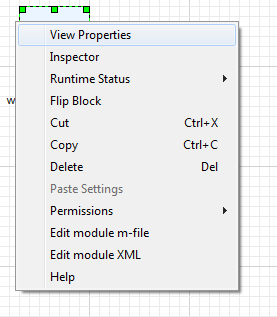
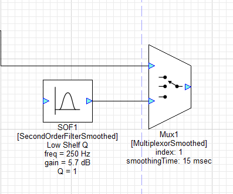
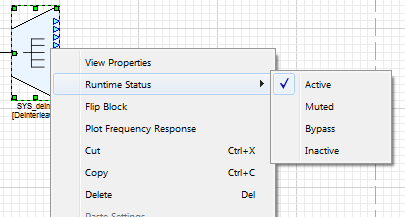

# Module Users Guide

## Introduction

This document is an overview of the audio modules included in Audio Weaver. It is intended for training users how to get the most out of the module library by providing a high-level overview with in depth examples of the modules. Modules build up sophisticated audio functions and systems in a matter of clicks, similar to circuit design or using lego blocks. Further information is available in the detailed HTML documentation provided with the Audio Weaver installer. For more information about a specific module, run Audio Weaver Designer and right click a module to view its “Help” file.

### How to use this guide

This guide is separated into sections as outlined in the table of contents: Chapter 2 starts us off with basic module concepts. It also discusses designer workflow including the module properties window and adjusting parameters. Chapter 3 explains each module folder in the browser, as well as how to pick the correct module as many of the modules are similar. To be clear about the differences between the modules, the end of each section in Chapter 3 includes a table that summarizes the differences between the modules in that folder. Chapter 4 provides in depth examples of common processing techniques and algorithms so the user can have a taste of the capabilities of Audio Weaver. **Usage tips are bolded throughout this guide for ease of reference.**

### Other Audio Weaver Documents

This document describes the Audio Weaver modules and module library. The MATLAB scripting interface is described in [Audio Weaver Matlab API](../../matlab-api.md). Read more about the graphical designer in [Audio Weaver Designer User’s Guide](../../audio-weaver-designer/users-guide.md).



### Module Library Organization

Audio samples are represented as 32-bit values. Several different data types are available:

* **Float32** – standard 32-bit floating-point with 1 sign bit, 8 exponent bits, and 23 mantissa bits.
* **Int32** – Standard twos complement 32-bit integer. The signed values are in the range \[-231 , +\(231-1\)\].
* **Fract32** – Fractional representation where values are scaled in the range \[-1 +1\). This is standard integer representation with an implied scale factor of 2-31.

**At the top of the module browser, there is a checkbox to filter based on the different module data types** \(_see above_\). This will filter out modules for hardware that operates on specific sample data type \(fract32 for fixed-point\). The integer module libraries are typically used for control operations and work on both fixed-point and floating-point targets. The type convert module allows any data type to transfer into the others. This may be destructive if converting to a type with lower resolution.

### Module Browser overview

Audio Weaver modules are organized into separate browser folders based on their function. The folders are arranged in alphabetical order titled with a short description of the contents. A search bar can be found directly above the browser window. **To use the search bar, type the name or some common tag for the wanted module and press enter.**

## Basic Module Concepts

Audio Weaver Designer has two modes: Design mode and Tuning mode. In Design mode, design signal flow: by adding modules, making connections, and setting parameters. Tuning mode occurs when the designed layout is run. **The layout can only be run if all modules have valid connections. Run the layout by clicking the play button at the top or by right clicking the canvas and selecting “Build and Run.”** Tuning mode allows for parameter changes only: no changes to the wiring or structure of the block diagram.

### Viewing Module Properties

An audio module gets instantiated when dragged to the canvas from the Module Browser, located on the left hand side of the canvas. **Module** _**arguments**_ **can only be changed in Design mode and affect memory allocation, pins, and wiring. Module** _**variables**_ **are tunable parameters which can be changed in either mode.** Arguments tend to define memory allocation for the module, which can’t be changed during runtime. For example, in an FIR filter, the length of the filter \(number of taps\) is specified as an argument. This length affects memory allocation and as a result setting these arguments is only allowed in Design mode. The FIR coefficients \(a variable\) can change at any time.

After a module is instantiated, change its arguments and variables by right-clicking and selecting “View Properties” \(see above\) which will open up the properties manager at the bottom \(see below\).

In the Matlab code for an FIR module, the module properties maps directly to the function arguments: `M=fir_module(NAME, L)`

### Tunable Variables and Inspectors

Most modules also have an associated _Inspector._ The inspector allows changing of the module’s tunable parameters. Inspectors can be used in Design mode and Tuning mode by double-clicking on a module, or by right-clicking and selecting “Inspector.” The inspector for an FIR filter holds the filter coefficients \(see right\). These parameters can also be changed under the “Variables” tab in the module properties window.

**Save a set of inspectors for later by using inspector groups.** Usually, many inspectors are shown at the same time. To use an inspector group, click ‘Inspector’ on the top menu of Designer. Here inspector group names are managed. The inspector group will save the inspector configuration, including positioning. To reposition an inspector group, simply adjust the inspectors and save the group again with the same name.

### Step Values and Fine Controls

Within the properties window, in the variables tab, many modules will have range attributes, with an optional ‘step’ to determine adjustable resolution for the slider or knob control. The Max and Min values determine the allowable tuning range, and can be adjusted at any time.

Fine controls of the tuning interface relies on a hotkey and click combination. _**Press and hold ctrl**_ **and scroll the mouse wheel on the knob/slider to use fine tuning.** For coarse tuning, hold shift and do the same. For adjusting with mouse clicks, the tuning is controlled by distancing the cursor away from the knob while tuning. This will allow for smaller changes to occur, as more distance is needed to create the angle.

### Viewing Module Variables on Canvas

A useful design feature is to see variable values without having to open all of the inspectors. The original design appears as:

**To show variable values, select “Module Variables” under the View menu.** With variables shown, it appears as:

### Module Status

Each module has an associated runtime status with 4 possible values:

_**Active**_ –The module's processing function is being called. This is the default behavior when a module is first instantiated.

_**Muted**_ – The module's processing function is not called. Instead, all of the output wires attached to the module are filled with zeros.

_**Bypassed**_ –The module's processing function is not called. Instead, the module's input wires are copied directly to its output wires. Some modules use an intelligent generic algorithm which attempts to match up input and output wires of the same size. Other modules implement custom bypass functions.

_**Inactive**_ –The module's processing function is not called and the output wire is untouched. This mode is used almost exclusively for debugging and the output wire is left in an indeterminate state. _**Use with caution!**_

Changing the module status is useful for debugging and making simple changes to the processing at run-time. The module status can be changed in both Design mode and Tuning mode.

**The Module Status can be changed by right-clicking on a module and selecting “Module Status ”.** To change the module status of a group, **select multiple modules\(including subsystems\) with drag and select or by pressing ctrl**, and right-click to change the status of all selected modules.

### Wires and Control Signals

Connections between audio modules are called _wires_ and correspond to buffers of data on the target. A wire has the following properties:

* number of channels
* block size
* sample rate
* complexity \(real or complex values\).

**Most modules can operate on an arbitrary number of channels, block size, and sample rate.** The number of channels and block size of a wire is called its _size._ Show wire properties using the View--&gt;Wire Types menu item.

#### Pin propagation

Wire information is resolved through a process known as _pin propagation._ The wire information is known from the system input and this information is propagated in module order until it reaches the system output pin. **To trigger pin propagation, click on the Propagate changes button \(**  **\) on the toolbar.** Alternatively, right-click on an empty part of the canvas and select “Redraw” from the context menu. If there is a wiring error and pin propagation is unable to complete, an error sound will play. To find out more details to this error, run the system.

#### Feedback Wires

Feedback occurs when a wire is routed backwards to an input earlier in the system. Feedback wires must be manually specified[\[1\]]() . **To make a feedback wire, right click a wire and select “Feedback”.** The wire will turn blue to indicate that it is a feedback wire. For each marked feedback wire, Audio Weaver will create a dedicated buffer to store its data. At system startup, data in the wire is initialized to all zeros. 



If a feedback wire is left _unmarked_, the following error will appear after an attempt to build the system:

To solve this, locate the feedback point in the block diagram and then mark the feedback wire.

**Wire size information must be set using the “Feedback Properties” dialog which is reached by right-clicking on the feedback wire.** The following dialogue box opens, allowing the ability to set the wire’s block size, number of channels, sample rate, data type, and whether or not it is complex. This should match the pins that the wire is connecting.

### Block Size

Each hardware target has a fundamental block size to specify how many samples per block are handled by the real-time audio I/O functions. This is shown on the Server window when the Server launches. \(see right\)

Layouts can use any multiple of the target’s fundamental blockSize. **Change blockSize at any time by adjusting the hardware input parameters in SYS\_in**. BlockSize information is propagated from the input pin, through the modules, to the output pin. **The blockSize of the output pin is set by pin propagation**[\[2\]]().

**Interpolator and decimator modules increase or decrease the blockSize**. Some modules also output a single value _control signal_ \(blockSize = 1\). For example, the BlockStatistics module can be configured to output the average value of a block of samples. This data will be one value per block. Control signals are drawn with dashed lines instead of solid lines.

In the example below, the `BlockStatistics1` module computes the RMS level of the signal and a lookup table \(TableInterp1\) turns this into a linear gain to be applied by Scaler1. The signals into and out of the lookup table module are control signals.

### Smoothed modules

Some modules have built in smoothing to prevent pops and clicks during tuning. Smoothing is implemented using a first order IIR filter:

𝑔𝑛=1−𝛼𝑔𝑛−1+𝛼𝑡\[𝑛\]

where is the instantaneous smoothed gain and is the discontinuous target gain. The coefficient controls the smoothing process and depends upon the _smoothingTime_ and the sampling rate. Smoothed modules take additional processing: only use these when tuning is needed during runtime.

The figure below shows a ScalerSmoothed module with a 10 msec time constant. The blue line is the instantaneous gain change from 1.0 to 2.0 and the red curve is the result of smoothing.

Time constants correspond to the familiar definition of time constants used in analog filters:

𝑔𝑡=𝑒−𝑡/𝜏

Where 𝜏 is the time constant. After 1 time constant has elapsed the gain has decayed by . After 3 time constants, the gain has decayed by 95%, because 𝑒−3=0.0498. Thus, it takes several time constants for the gain change to fully take effect and this is reflected in the figure above.

