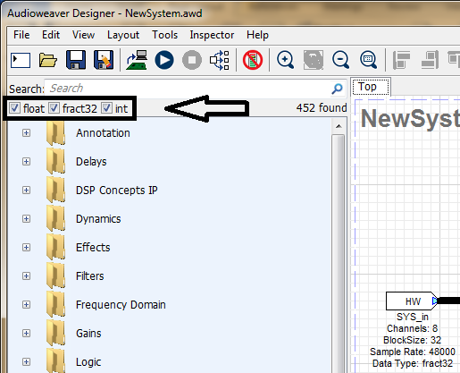
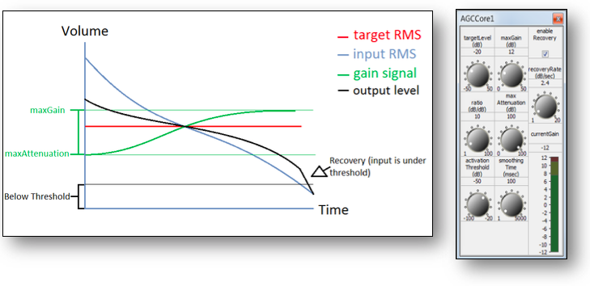
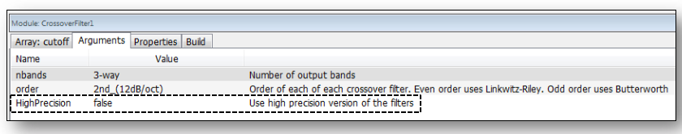
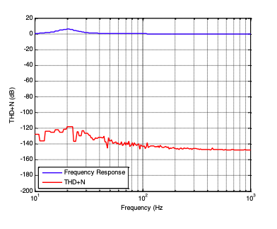
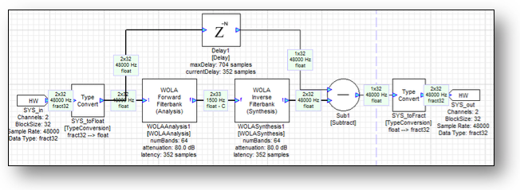
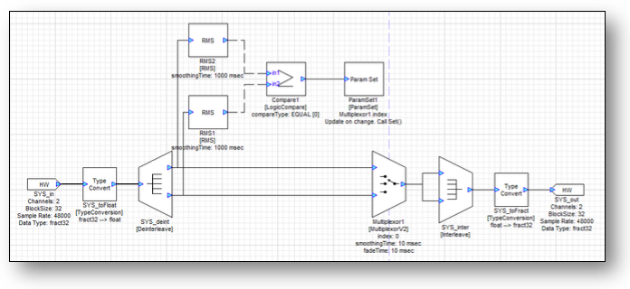
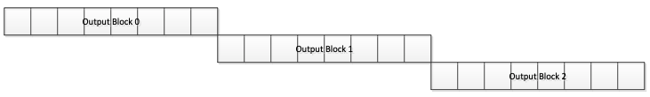

# Module Users Guide

## Introduction

This document is an overview of the audio modules included in Audio Weaver. It is intended for training users how to get the most out of the module library by providing a high-level overview with in depth examples of the modules. Modules build up sophisticated audio functions and systems in a matter of clicks, similar to circuit design or using lego blocks. Further information is available in the detailed HTML documentation provided with the Audio Weaver installer. For more information about a specific module, run Audio Weaver Designer and right click a module to view its “Help” file.

### How to use this guide

This guide is separated into sections as outlined in the table of contents: Chapter 2 starts us off with basic module concepts. It also discusses designer workflow including the module properties window and adjusting parameters. Chapter 3 explains each module folder in the browser, as well as how to pick the correct module as many of the modules are similar. To be clear about the differences between the modules, the end of each section in Chapter 3 includes a table that summarizes the differences between the modules in that folder. Chapter 4 provides in depth examples of common processing techniques and algorithms so the user can have a taste of the capabilities of Audio Weaver. **Usage tips are bolded throughout this guide for ease of reference.**

### Other Audio Weaver Documents

This document describes the Audio Weaver modules and module library. The MATLAB scripting interface is described in [Audio Weaver Matlab API](../../matlab-api.md). Read more about the graphical designer in [Audio Weaver Designer User’s Guide](../../audio-weaver-designer/users-guide.md).



### Module Library Organization

Audio samples are represented as 32-bit values. Several different data types are available:

* **Float32** – standard 32-bit floating-point with 1 sign bit, 8 exponent bits, and 23 mantissa bits.
* **Int32** – Standard twos complement 32-bit integer. The signed values are in the range $$[-2^{31},+(2^{31})]$$. 
* **Fract32** – Fractional representation where values are scaled in the range $$[-1 +1)$$ . This is standard integer representation with an implied scale factor of $$2^{-31}$$ .  

**At the top of the module browser, there is a checkbox to filter based on the different module data types.** \(S_ee above._\). This will filter out modules for hardware that operates on specific sample data type \(fract32 for fixed-point\). The integer module libraries are typically used for control operations and work on both fixed-point and floating-point targets. The type convert module allows any data type to transfer into the others. This may be destructive if converting to a type with lower resolution.

### Module Browser overview

Audio Weaver modules are organized into separate browser folders based on their function. The folders are arranged in alphabetical order titled with a short description of the contents. A search bar can be found directly above the browser window. **To use the search bar, type the name or some common tag for the wanted module and press enter.**

## Basic Module Concepts

Audio Weaver Designer has two modes: Design mode and Tuning mode. In Design mode, design signal flow: by adding modules, making connections, and setting parameters. Tuning mode occurs when the designed layout is run. **The layout can only be run if all modules have valid connections. Run the layout by clicking the play button at the top or by right clicking the canvas and selecting “Build and Run.”** Tuning mode allows for parameter changes only: no changes to the wiring or structure of the block diagram.

### Viewing Module Properties

An audio module gets instantiated when dragged to the canvas from the Module Browser, located on the left hand side of the canvas. **Module** _**arguments**_ **can only be changed in Design mode and affect memory allocation, pins, and wiring. Module** _**variables**_ **are tunable parameters which can be changed in either mode.** Arguments tend to define memory allocation for the module, which can’t be changed during runtime. For example, in an FIR filter, the length of the filter \(number of taps\) is specified as an argument. This length affects memory allocation and as a result setting these arguments is only allowed in Design mode. The FIR coefficients \(a variable\) can change at any time.

After a module is instantiated, change its arguments and variables by right-clicking and selecting “View Properties”. \(_See above._\) which will open up the properties manager at the bottom. \(_See below._\)

In the Matlab code for an FIR module, the module properties maps directly to the function arguments: `M=fir_module(NAME, L)`

### Tunable Variables and Inspectors

Most modules also have an associated _Inspector._ The inspector allows changing of the module’s tunable parameters. Inspectors can be used in Design mode and Tuning mode by double-clicking on a module, or by right-clicking and selecting “Inspector.” The inspector for an FIR filter holds the filter coefficients \(see above\). These parameters can also be changed under the “Variables” tab in the module properties window.

**Save a set of inspectors for later by using inspector groups.** Usually, many inspectors are shown at the same time. To use an inspector group, click ‘Inspector’ on the top menu of Designer. Here inspector group names are managed. The inspector group will save the inspector configuration, including positioning. To reposition an inspector group, simply adjust the inspectors and save the group again with the same name.

### Step Values and Fine Controls

Within the properties window, in the variables tab, many modules will have range attributes, with an optional ‘step’ to determine adjustable resolution for the slider or knob control. The Max and Min values determine the allowable tuning range, and can be adjusted at any time.

Fine controls of the tuning interface relies on a hotkey and click combination. _**Press and hold ctrl**_ **and scroll the mouse wheel on the knob/slider to use fine tuning.** For coarse tuning, hold shift and do the same. For adjusting with mouse clicks, the tuning is controlled by distancing the cursor away from the knob while tuning. This will allow for smaller changes to occur, as more distance is needed to create the angle.

### Viewing Module Variables on Canvas

A useful design feature is to see variable values without having to open all of the inspectors. The original design appears as:

**To show variable values, select “Module Variables” under the View menu.** With variables shown, it appears as:

### Module Status

Each module has an associated runtime status with 4 possible values:

_**Active**_ –The module's processing function is being called. This is the default behavior when a module is first instantiated.

_**Muted**_ – The module's processing function is not called. Instead, all of the output wires attached to the module are filled with zeros.

_**Bypassed**_ –The module's processing function is not called. Instead, the module's input wires are copied directly to its output wires. Some modules use an intelligent generic algorithm which attempts to match up input and output wires of the same size. Other modules implement custom bypass functions.

_**Inactive**_ –The module's processing function is not called and the output wire is untouched. This mode is used almost exclusively for debugging and the output wire is left in an indeterminate state. _**Use with caution!**_

Changing the module status is useful for debugging and making simple changes to the processing at run-time. The module status can be changed in both Design mode and Tuning mode.

**The Module Status can be changed by right-clicking on a module and selecting “Module Status** $$\to$$ **”.** To change the module status of a group, **select multiple modules\(including subsystems\) with drag and select or by pressing ctrl**, and right-click to change the status of all selected modules.

### Wires and Control Signals

Connections between audio modules are called _wires_ and correspond to buffers of data on the target. A wire has the following properties:

* number of channels
* block size
* sample rate
* complexity \(real or complex values\).

**Most modules can operate on an arbitrary number of channels, block size, and sample rate.** The number of channels and block size of a wire is called its _size._ Show wire properties using the View $$\to$$ Wire Types menu item.

#### Pin propagation

Wire information is resolved through a process known as _pin propagation._ The wire information is known from the system input and this information is propagated in module order until it reaches the system output pin. **To trigger pin propagation, click on the Propagate changes button \(**  **\) on the toolbar.** Alternatively, right-click on an empty part of the canvas and select “Redraw” from the context menu. If there is a wiring error and pin propagation is unable to complete, an error sound will play. To find out more details to this error, run the system.

#### Feedback Wires

Feedback occurs when a wire is routed backwards to an input earlier in the system. Feedback wires must be manually specified. \[The manual specification of feedback wires is a limitation of the way that Audio Weaver resolves wiring information. Recall that Audio Weaver starts at the input of the system and then propagates wire size information module-by-module. When it first reaches a feedback point, it will have not yet resolved the size information for that wire and cannot proceed further. As a result, wires must be manually marked as feedback.\] **To make a feedback wire, right click a wire and select “Feedback”.** The wire will turn blue to indicate that it is a feedback wire. For each marked feedback wire, Audio Weaver will create a dedicated buffer to store its data. At system startup, data in the wire is initialized to all zeros. 



If a feedback wire is left _unmarked_, the following error will appear after an attempt to build the system:

To solve this, locate the feedback point in the block diagram and then mark the feedback wire.

**Wire size information must be set using the “Feedback Properties” dialog which is reached by right-clicking on the feedback wire.** The following dialogue box opens, allowing the ability to set the wire’s block size, number of channels, sample rate, data type, and whether or not it is complex. This should match the pins that the wire is connecting.

### Block Size

Each hardware target has a fundamental block size to specify how many samples per block are handled by the real-time audio I/O functions. This is shown on the Server window when the Server launches. \(_See below_.\)

Layouts can use any multiple of the target’s fundamental blockSize. **Change blockSize at any time by adjusting the hardware input parameters in SYS\_in**. BlockSize information is propagated from the input pin, through the modules, to the output pin. **The blockSize of the output pin is set by pin propagation**. \[The exact behavior is controlled by the checkbox “Validate system output pin” in Layout-&gt;Layout Properties dialog. There is the option of inheriting the output pin size from the wire attached to it \(Validate system output pin unchecked; this is the default\). Or force the wire to match the output pin \(Validate system output pin checked.\)\]

**Interpolator and decimator modules increase or decrease the blockSize**. Some modules also output a single value _control signal_ \(blockSize = 1\). For example, the BlockStatistics module can be configured to output the average value of a block of samples. This data will be one value per block. Control signals are drawn with dashed lines instead of solid lines.

In the example below, the `BlockStatistics1` module computes the RMS level of the signal and a lookup table \(TableInterp1\) turns this into a linear gain to be applied by Scaler1. The signals into and out of the lookup table module are control signals.

### Smoothed modules

Some modules have built in smoothing to prevent pops and clicks during tuning. Smoothing is implemented using a first order IIR filter:

𝑔𝑛=1−𝛼𝑔𝑛−1+𝛼𝑡\[𝑛\]

where 𝑔\[𝑛\] is the instantaneous smoothed gain and _t_\[𝑛\] is the discontinuous target gain. The coefficient controls the smoothing process and depends upon the _smoothingTime_ and the sampling rate. Smoothed modules take additional processing: only use these when tuning is needed during runtime.

The figure below shows a ScalerSmoothed module with a 10 msec time constant. The blue line is the instantaneous gain change from 1.0 to 2.0 and the red curve is the result of smoothing.

Time constants correspond to the familiar definition of time constants used in analog filters:

                                                           𝑔𝑡=𝑒−𝑡/𝜏

Where 𝜏 is the time constant. After 1 time constant has elapsed the gain has decayed by by $$e^{-1}=0.3679$$ . After 3 time constants, the gain has decayed by 95%, because 𝑒−3=0.0498. Thus, it takes several time constants for the gain change to fully take effect and this is reflected in the figure above.

## Modules in Browser Order

Audio Weaver has over 400 different types of modules available. This section organizes the modules into standard types with brief descriptions of each. Our focus will be on how to use the modules, with information provided in tables to determine the differences between similar modules.

### Annotation

In order to keep notes within layouts, Designer supports text boxes, rectangle panels, and arrows. While there are many ways to use these, the standard is to break the layout file into “processing sections” with information on how to tune the design. Annotation is also good for keeping “presets” or “modes” written down on the canvas.

#### Documenting Layouts

To use the annotations, drag them onto the browser. Rescale them and position them accordingly. To edit a text box, double click it and type away on the canvas. To change text size or annotation color/width, check the properties panel for each annotation. In order to keep a standard across the design file, it is recommended to establish a standard annotation \(i.e. get the fonts/size/color set up\) and copy/paste this to keep the style throughout the annotations.  

### Delays

Delay modules hold the input signal for some amount of time using an internal circular buffer. This buffer is instantiated with a size _maxDelay_. At runtime, _currentDelay_ is set to control the time constant for the maxDelay buffer. Most delays update currentDelay instantaneously, but smoothed\(interpolated\) delays are provided if the final product needs a varying delay. 

Delay time type can be int or fract32 samples, int or fract32 milliseconds, or blocks. Input type also varies, meaning some modules take Float audio data, some take Fract32 audio, and some take any type \(including int\). 

For most cases, use Delay msec or Delay samples. Modulated delays come into play for making musical effects.

#### Allpass Delays

Allpass Delays use feedback and feedforward in order to vary the phase of a signal without changing its magnitude or its position in time. Our allpass delays have a coef variable which determines the amount of gain on the feedback/forward mix factor. Allpasses are commonly used in audio effects like chorus, flanger, reverb, and stereo effects. Our allpasses also have the option of outputting the delayed signal \(in cases where time position and phase should change\). 

#### Modulated Delays

Modulated Delays come with a modulation control pin. This control pin feeds the modulation factor _mod_, limited in depth by _modDepth_. A common use case is to provide the mod pin with a random or oscillator source that varies from -1 to 1, allowing the delay to vary. This oscillation reduces harmonic artifacts from feedback delay lines.

#### Delay Taps

Delay Taps create an evenly spaced N amount of delays, which are all interleaved into separate ‘delay channels.’ This is useful for adaptive FIR filters and prediction algorithms due to the consistency in delay length.

#### Low Memory Delays

Since delays tend to be memory intensive, memory efficient options are provided. Modules labelled with a 16 in the name use half of the bits \(compared to 32 bit data\). This results in about half the size on the heap, at a cost of lost amplitude resolution. Our most memory efficient delay for multiple lines is the Delay State Writer16. This uses a circular buffer and multiple pointers instead of multiple buffers in memory, all while using 16-bit resolution.

#### Table of Delay Modules

### DSP Concepts IP

#### Long FIR Filter

This **zero latency FIR** allows for large FIR filters by breaking a large convolution into multiple smaller convolutions. This module supports one channel of audio. **The larger the blockSize, the more efficient the processing**. It expects time domain FIR coefficients, and will automatically convert these into the frequency domain for processing. It is recommended to load the coefficients as a text file using the properties browser to edit the FIR array, rather than typing them in by hand. 

####  WOLA Forward Filterbank \(Analysis\)

This module is used to convert a time domain\(real number\) signal into frequency domain\(complex number\) bins. The output of this module will operate according to this blocksize. From this point on, the data is complex. See the Frequency Domain folder for modules that operate within the complex domain. The first and last bin represent DC, and have no complex data.

#### WOLA Inverse Filterbank \(Synthesis\)

This module will convert a block of frequency bin\(complex number\) data into the time domain\(real number\). This is normally paired with WOLA Forward Filterbank \(Analysis\). Be sure to keep the WOLA Forward and Inverse sizes the same. More information is provided in the Frequency Domain section.

### Dynamics

Dynamic modules de/emphasize the amplitude structure of data. AGC stands for Automatic Gain Control. It differs from standard gain modules in that the gain value changes by itself over time, and the gain can scale loud volumes separate from quiet volumes. This ‘warping’ of the volume information can regulate perceived volume, maximize output, add a safety stage before the signal hits the speakers, remove low volume noise, and manage sound source priority like ducking music behind a dialog track. This section of the guide will cover the modules in the AGC folder: compressor core, envelope followers, limiter core, expander\(and noise gate\), ducker, and agc core. It will then go over building a custom AGC, and finally optimize an AGC to run at reduced computation cycles.

  
The dynamics modules operate with different gain variation speeds and different magnitude reference signals. **All dynamics modules with the suffix \*\*\*Core do not generate audio data, but instead output volume data to be sent to a scaler control pin or an AGC Multiplier.** The following diagrams represent the typical input/output response for various AGC types. 

_**Compressor**_ – reduce the peak dynamic range of a signal

_**Downward expander \(and noise gate\)**_ – reduce small signal levels and behave as noise gates

_**Limiter**_ – restrict peak signal levels to avoid digital clipping _\(limiters generally have a horizontal or flat slope, which means high ratio\)_

_**Ducker**_ ****– use a trigger signal to determine when to boost or reduce gain of another signal.

_**AGC Core**_– adjust the gain to keep the signal within a specified RMS range

#### Compressors

A compressor reduces the signal’s dynamic range, meaning that it lowers the level of loud signals and boosts quiet ones, reducing the difference between loud and soft signals. Make-up gain is usually applied after for increasing the perceived loudness. This can be used for scenarios when keeping the overall volume low is desired but hearing small details is still important, such as night-time movie watching. The behavior of the compressor is best understood by looking at its input-output response:

Above the threshold the compressor reduces the signal level; below the threshold the compressor increases the signal level \(it’s expanding the system\). This brings all output signals closer to the threshold level and reduces the overall dynamic range. The AGCCompressorCore module is wired the same way as the limiter module, receiving its input from an Abs or MaxAbs module and outputting to a multiplier, as shown below:

#### Envelope Modulation

Envelope modulators control the impact that relative peaks have. The Attack Release module uses attackTimeInitial and attackTimeFinal to smooth peaks. The Attack Decay Sustain Release is similar, but also includes 2 stages in between the attack and release. Decay lowers the level into a hold that is based on the sustain level. After this hold ends, the release occurs.

#### Limiters

The AGCLimiterCore module is parameterized by its threshold, ratio, gain, knee depth, attack time, and decay time. The AGCLimiterCore module computes the time varying gain.

Take the absolute value of the signal so that the AGCLimiterCore module treats positive and negative signals equally. The first pin on the AGCMultiplier is the gain to apply and the second input is the audio signal itself.

When the input is below the threshold the line has a slope of 1 indicating that the signal level is unchanged. Above the threshold the slope drops indicating that the output level will be reduced compared to the input level. Limiters have a parameter called the “ratio” referring to the reciprocal slope of the gain ratio **above the threshold**. A high ratio provides hard limiting, close to 1 provides gentle limiting.

The limiter applies a piecewise function to determine its gain: at a specified threshold, the slope changes. The transition between sections is smoothed by a connecting polynomial section, often referred to as the “knee”. The knee provides a gentle polynomial interpolation between the threshold and the requested slope. The kneeDepth parameter controls the extent of the polynomial section. The polynomial starts at threshold-kneeDepth and ends at threshold+kneeDepth.

The speed with which a limiter responds to an increase in sound level is described by its “attack time”. The lower the attack time, the faster the limiter will respond to the sound level rising above its threshold. Similarly, decay \(or release\) time describes the speed with which the limiter’s effect is relaxed after the sound level drops back under its threshold. The time behavior of the dynamics processors is implemented with first order IIR smoothers with different attack and decay coefficients. The above image shows example attack and decay curves.

#### Downward Expander

The DownwardExpanderCore module is also a limiter with a piecewise gain, but its piecewise function is different. Whereas most limiters use a slope of 1 below a threshold and a reduced slope above it, this module features a very steep slope below its threshold and a slope of 1 above it. Rather than reducing the level of loud signals, this reduces the level of quiet signals. The DownwardExpanderCore module’s response behavior is shown below:

One use of this module is for filtering out low-level noise while retaining a louder signal. This is very useful for eliminating “hiss,” low level background noise in a signal. Like most dynamic processing modules, the DownwardExpanderCore is designed to take its input from the MaxAbs module and output its gain as an input to the AGCMultiplier module. Shown below is an example of a noise gate which eliminates low level signals.

#### AGC Core

This module has a slowly varying volume control which transfers the **input signal** level towards a targetLevel, a specified RMS level. The input RMS is smoothed via the smoothing time variable. This allows the gain to change gradually. The gain is limited to the range \[-maxAttenuation and maxGain\]. The ratio control determines the speed of the gain change for all signals above the **activation Threshold**. When the level of the input signal falls below **activationThreshold**, the AGCCore holds the last gain setting. If the enableRecovery checkbox is checked, the gain will slowly return to 0 dB when not activated. The rate of return is governed by recoveryRate.

The Audio Weaver Filters folder lists over 60 filters. They have been broken down according to user needs, with the folder labels Adaptive, Calculated Coeffs, Controllable, High Precision, Raw Coeffs, and list the most commonly used filters. The Adaptive folder contains the LMS module, an adaptive filter with tracking capabilities. For those users less experienced with designing filters, the Calculated Coeffs filters take in frequency information, Q, Gain, and type, similar to tuning a filter in a DAW. Users with more DSP background can use the Raw Coeffs filters to tune filters with mathematical information. The most frequently used filters are the ButterworthFilter \(highpass, lowpass, allpass\), SecondOrderFilterSmoothed, with 20 different filter types, and the SecondOrderFilterSmoothedCascade: multiple 2nd order filters in series.

#### Adaptive \(LMS\)

The LMS filter predicts the FIR of a system whose transfer function is not given. It’s input and output adapt or “predict” what the system response is. Filter weights are updated over time based on mu speed, higher numbers being the faster update speed. Higher numtaps give higher chance to converge with the optimum filter weight\(meaning less error\). The error can be tracked realtime with the errorSignal output. The module comes with an option to output the predicted “coeffs”. The following system shows white noise being ran through a 10 point FIR. The LMS will predict the FIR coefficients, and sinks will display the error and coeff function.

This sink shows the coeff prediction.

The Error2 display shows a value of -125 dB, which means that our signal is very accurate. The sink to the right displays this as well.

#### Filters with Calculated Coeffs

Audio Weaver has a several filters with built-in design equations. These filters are implemented using Biquad or BiquadCascade modules behind the scenes and the filter coefficients are computed by the design equations based on high-level filter specifications. The design equations use the sample rate on the input wire when computing coefficients. The following sections describe each of the calculated coeffs modules.

**AllPass Pair**

The Allpass Pair module creates a pair of allpass filters with the special property that their sum and difference form a doubly complementary highpass-lowpass filter pair. When used in conjunction with the Sum and Difference module \(available in the Math folder\) this Allpass Pair module can be used to construct more complex structures such as N-way crossovers and filter banks. The following design mixes one channel of white noise into two “bands” of white noise using this technique. The sink is an FFT showing the frequency response of the signal.

**Audio Weighting Filters**

The AudioWeighting module is located under Filters/Calculated Coeffs This module applies different standard audio weighting to a signal. The available weightings are selectable from the inspector and include: A, B, C, and D-weighting, as well as ITU468, LeqM, and ITU 1770. The WeightingFilter is used for noise measurements and broadcast loudness applications. The following frequency responses display each weighting’s filter.

A crossover is a special type of filter that splits a signal into multiple bands, while sustaining a total gain of 0 dB. It will boost the level of one frequency band as the other drops to compensate to 0 dB gain. This behavior is shown in the figure below.

Crossovers are used in loudspeaker applications to separate signals into different frequency bands to be output via woofers, mid-range, and tweeter speakers. They are implemented using ButterworthFilter \(odd-order\) or Linkwtiz-Riley \(even-order\) filters. Crossover filters can be made manually using individual filters. By cascading filters and applying an allpass filter during other lane filter stages \(shown below\), more crossover points can be added and the signal split into more frequency bands, while retaining the unity gain property.

Alternatively, use the crossover module which contains all of the needed filters. The Crossover Filter module allows the user to set the type of filter, number of output bands, and filter order, specified in the module’s properties. Crossovers are used for separating different frequency bands of a signal. The example below demonstrates a crossover module being used to split a signal into a high band above 250 Hz and a low band below 250 Hz. The sum of the levels of the two bands is always 0 dB. As the input frequency changes near 250 Hz, one channel’s level drops and the other smoothly increases to compensate to 0 dB.

This is the same behavior as using two ButterworthFilter filters:

The Crossover Filter module allows the configuration of 2 or more output channels. The module will then be drawn with 3 output pins. The top pin is the low frequency; the center pin is the mid-range, and the bottom pin is the high frequencies. The inspector shows two cutoff frequencies: between the low and mid-range; and between the mid-range and high frequencies. For example, if implementing a 3-way loudspeaker crossover, configure it as:

**Emphasis Filter**

The EmphasisFilter ****module implements a pre-emphasis or de-emphasis, used for noise reduction. The cutoff frequency is specified by the time constant tau, which is set in the inspector. The examples below show emphasis and de-emphasis filters with 75 microsecond time contants.

**GRAPHIC EQS**

The GraphicEQ module splits up a signal into different bands and independently attenuates or amplifies each band. Under module names and arguments, the number of bands and the order of each filter are set. The bands are logarithmically spaced across the Nyquist frequency of the input signal. Each band’s gain can be set in the inspector. This EQ can automatically adjust its bands based on the lowEdge and highEdge arguments. After setting this to the desirable range, change the resetCenterFreqs flag to ‘1’. This will recalculate the bands, throwing away all slider data \(so change the bands before tuning\). 

**TIP – The more bands there are, the higher the filter order should be to better isolate the bands.** 

The GraphicEQBand module applies a gain to a specific frequency band. This module is the building block of the GraphicEQ. In the inspector, the gain, lower edge frequency and upper edge frequency are specified. The filter order is specified from by the module properties. This module is not typically used directly; use GraphicEQ instead.

**Hilbert**

The Hilbert module can be considered a filter which simply shifts phases of all frequency components of its input by -n/2 radians. This operates on complex \(real and imaginary\) data input and output.

**Pink Filter**

The PinkFilter is a low pass filter with a -3dB/octave slope. It is used to generate pink noise from white noise.

**Three Band Tone Control**

The ThreeBandToneControl module is similar to the GraphicEQ except there are only 3 bands. The low, mid, and high bands’ middle frequency and gain are set in the inspector. The ThreeBandToneControl module is very efficient and uses first order shelf filters for the low and high frequency gain adjustments. The middle band is a simple gain and the net result is that the ThreeBandToneControl takes as much computation as a single BiquadSmoothed filter.

#### Controllable Filters

The filters presented thus far get their high level design parameters from the inspectors. At times, it is useful to have a filter whose parameters are controlled by other signals or modules in the layout, such as a source or a hardware input pin. This is called a _controllable filter_. The controllable filters folder includes a first and second order filter, along with a lowpass filter, which all have control pins for their frequency. The second order filter can also enable more pins, like Q and Gain depending on the module arguments.

**First Order Filter Control**

The FOFControl module implements a first order lowpass or highpass filter. The control pin specifies the cutoff frequency of the filter and the design equations are executed every block allowing very rapid updates. 

#### LPF Control

The LPF Control module is a time varying first order low pass with smoothly varying frequency based on the input pin.

**Second Order Filter Control**

The SOFControl filter is built upon the SecondOrderFilterSmoothed ****module. It has a fixed filterType which is specified on the inspector. Under module arguments, specify which of the filter design parameters should be obtained via input pins:

Parameters which aren’t specified by input pins are specified via the variables and properties tab. The SOFControl module uses deferred processing to compute the filter coefficients. That is, the design equation is not executed every block. Rather, when the control data on the input pin changes, the module sets a bit in its instance structure which causes the design function to be called from non-real-time code. This reduces the peak CPU load at the expense of having a slower update rate. In typical applications, the module will update every few 10s of milliseconds. If updating needs to happen more quickly, then use the FOFControl module or the ParamSetmodule coupled with a SecondOrderFilterSmoothed module.

A very common use of the SOFControl module is within a perceptual volume control. As the volume of the system is reduced, overall spectral balance should be maintained. Due to the sensitivity of the human auditory system, low frequencies and high frequencies appear to drop off more quickly than mid frequencies. Thus, to maintain the overall spectral balance, boost low and high frequencies as the volume level decreases. The VolumeControl module accomplishes this with a fixed boost table. For finer control over the boost, use a TableInterp module together with a SOFControl filter as shown below. The control signal “Volume” specifies the listening level and ranges from 0 \(loud\) to -80 \(soft\). The lookup tables convert the Volume setting into low frequency and high frequency boosts which are applied using the SOFControl module. The low frequency SOFControl module implements a peaking filter at 40 Hz and the gain is taken from the control pin. The high frequency SOFControl module implements a high shelf in which the gain is taken from the control pin.

#### Filters with Raw COEFFS

Audio Weaver contains several filter types which operate on raw coefficients. These filters are for expert users who understand DSP and know how to calculate the filter coefficients. \[Matlab is often used by expert Audio Weaver users to compute coefficients and then update them in the block diagram.\] There are two types of filters – Finite Impulse Response \(FIR\) and Infinite Impulse Response \(IIR\). Although Audio Weaver supports both types of filters, the majority of the filters used in audio applications are IIR due to their computational efficiency.

The most basic IIR filter is the Biquad and it is implemented with the difference equation:   

                                             𝑎0𝑦𝑛=𝑏0𝑥𝑛+𝑏1𝑥𝑛−1+𝑏2𝑥𝑛−2−𝑎1𝑦𝑛−1−𝑎2𝑦𝑛−2

There are 5 coefficients that the user must set: $$b_0$$, $$b_1$$, $$b_2$$, $$a_1$$ , and $$a_2$$ \( $$a_0$$ is always assumed to be 1\). Audio Weaver does not check for stability and care must be used when computing the filter coefficients. There are several variants of Biquad filters. The simples – Biquad – has a single stage and implements the different equation shown above. BiquadCascade implements N stages of filtering with each channel using the same coefficients. BiquadNCascade implements N stages with each channel have its own set of coefficients. Finally, BiquadSmoothed implements a single Biquad stage with coefficient smoothing on a block-by-block basis.

#### High Precisions Filters

Audio Weaver contains a variety of Biquad filters for equalizing audio. Some filters require raw coefficients \(such as Biquad or BiquadCascade\) while others contain built-in design equals \(such as the SecondOrderFilter or ButterworthFilter\). These filters are implemented using a Direct Form 2 \(DF2\) structure:

All Biquad filters including the DF2 have 5 coefficients. The advantage of the DF2 structure is that it requires only 2 state variables per filter as compared to 4 state variables for the DF1 structure.

These Biquad filters are implemented using floating-point arithmetic and are generally fine for most audio applications. Floating-point arithmetic, though, is not a panacea for all numerical issues and these filters can still suffer from quantization noise. The noise manifests itself as low-level noise correlated with the level of the input signal. Quantization noise is exacerbated by high sampling rates \(96 kHz and above\) and by having poles very close to the unit circle and this usually arises when making very low frequency EQ changes.

To solve these noise issues Audio Weaver includes a High Precision filter modules. These modules use floating-point input and output data and are compatible with the other floating-point modules. Internally the high precision filters use a proprietary DSP Concepts filter structure which significantly reduces quantization noise. The filters are also efficient with a typical Biquad requiring 7 MAC operations vs the 5 needed in a DF2 Biquad.

The High Precision modules are designed to be drop in replacements for the non-high precision filters. That way, numerical problems can be resolved by replacing the offending filter with its high precision version.

The crossover filter module \(XoverNway\) is actually a subsystem consisting of multiple individual modules. The module properties give the option to construct the crossover using standard Biquads or high precision Biquads:

The graphic equalizer gives the option of using standard precision or high precision filters.

Here is an example of the benefits of the high precision filter. The system in the example has a peaking filter at 20 Hz with a gain of 6 dB and a Q of 2 and operates at a 48 kHz sample rate. The total harmonic distortion and noise \(THD+N\) for different input frequencies is plotted below. First for standard Biquad filters.

And now with a high precision filter, notice that the noise floor is reduced significantly – by up to 90 dB at low frequencies.

For the interested reader, this measurement is performed by passing sine waves of different frequencies through the filter. Apply a notch filter at the output which removes the sine wave and then measure the RMS energy in the residual. This residual energy equals the THD+N. The measurement is repeated for many different frequencies and the plot reflects the measured THD+N at each input frequency.

#### Common Filter Modules

The following filters are found as modules with no folder in the Filters directory. This is because they are the most common types of filters, which cover most general cases of filtering needs.

**Butterworthfilter**

This module implements lowpass, highpass, or allpass filters using a Butterworth design. The filters have a gain of 0 dB in the passband and are then monotonically decreasing in the stopband. The filter order is specified under module properties and ranges from 1st order \(6dB/octave\) to 10th order \(60dB/octave\). The filter order can only be changed in Design mode. Specify the filter type on the inspector \(lowpass, highpass, or allpass\) as well as the cutoff frequency, in Hz. Since these parameters are on the inspector, the filter type and cutoff frequency can be changed at run-time. Unfortunately, the ButterworthFilter does not have coefficient smoothing and there may be discontinuities when coefficients are updated.

**SecondOrderFilterSmoothed**

  
This module is the most frequently used filter among all of the Audio Weaver modules. It implements a 2nd order Biquad filter and includes design equations for 20 different filter types. The filter type and high-level design parameters \(frequency, gain, and Q\) can be changed at run-time using the inspector:

Depending on the filter type, some parameters are not used. See the table below for the filter types available and which control parameters are applicable.

**Pass Through**

filterType = 0

Applicable parameters: none.

Biquad coefficients are set to b0=1, b1=0, b2=0, a1=0, and a2=0. The filter runs and consumes processing but the output equals the input.

**Gain**

filterType = 1

Applicable parameters: gain

A simple gain with coefficients set to b0=undb20\(gain\), b1=0, b2=0, a1=0, and a2=0

**1st order Butterworth lowpass filter**

filterType = 2

Applicable parameters: freq

**2nd order Butterworth lowpass**

filterType = 3

Applicable parameters: freq

**1st order Butterworth highpass**

filterType = 4

Applicable parameters: freq

**2nd order Butterworth highpass**

filterType = 5

Applicable parameters: freq

**1st order allpass**

filterType = 6

Applicable parameters: freq

**2nd order allpass**

filterType = 7

Applicable parameters: freq and Q

**2nd order low shelf**

filterType = 8

Applicable parameters: freq and gain

Use as a low frequency tone control

**2nd order low shelf with Q**

filterType = 9

Applicable parameters: freq, gain, and Q

**2nd order high shelf**

filterType = 10

Applicable parameters: freq and gain

Use as a high frequency tone control

**2nd order high shelf with Q**

filterType = 11

Applicable parameters: freq, gain, and Q

**2nd order peaking / parametric**

filterType = 12

Applicable parameters: freq, gain, and Q

Commonly used for generic equalization since it has controllable frequency, gain, and Q settings.

**2nd order notch**

filterType = 13

Applicable parameters: freq and Q

**2nd order bandpass filter**

filterType = 14

Applicable parameters: freq and Q

**1st order Bessel lowpass filter**

filterType = 15

Applicable parameters: freq

**1st order Bessel highpass filter**

filterType = 16

Applicable parameters: freq

**1st order asymmetrical low shelf**

filterType = 17

Applicable parameters: freq and gain

**1st order asymmetrical high shelf**

filterType = 18

Applicable parameters: freq and gain

**1st order symmetrical low shelf**

filterType = 19

Applicable parameters: freq and gain

**1st order symmetrical high shelf**

filterType = 20

Applicable parameters: freq and gain


  
The Butterworth filter from SecondOrderFilterSmoothed is the same as the ButterworthFilter ****module of equal filter order. However, SecondOrderFilterSmoothed only implements 1st and 2nd order Butterworth filters. **Higher order Butterworth filters can only be implemented by the ButterworthFilter module.**

The SecondOrderFilterSmoothed implementation of the first order Butterworth filter is more computationally efficient than the ButterworthFilter ****module.

Low/high shelf filter and low/high shelf filter Q are identical if Q is set to 0.707 \($$\sqrt{0.5}$$ \).


**Second Order Filter Smoothed Cascade**

This module contains several SecondOrderFilterSmoothed modules in series. This can be used to implement a more complicated EQ with only a single module. Under module properties, specify the number of stages of filtering. If the number of stages is set to 1, then this module is equivalent to the SecondOrderFilterSmoothed module. When there are multiple stages, the inspector expands as shown below:

#### Table of Filter Modules

### Frequency Domain

#### Frequency Domain Modules

Modules for processing signals in the frequency domain are found in the Frequency Domain folder. Frequency domain processing yields novels solutions to audio processing problems and may also lead to more efficient implementations. This section describes the main concepts behind frequency domain processing, then Filterbank Processing describes more sophisticated processing using weighted-overlap short-term Fourier transform filterbanks.

**Complex Data Support**

Audio Weaver natively supports complex data within wire buffers. The data is stored in an interleaved fashion:

                                                ****real\[0\], imag\[0\], real\[1\], imag\[1\], real\[2\], etc

For multichannel data the interleaving of real and complex data happens at the lowest level. For example, interleaved stereo data is stored as:

             L\_real\[0\], L\_imag\[0\], R\_real\[0\], R\_imag\[0\], L\_real\[1\], L\_imag\[1\], R\_real\[1\], R\_imag\[1\], etc.

Two modules are provided to convert between real and complex data

The system below essentially does nothing except convert two mono signals into complex and then back again. If view wire info is enabled, \(“View $$\to$$ Data type”\) it will mark complex wires with a “C”.

**Transform Modules**

Audio Weaver provides 3 different transform modules for converting between the time and frequency domains.

The complex FFT takes a complex N-point input and generates a complex N-point output. The module is configured on the module properties as either a forward or inverse transform.

The Fft and Ifft modules are designed to operate on real signals. The Fft modules takes an N-point real input and generates an N/2+1 point complex output. The output signal contains frequency samples from DC \(ω=0\) all the way up to and including the Nyquist frequency \(ω=π\). A property of the real FFT is that the samples at DC and Nyquist contain real data only and the imaginary components are guaranteed to be zero. _These samples are still stored as complex values but the imaginary component is zero._ The output of the real FFT will therefore consist of the samples:

X\[0\]                        real

X\[1\]                        complex

X\[2\]                        complex

…

X\[N/2-1\]               complex

X\[N/2\]                   real

The Ifft takes N/2+1 complex samples and returns a real N-point sequence. The Ifft ignores the imaginary component of the DC and Nyquist samples.

**Windowing**

Before an FFT is computed the signal is typically windowed to prevent edge effects from influencing the results. There are 3 modules which perform windowing.

The windowing modules are for advanced users who use Matlab to compute window coefficients.

The Window module can compute a large number of different window functions. Under module properties, specify the length of the window to apply. Then on the inspector, specify the starting and ending indexes of the window as well as the window type and an optional amplitude.

Allowing the ability to change the starting and ending indexes of the window is more flexibility than is usually needed.

The WindowOverlap module has an internal FIFO that buffers up data into overlapping blocks. For example, a 64-sample input block size with a 50% overlap turns into 128 sample blocks, to be windowed. Essentially, the WindowOverlap module contains a Rebuffermodule combined with a Window module. The module has an internal array of window coefficients. This array is initialized to a Hamming window \(raised cosine\) at instantiation time. To change the window coefficients use the Matlab scripts.

The WindowAlias module applies a window followed by time aliasing the sequence to a shorter length. This module is used in the analysis back of short-term Fourier transform based filterbanks. 

The OverlapAdd module performs the opposite of the Rebuffer module. The module has a large input block size and a smaller output block size. The module contains an internal buffer equal to the input block size. The module takes the input data, adds it to the internal buffer, and then shifts out one block of output data. The data in the internal buffer is also left shifted and the leading samples are filled with zeros. The OverlapAdd module finds use in fast convolution algorithms.

The RepWinOverlap module is for advanced users building synthesis filterbanks. The module replicates a signal N times, applies a window, and then performs overlap add.

The ZeroPad module inserts zeros at the end of a signal. Specify the length of the output buffer under module properties. If the output is longer than the input then the signal is zero padded. If the output is shorter than the input then the signal is truncated.

The ZeroPad module inserts zeros at the end of a signal. Specify the length of the output buffer under module properties. If the output is longer than the input then the signal is zero padded. If the output is shorter than the input then the signal is truncated.

**Complex Math**

The frequency domain modules have a large number of modules which operate on complex data. The modules here are listed without detailed explanations because the underlying functions are basic and easily understood.

The modules listed above operate on complex data only. A few of the other Audio Weaver modules found outside the Frequency Domain folder are also able to operate on complex data type:

#### Filterbank Processing

**Introduction**

This Section describes the filterbank blocks. The blocks are based on a weighted overlap-add \(WOLA\) design and are applicable to a wide range of audio processing tasks. The document first describes how the blocks work from an end user’s point of view. It then describes the theory behind the filterbanks and how they lead to efficiency during runtime.

**Using Wola And Sub-Band Blocks**

The WOLA filterbank blocks are part of the DSPC Concepts IP Folder. The Frequency Domain  contains the key set of Audio Weaver modules which are used for performing frequency domain computations. There are blocks for FFTs, windowing, complex operations, etc. Frequency domain operations often involve filterbanks, and Audio Weaver also includes modules for implementing entire weighted overlap-add filterbanks. There are separate modules for the forward filterbank \(the analysis bank\) and the inverse filterbank \(the synthesis bank\).

The blocks are called “WOLA Analysis” and “WOLA Synthesis”. When dragged out, they will appear as follows in the layout:

The input to the WOLA Analysis bank is real time domain data and the output is complex frequency domain data. Similarly, the input to the WOLA Synthesis bank is complex frequency domain data and the output is real time domain data. When configuring the filterbanks using Module Name and Arguments, the FFT size \(K\) and the stopband attenuation between subbands is specified. This holds for both the analysis and the synthesis banks. Under module name and arguments, this would show:

The FFT specifies the number of frequency domain “bins” and the input \(and output\) block size is always ½ of the FFT size. For example, if using a 32 sample block size will only work with an FFT size K = 64. Manually set this on both the analysis and the synthesis filterbanks. This will error out if improperly specified:

The attenuation relates to the separation between outputs of the filterbank, in dB, and will be described in more detail later in the guide. A “safe” value to use is somewhere in the range from 40 to 80 dB. When combining analysis and synthesis filterbanks, ensure that the same value of attenuation is used throughout.

  
Assuming a block size of 32, set the FFT size K = 64. Making connections between blocks and then showing wire sizes:

Note that the output of the filterbank contains 33 complex samples rather than 64. This is because the filterbank modules use _real_ FFTs and as a result discard the redundant conjugate symmetric data. Only K/2+1 bins are kept, which in this case equals 33. The bins have the following properties:

Bin k=0.               Real data.

Bin k=1.               Complex data.

Bin k=2.               Complex data.

…

Bin k=31.             Complex data

Bin k=32.             Real data

The first and last bins have real data; this is a property of the FFT and results from the fact that the input data is real. Audio Weaver stores the output of the FFT as 33 complex values with the imaginary parts of bins k=0 and k=32 set to zero.

The filterbanks accept any number of channels of input data, but it is not a typical scenario in Audio Weaver. \[Note that although the analysis and synthesis filterbanks accept any number of channels, most modules in the Frequency Domain folder only operate on mono signals.  It is recommended to design systems with mono frequency domain data for greatest flexibility.\]

The text below the filterbank modules also shows the latency through the filterbanks, in samples. The latency is the combined latency through the analysis and synthesis filterbanks given the current values of K and attenuation. Increasing K or increasing the attenuation increases the latency through the filterbanks. use the displayed latency to time align other signals in the system. For example, to check the reconstruction properties of the filterbanks, compensate using a sample delay module:

This example shows the meter module with a residual difference at around -80 dB. The filterbanks are not perfect reconstruction but introduce a small amount of aliasing noise. The level of aliasing noise is directly related to the attenuation setting of the filterbanks.

The frequency domain outputs of the analysis filterbank represent the outputs of a series of bandpass filters. There are K filters and the spacing between bins is  $$\frac{2π}{K}$$ radians, or if the sample rate of the system is SR, then the spacing between bins is $$\frac{SR}{K}$$Hz. For example, if the sample rate of the system is 48 kHz and K=64, then the spacing between bins is 750 Hz. The first bin \(with real data\) is centered at 0 Hz. The next bin is centered at 750 Hz, and so on. The last bin \(with real data\) is centered at 24 kHz.

The filterbanks also contain built in decimation. The outputs of the analysis bank represent the decimated outputs of bandpass filters. The decimation factor equals the block size, that is, K/2. Continuing the example from above, the sample rate of the system is 48 kHz and the block size is 32 samples. Thus, the sample rate of the frequency domain subbands is 1500 Hz. see this by showing the sample rate on the wires.

**Theory**

This section describes more of the mathematical theory behind the filterbanks. The design of the filterbanks was based primarily on chapter 7 of the book Multirate Digital Signal Processing by Crochiere and Rabiner. This is an excellent and very readable introduction to the subject of filterbanks. Our description follows the derivation found in this book.A classical filterbank uses a time domain window function followed by an FFT as shown below: 

The length of the FFT equals the length of the window function. In many cases, the window function is a raised cosine, or Hanning window:

The input blocks of the filterbank are overlapped in time. There are many ways to describe the amount of overlapping. The terminology “50% overlap” indicates that from FFT to FFT, K/2 new input samples are made. If there is “75% overlap” then there are K/4 new samples for each FFT computed. In this discussion, the phrase “block size” is used to describe how many new samples arrive each time. This approach is also referred to as a short-term Fourier transform \(STFT\).

There are two different ways of looking at the output of the STFT analysis bank. On is to segment the input signal into blocks which are windowed and then FFT’ed. The output of the analysis bank thus corresponds to frequency spectra. On the other hand, a careful study of the analysis bank shows that it is in effect implementing a set of parallel bandpass filters as shown below.

The input signal is filtered and then decimated by the block size M. The filters are all related by the mathematical expression

ℎ𝑘𝑛=ℎ0𝑛𝑒𝑗2𝜋𝑘𝑛/𝐾

where  is the prototype lowpass filter and all other filters are related to the prototype filter by complex modulation. In the frequency domain, the filters are shifted versions of the prototype filter

𝐻𝑘𝜔=𝐻0𝜔−2𝜋𝑘/𝐾

For example, if a Hanning window is used as the prototype filter,

ℎ𝑛=121−cos2𝜋𝑛𝐾−1

then the frequency response $$H_0$$\(𝜔\) for K = 32 is

Subsequent bins are spaced by 2π/32 \(or 1/16 when viewed as normalized frequencies\) and the first 4 bins are shown below:

Note that the prototype filter is quite wide in the frequency domain and there is significant overlap between neighboring bins. Not only does bin k overlap with bin k+1, but also with k+2 and k+3. If a decimation factor of 16 is picked, then aliasing will start at normalized frequency of 1/16 as shown below. The prototype filter has only attenuated the signal by 0.5 and severe aliasing will occur.

If the decimation factor is changed to 8, then aliasing begins at a normalized frequency of 1/8 SR and the filter has attenuated the signal. However, with a decimation factor of 8 the 32 sample Hanning window only advances 8 samples each time and this corresponds to an overlap factor of 75%.

Is there a way to achieve high decimation while at the same time avoiding aliasing? This brings up the weighted overlap-add filterbank \(WOLA\). The block based derivation from Crochiere and Rabiner avoids aliasing while supplying high decimation. The analysis filterbank is implemented as shown on the next page.

The main difference is that the prototype filter is N times longer and that after multiplying the input signal, the output is time aliased to the FFT length. Time aliasing is a standard property of the FFT. Suppose an input signal is given: 𝑟\[𝑛\] of length KN. Time alias this to a shorter signal x\[n\] of length K

𝑥𝑛=𝑝=0𝑁−1𝑟\[𝑛+𝑝𝐾\]

The FFT  of  is related to the FFT  of  by subsampling

That is, 𝑋\[𝑘\] contains samples of  spaced by  bins.

The advantage of using a longer prototype filter is that it allows us to get better frequency separation between bands. Consider the designs shown below with N=1, N=2, and N=4. The filters get progressively sharper in frequency and for N=4, the passband of the filter falls within the rectangle indicating the aliasing region for a decimation factor of 16. Thus a high decimation factor is achieved while avoiding high amounts of aliasing.

Now let’s plot the frequency response of the first 4 filters in the filterbank assuming an FFT size of 32 samples, a window length of 128 samples, and a decimation factor of 16.

When N is increased to a very high number to achieve a decimation factor of 32, the result is a critically sampled filterbank with no net increase in data. This limit can be approaced, but never achieved in practice. With realizable filters, a filter will always overlap its immediate neighbors. In Audio Weaver, a decimation factor of K/2 is used and the filterbanks are oversampled by a factor of 2. There is a net doubling of the data rate, but this is important because it decouples the subbands and allows them to be modified without introducing further aliasing distortion.

Recent theory of filterbanks has been focused on critically sampled filterbanks. These filterbanks find use in audio compression and since the goal in compression is to reduce the overall data rate, it is important not to oversample and introduce more data in the subband representation. However, the operations performed on subbands in audio codecs are very gentle compared to what is possible with our WOLA filterbanks. In audio compression, the goal is for the output to equal the input. In Audio Weaver processing systems, the focus is to be able to make gross changes to the subbands without introducing objectionable aliasing artifacts. This requires a fundamentally different approach. Furthermore, if the algo calls for a frame overlap add and overlap save convolution in a filterbank framework, oversampling is needed. _In general, in order to perform subband modifications of audio signals without introducing objectionable aliasing distortion, some amount of oversampling is required._

As noted above, the filters in the filterbanks are not ideal and introduce some amount of aliasing. The amount of aliasing depends upon the stopband attenuation used in the design of the filters. This section provides details on the amplitude of this aliasing noise. To test this, use the system shown below:

Analysis and synthesis filterbanks are placed back-to-back. The input is white noise, the output is subtraction of the inputs while compensating for the delay through the filterbanks. Comparing the energy at the input to the energy of the residual noise provides an indication of the level of the aliasing components. The following table shows the aliasing level and latency as a factor of the stopband attenuation of the prototype low pass filter. In the test, an FFT size of 256 samples was used with a resulting blockSize of 128 samples.

Keep in mind that the aliasing components are linearly related to the input signals. That is, reducing the level of the input signal by 20 dB results in the level of the aliasing components dropping by 20 dB. Thus, the aliasing level is more similar to a signal to noise ratio \(SNR\) rather than total harmonic distortion.

**Subband Signal Manipulation**

Part of the beauty of these filterbanks is that it is possible to manipulate the signals in the subband domain. For example, if scaling the subband signals as shown below, the result will be an equalizer with linearly spaced frequency bins.

Another nice property of the WOLA filterbanks is that they have built in smoothing. That is, making an instantaneous gain change to one of the subband signals then the net effect at the output will be smooth. This is because the synthesis bank has built in low pass filters in each subband and these smooth out discontinuities.

The FIR filter example can be taken further. The example above had only a single gain within each subband. What if the goal is to have more frequency resolution? Place FIR filters into each subband. A longer FIR filter would provide more resolution within that particular frequency band. Consider the following example. A filterbank has an FFT size of 64 samples and is operating with a decimation factor of 32. If the input is 48 kHz then each subband has a sample rate of 1.5 kHz. If an FIR filter of length 500 samples is placed in the DC subband \(bin k=0\), then this yields an effective frequency resolution of 3 Hz within this band. The amount of computation needed to implement this filter is approximately 1500 x 500 = 0.75 MIPs. High resolution is needed in audio applications at low frequencies. For higher frequencies, reduce the lengths of the FIR filters and achieve something close to “log frequency resolution”. By proper design of the subband filters, designing phase response becomes simple.

Any of the Frequency Domain modules which operate on complex data operate in the subband domain. Audio Weaver also provides a special set of “Subband Processing” modules that start with the “Sb” prefix. These modules replicate some of the standard time domain modules but the operations occur separately in each subband.

**Synthesis Filterbank**

The synthesis filterbank takes the subband signals and reconstructs a time domain output. **Error! Reference source not found.** __Remember that the analysis filterbank can be considered to be a parallel set of bandpass filters and decimators. The synthesis filterbank uses the inverse of this with upsamplers, filters, and adders. The upsamplers take the decimated subband signals and return them to the original sampling rate by inserting M-1 zeros between each sample value. In the frequency domain, upsampling creates copies of the input spectrum at multiples of  and the filters remove the high frequency copies.

For efficiency, the synthesis filterbank is implemented using an inverse FFT and periodic replication. As in the analysis filterbank, the window function $$ f[n] $$corresponds to the impulse response of the prototype lowpass filter used in subband k=0.

### Gains

Scaler modules multiply the input signal by a constant value. think of scalers as gain controls or faders. There are many different types of scalers and they have the following characteristics:

1.     Smoothed or unsmoothed

2.     Linear or dB gains

3.     Single gain applied to all channels or individual gains per channel

All scalers support multichannel data and arbitrary block sizes. The scaler modules with a single gain support multiple input and output pins and the number of pins is specified as a constructor argument.

If the scaler has individual gains per channel, then the initial number of channels can be specified as a constructor argument. This makes it easy to enter initial gains before completing the entire block diagram. Thereafter the number of gains is updated by pin propagation. For these modules, the gain values are specified using an array. **The module to use for multiple gain channels is the General Purpose Vector Scaler. It supports smoothing/non, linear/dB, and multichannel gain control.**

In unsmoothed scalers the gain change takes place immediately and may result in an audible “pop” due to the discontinuity. To avoid this, use a scaler with built-in smoothing instead. The following list explains the differences between the deprecated scaler modules, which each had its own function. **THESE MODULES ARE OUT OF DATE, USE GENERAL PURPOSE SCALER**. This list is here to keep documentation for the deprecated modules, whose documentation is similar to the fract32 scaler modules.

For the above modules, the gain to apply is specified by an inspector variable. The module library also has two controllable scalers. For these modules, the gain to apply is taken from the first input pin. There are linear and dB variants and both have built-in smoothing.

These modules are frequently used to invert or add an offset to a signal by setting the scale factor equal to 1.0. This is easier than using separate DCSource and Adder modules.

#### Mutes

Several other modules exist which do smoothing scaling of signals between fixed values. The MuteSmoothed module scales between 0 and 1 and the Invert module scales between +1 and -1. There is also a MuteNSmoothed module which is designed for multichannel signals and allows the individual mute control for each channel.

The SoloMute module allows muting of all channels except one \(like soloing on a soundboard\). The SoloMute module can have multiple input pin, where each input can have multiple channels. Or, if it has a single input pin, the soloing functionality is applied to individual channels.

#### Crossfader

The Crossfader module takes in two sources and smoothly varies between the two input sources. It also has energy levelling during the crossfade based on either a Linear scale \(amplitude\) or the energy of the signal \(rms\). This module has a control pin that varies between 0 and 1, correlating to the next two input pins. It is limited to two channels. 

#### General Purpose Scalers

As mentioned earlier, the general purpose scaler supports smoothing, dB and linear gain values, optional input pin, and even pin counts. If a multichannel-multivalued gain is needed, the General Purpose Vector Scaler supports up to 256 simultaneous channels. 

#### Table Of Mute Modules

#### Table Of Gain Modules

### Logic

#### Control Signals And Boolean Logic

Control signals are defined as having a block size of one. This useful for reducing the computational load when only a single value is needed. Wires holding control signals are shown as dashed lines \(---&gt;\). 

To illustrate the use of control signals we’ll build up a Fletcher-Munson equal-loudness contour. This guide is not intended to go into depth on topics of audio processing, but in simplest terms, this system adapts frequency as the level of audio drops. The human ear perceives both the low- and high-range frequencies dropping off more quickly than the mid-range frequencies. A common method for dealing with this in audio processing is to boost the bass and treble frequencies as the volume drops to create what is called an “equal-loudness contour,” or a “Fletcher-Munson curve.” This can be achieved by a filter which varies based on the desired volume level. This example will demonstrate the process, including the use of several control signals.

The complete system \(shown below\) has a few key points. As the volume is reduced at the DCSource, the levels of the bass and treble frequencies will be boosted so that they sound as though they are dropping off at the same rate as the mid-range frequencies. Note the dotted lines representing all the control signals. This implementation is also computationally efficient. The control signals have a block size of 1 and do not require much computation. The main processing is performed by the Scaler and two SOFControl modules.

The VolumeSetting module is a DCSource which outputs the gain setting, in dB; this is a control signal and is drawn as a dotted line. When configuring the VolumeSetting using module properties set its blockSize and number of channels to 1.

The first step is to reduce the signal level by VolumeSetting. This is accomplished using the ScalerDBControl module. This module takes its gain setting from an input pin rather than from an inspector and allows for a control signal-dependent gain.

In this example it will be used to allow a DC source to adjust the overall volume. Thus begins the system as shown below:

Another example of a control signal module is the SOFControl module.

The SOFControl module allows for a control signal to adjust parameters \(frequency, gain, or Q\) of a second order filter. The control parameter\(s\) are selected in the module’s module properties. In this case, only the gain is controlled as shown below:

In this example, this will allow for a volume-dependent bass \(and treble\) boost. The SOFControl module will take in the audio from the Scalar module as one of its inputs \(the lower input pin\):

Since the purpose of this filter is to boost bass frequencies, a filter type of “Peak EQ” and a frequency of 30 Hz are selected in the module’s inspector. The upper input pin of the SOFControl module requires a control signal input. This control input will originate from the DCSource controlling the volume. To achieve the equal-loudness contour, the bass must be boosted in relation to the volume. The mapping between the volume and the bass boost is accomplished with the TableInterp module:

The TableInterp module allows the user to map out the intended input-output relation visually and interpolates between given points to produce a continuous function. In this case, the relation shown below will be sufficient:

At full volume \(0 dB\) there is no bass boost. As the signal level drops more boost is progressively applied. At -80 dB 28 dB of boost is applied. Also note that the table interpolation both takes in and outputs a control signal. Only a single value is translated through the table’s function at a time.

A sink module can be appended to the output of the table interpolation to show in real-time the computed gain. Note that when the sink module is given a control signal as input, it will only display the single value, rather than the graph it normally displays. 

This has accomplished the boosting of the bass frequencies, and the same strategy can be employed to boost the treble frequencies. This SOFControl will be set to alter the treble frequencies, with a filter type of “Shelf High” and a frequency of 6000 Hz:.

This TableInterp will use a slightly different relation but will achieve fundamentally the same function – boosting the level at lower volumes:

**Boolean Signals**

A Boolean signal has only two possible values, 0 and 1. Boolean data is useful for controlling systems. Boolean signals are represented using 32-bit integer values. Audio Weaver includes several modules that perform logical operations on Boolean signals. 

By default the LogicAll and LogicAny modules do not have any output wires; they store the output in an internal variable \(“.result”\). By checking the box next to “outputValue” in the module properties, an output pin can be created.

The LogicBinaryOp module allows the user to select a logical operation \(logical AND, OR, and XOR\). It takes two control signals as input and outputs one wire with the computed Boolean value.

The BooleanSource module is a source module that supplies a buffer of Boolean data. As with any source module, the number of channels, block size, and sample rate are user-specified in the module properties.

The LogicCompare module performs one of many possible comparisons on two input values. In its Inspector is a drop-down menu of the possible comparisons: EQUAL, NOTEQUAL, LESSTHAN, LESSOREQUAL, GREATERTHAN, and GREATEROREQUAL.

The module performs the comparison and outputs 1 if the comparison resolves to true and 0 if it resolves to false. 

The LogicConstCompare module functions the same way, except it compares a single input to a constant, user-specified value. 

A simple example of the use of the Boolean signals is shown below. This system selects the louder of the two input channels and outputs it on both channels. To accomplish this, the RMS module measures the levels of the two input signals and outputs control signals. These control signals are then fed into a LogicCompare control, set to LESSTHAN comparison type. Its output controls the index of the MultiplexorFadeControl module which selects the louder of the two input channels.

If RMS1 &lt; RMS2 then the LogicCompare module outputs 1 and the louder right channel is selcted; if RMS1 &gt;= RMS2 then the module outputs 0 and the louder left channel is selected.

**Paramset And Paramget**

Control signals can be used to adjust parameters of modules. This can also be accomplished with the Param Get and Param Set modules. These are found in the Misc. folder. The example from the previous section can be made even cleaner by using ParamSet. 

The output of the LogicCompare module is fed straight into the ParamSet module, which in turn sets the index of the MultiplexorFade module. Note that in this version, the multiplexor does not have to be a control module. 

Just like ParamGet, the target parameter is specified in the module properties, with “name of the module”.“parameter to be set”. Also specify the data type of the input wire. In its Inspector, the ParamSet module allows the user to change the when the parameter update occurs using the setBehavior drop-down menu:

The choices available are:

_AlwaysNoSet_ – Always update the variable in the instance structure. Do not call the module’s set function.

_AlwaysDeferredSet_ – Always update the variable in the instance structure. Call the module’s set function in the deferred processing thread.

_OnChangeNoSet_ – Only update the variable when it has changed. Do not call the module’s set function.

_OnChangeDeferredSet_ – Only update the variable when it was changed. Call the module’s set function in the deferred processing thread.

_OnChangeInstantSet_ – Only update the variable when it has changed. Then call the module’s set function from the real-time thread. Change occurs immediately.

The many options allow for optimization of computational efficiency by performing the change at a time when it is most appropriate for the system. In most cases, the OnChangeDeferredSet is the most appropriate.

#### Advanced Math

The advanced math modules include the functions seen below:

 The Convolve module is similar to the FIR module, with the property that it can ignore signal tails. It is normally not used for filtering. Its shape parameter acts as a truncation control. When the user selects shape 0, no truncating occurs, outputting normal convolution. If the user selects shape 1, the module will ignore the first N/2 samples of the output, then display the next N samples, followed by ignoring the last N/2 samples. This is useful for statistics between two data sets. This is essentially partial correlation.

The Correlate module is similar to the convolve module, except it differs in the order of the output. 

Derivative and Integral modules compute discrete derivative and integral equations respectively:

y\[n\] = 1/dt \* \(x\[n\] - x\[n-1\]\)

where dt is the time step, dt = 1/SR.

y\[n\] = dt/K \* sum\(x\[0\] .. x\[n\]\)

 where dt is the time step, dt = 1/SR and K is a gain.

#### Basic Math

These modules perform basic math operations.

The Adder and Subtract module by default have two input pins. Additional pins can be specified on the module properties. For the Adder, all inputs are summed together. For the Subtract module, the last input pin is subtracted from the others. The Adder and Subtract modules both handle signals with multiple input channels.

The Adder module has an additional property that can be selected on the module properties:

When oneChannelOutput is checked then the output will be mono and all input channels will be summed together to form the output. In this mode, the input pins can have _different numbers of channels_. By default, oneChannelOutput is unchecked and all input pins have to have the same number of channels and the output will be multichannel as well. A useful way of using the Adder is to sum together the left and right components of a stereo signal. The traditional way is to use a Deinterleave module.

Or, use an Adder module with the number of input pins set to 1 and oneChannelOutput checked:

In addition to these basic math functions, the Math folder has modules corresponding to the functions in the standard C math.h library. These modules will be skipped, but here is a preview:

#### DB Conversion

To convert to and from dB10 and dB20, this folder hosts Approx and exact modules. The Approx modules are less cpu intensive, and less accurate. To be clear, the UndB modules convert from dB to linear scaling.

#### Lookup Tables

The Table Interp module uses a table with clickable/movable points to discern how the input values scale into the output pin. For data in between the points, the scaling is interpolated either linearly or cubicly.

Table Interp2d takes in a vector input \(x and y pins\) and scales them according to the nPoints length matrix. It uses bilinear interpolation of the table values at the four neighboring points.

TableLookup uses either Linear or nearest interpolation. The user has to specify the upper and lower bounds of this table. Set the size of the table with the ‘L’ variable found in the arguments:

For non-interpolated lookup tables, an integer index is listed, and output is based on that index’s data value. That data can be float or int type data.

#### Nonlinearities

Modules which implement point nonlinearities and are stateless and easy to understand. They are listed below and used in the examples later on.

Other nonlinearities which are documented elsewhere are the Abs, TableInterp, SoftClip, and TwoPieceInterp modules.

####  Trig

Trig functions are simple enough to not need much detail. They operate in radians, not degrees. The following trig functions are provided:

Most of these modules are used for debugging, and verification during the product development phase. These modules are great for testing the hardware, stimulating conditions, profiling, and adding custom interfacing with the Board Support Package such as GPIO and other \(non-audio\) input signals. There are also modules in here that help get around the strict data flow of AudioWeaver by manipulating how the data is represented \(i.e. samples turn into channels, etc\).

#### Biquad Loading

This module builds virtual biquads in memory with a number of max stages, and a variable that “turns on” the filter function. As data passes through, the mips and memory will update in the server window. This is useful for evaluating what kind of processing works and fits on a target. Set maxStages in the Arguments tab.

#### Block Counter

This module outputs the number of blocks processed based on the system BlockSize. This source increments for each block called at the hardware defined samplerate. It then outputs this value. This is useful for determining how many blocks get processed in the system, typically for debugging.

#### Coeff Table

This module is similar to paramSet, except it sends a vectored variable rather than a singular numeric variable. Set the coeffs to be sent to the variable by typing into the properties sheet, then clicking apply\(see right\). Upon clicking apply, the coefficient data is sent to whatever module lies within the modVar argument. \(See below.\)

#### Counter

This counter module counts at a given interval, with a minimum interval of one msec. This is good for debugging, as it gives a time constant to determine when\(in ms\) an issue arises. 

#### Cycle Burner

This module is similar to the Biquad loading, except it works in computation cycles per block, and has no inputs or outputs. This is convenient for testing out multiple block sizes and cpu load for the target. 

#### Firloading

This module is similar to the Biquad loading, except it is more memory intensive. Use this to determine the amount of FIR modules that can be loaded onto a target. 

#### GPIO

The GPIO module is binary only. It can both accept GPIO signals and send them to the target, based on parameters in the module properties. The sample rate can also be specified. This should match the setup in the BSP. Most target chips will have dedicated GPIO lanes, and will specify how to set it up.

#### Math Exception

This module replaces NAN and INF with the value specified by the user. This is useful for keeping stability in a system which may require numeric data.

#### Measurement

This module is used to measure a room based on a periodic output of the input signal. This is used to average the recorded signal into the response buffer. The trigger pin starts the measurement upon changing from 0 to 1. Once the measurement is complete \(based on numReps and the length of the signal, L\), the trigger is set back to 0. 

#### Param Get

The ParamGet module reads the value of a parameter from an existing module and outputs it on a wire for use elsewhere in the system. Which parameter to output is specified in the module properties, with “name of the module”.“parameter to be output”. An example of this module can be found in ParamSet and ParamGet. 

#### Param Set

The ParamSet module does the opposite: it takes an input from the system and sets its value to a parameter of an existing module. The key is that this module can set parameters of any type of module, which eliminates the need to create separate controllable versions of each module. An example of this module can be found in ParamSet and ParamGet.

#### Safety Clip

This module clips an incoming signal based off of an external trigger. The clip amount can be specified in the properties. This is used in systems to prevent damage to equipment by digitally clipping loud sources. This usually results in less gain given. 

#### Sample Rate

This module counts the sample and outputs the estimated sample rate of a system. This is useful for debugging samplerate related issues.

#### Set Wire Properties

This module is used to change wire properties for a more direct handling of audio weaver data values. It works by treating the samples as different block sizes, channels, data type, sample rate, and complexity. The only rule is that the samples in must equal the samples out. For example, at 48k and a block size of 32 stereo signal, that means there are 32 samples every block, or 64 samples per block of stereo information. These 64 samples can also be represented as blocksize=64, one channel. Notice the wire info and SetWireProperties modules in the following design:

While this doesn’t give much advantage in the time domain with standard audio data, this module is especially strong in the frequency domain to handle signal flow.

#### Status Set

This module can change the “status” of other modules in the design. This is useful for limiting compute cycles during runtime. To bypass a module during runtime, the status set module is given a variable name of where to point, and four controls for the status states: Active, Muted, Bypass, and Inactive. The input takes in an integer signal 1-4, with any other number gets treated as 1. These numbers represent the four states. If this control signal gets bypassed, then the status set module cannot turn itself back on. The diagram below is an example of a very low power “processing” system, which takes advantage of the status set module. 

#### Update Sample Rate

This module updates the sample rate information for wires and modules. It does not change the sample rate. For that, see the FIR Interpolator and Decimator in the “Multirate” folder.

### Mixers

Mixers combine separate audio sources into fewer channels, or into each other. 

#### MixerV3

A Mixer is an M x N array of gains that transform M input channels into N output channels. This is useful for combining signals together, and consolidating many gain values into a single module. Our Mixer module is smoothed, and optimized based on the amount of non-zero coefficients specified by the user. It supports input pin controls or single pin, multi-channel controls. A mixer is good for handling many channels at once, so it excels in the algorithm for downmixing from surround sound 5.1 to stereo. This means transforming 5 input channels to 2 output channels: 

The Mixer module holds a matrix representing the downmix equations, which are shown in its inspector \(in linear units\): 

Lt = L + -3dB\*C + -3dB\*\(-Ls -Rs\)

Rt = R + -3dB\*C + -3dB\*\(Ls + Rs\),

The Mixer module stores a matrix of all the gain coefficients and performs matrix multiplication to apply the gains to the appropriate channels. When the matrix becomes large, this computation becomes very expensive. It may be beneficial to deinterleave out channels if they don’t require the mixing stage.

#### Smixer2x1

This mixer takes in two pins of arbitrary channel count and outputs the sum of the two with a scale factor specified in the module’s variables.

#### Wet Dry

This module is similar to the 2x1 mixer, except the two pins are exclusively balanced from one another to achieve either same energy or same amplitude. This setting can be configured in module variables. The linear mixing value represents the ratio from 0-1 of the mixing of the signals. A value of .5 means equal mix from both signals, and is similar to the Smixer2x1 module. Values under .5 mean that the signal is less “wet” so more of the “dry” pin comes through. Values over .5 drive more of the “wet” pin. 

### Multirate

#### Multirate Processing

Audio Weaver is able to process signals at different samples rates all within the same layout. This was seen with control signals but the feature is much more powerful. Audio Weaver is able to handle multirate processing in two different ways:

1.     Single block time processing

2.     Multiple block time processing

In single block time processing all of the audio modules execute within a single thread at the same rate. In multiple block time processing there are multiple threads on the target processors and different block times execute within separate interrupt levels. Each approach is described in turn.

**Single Block Time Processing**

A module has an associated block size and sampling rate. We’ve been treating these wire properties as separate information but when combined they yield the _block time_ of a module. For example, consider the system shown below.

The sampling rate is 48 kHz and the block size is 32 samples. Each block of audio thus represents 32 / 48000 = 2/3 msec of audio. 32 sample audio buffers arrive every 2/3 msec and each block executes in turn.

There are 4 modules which can be used to change the sampling rate and still maintain the same block time.

The Upsampler and Downsampler modules insert zeros and discard samples, respectively. Specify the up and downsampling factors on the module properties. The downsampling factor must be chosen so that it divides the input block size and yields an integer number of output samples. Consider the system shown below:

As before, the input block time is 2/3 of a millisecond. The Upsampler module is configured for an upsampling factor of L=2. The output sampling rate is 96 kHz and the block size is now 64 samples. Note that 64/96000 = 2/3 millisecond and the block time is preserved. As before, all modules execute every 2/3 millisecond.

The Upsampler and Downsampler modules correspond to standard up and downsamplers found in DSP text books. Since they lack any filtering, they are rarely used. 

The FIRInterpolator and FIRDownsampler modules, on the other hand, contain FIR filters. The FIRInterpolator inserts zeros and then filters the resulting signal with a lowpass filter; the FIRDecimator first applies an FIR lowpass filter and then decimates. Both modules use an efficient polyphase implementation to reduce the processing load. These modules also preserve the underlying block time.

  
On the module properties for the FIRInterpolator / FIRDecimator specify the up / downsampling factor as well as the length of the FIR filter. The length of the FIR filter must be an integer multiple of the up / downsampling factors. When the modules are instantiated the FIR filter coefficients are computed using a Hamming window. Advanced users can change the filter coefficients by using Matlab scripts.

The Rebuffer module stores and overlaps buffer data into larger block sizes, allowing for more data to be displayed. It does not change the fundamental block size for the system.

The Rebuffer can accept data of any type. In its module properties is a variable called “outBlockSize,” which allows the user to set the output block size for the module. If a positive value is entered, that value is used as the output block size. If a negative value is entered, the value is used as a multiplier to the input block size. For example, an outBlockSize of 32 will yield an output of block size 32, and an outBlockSize of -8 yields an output with 8 times the block size of the input. 

For example, the following block diagram shows a SinGen source wired directly to a Sink module to view in the scope display:

However, the scope display shows only a small amount of data \(in this case, 0.67 msec, based on the example above with a block size of 32 and sample rate of 48000 Hz\):

To extend the amount of displayed data, a Rebuffer module with outBlockSize -8 is added between the source and the sink:

This allows the Sink module to display 8 times the amount of data, easily spanning the 4-msec window:

The Rebuffer module is also useful for multirate processing. The Rebuffer module increases the output block size while keeping the sampling rate and block time constant. It achieves this by outputting blocks which overlap in time. Consider the system shown below. The input block size is 32 samples and the Rebuffer module is configured to output 128 sample blocks.

Each block that is output overlaps the previous one by 96 samples as shown below.

The Rebuffer module is useful for frequency domain processing when it is necessary to have a certain amount of overlap between blocks. The inverse of the Rebuffer module is the BlockExtract module. This module extracts a subset of samples and reduces the block size.

**Multiple Block Time Processing**

In some applications processing needs to be performed at multiple block times. Consider a system that has low latency processing with a block size of 32 samples combined with frequency domain processing at a block size of 256 samples. At a 48 kHz sampling rate, the 32 sample processing would occur every 2/3 millisecond while the 256 sample processing would occur every 5 1/3 millisecond. This type of processing is achieved using the BufferUp and BufferDown modules.

The BufferUp module generates larger non-overlapping blocks. On the module properties dialog specify the output block size either as an integer number of samples or as a multiple of the input block size. In the example above, to go from 32 to 256 samples, specify a 256 sample block size \(or a multiplier of 8\). To return to a 32 sample block size, use the BufferDown module. Again, explicitly specify the output block size either as an integer number of samples or as a divider.

The system shown below combines 32 and 256 sample block sizes.

In the figure, the name of the filter module is shown as “SOF1 \[1/8\]”. The annotation \[1/8\] indicates that this module executes in a separate thread at a rate of 1/8th compared to the others. The BufferUp module indicates \[1/1 $$\to$$ 1/8\] which means that the part of the module operates at the full rate \(1/1\) and part of the module executes at the 1/8 rate. The output of the BufferUp module contains 256 samples which equals 8 32-sample blocks. The output is non-overlapping as shown here.

The BufferUp and BufferDown modules contain internal double buffering to connect the two processing rates. The double buffering introduces a latency equal to twice the larger block size. In the example above, the latency through the BufferUp, SOF, and BufferDown modules equals 512 samples.

On the target processor, the 32 and 256 sample processing occurs in different threads \(or interrupt levels\). The 32 sample processing occurs in a higher interrupt level and actually interrupts the 256 sample processing. The pattern of processing would be as shown below. The 32 sample block processing occurs at a uniform rate. When the 32 sample processing is not active then the 256 sample processing has a chance to execute. The 256 sample processing must complete before the next 8 blocks of 32 samples arrive.

Running at multiple block times can lead to erroneous module profiling results for the larger block time. The small block time is correct but the large block time incorrectly includes the time needed to execute the smaller blocks. Be aware of this when viewing profiling results. Another limitation of Audio Weaver is that the smallest possible block time in the system corresponds to the fundamental block size of the target system. This means that the smallest block time occurs at the _input pin_ of the system. Audio Weaver buffers can only BufferUp to larger block times. When using a platform with a fundamental block size of 32 samples, it is not possible to BufferDown to a 1 sample block size for stream processing. 

One final note, not all targets support multiple block times. Refer to the user guide of the specific hardware target to see if this feature is supported.

### Signal Management

#### Signal Routing

Signal routing modules are modules that manipulate the flow of data. This is done on a few different levels. The marker module is a simple fix to _wiring_ components overlapping, and has no effect on the runtime algorithm. This module can also be used as test points to view signal response. There are also modules that control _channel flow_, allowing interleave/deinterleave, or even the routing of one channel into another, and finally the multiplexing to choose between various signals. _Data type conversion_ occurs when the samples are all converted into another numerical format. The more complicated modules in this folder control _block flow_ and _sample flow_. 

**Multiplexors**

Multiplexors \(or Muxes\) are logic elements that allow different signals to be selected based on an index \(or control\) value. Muxes are useful for setting up A/B comparisons to allow accurate comparison of two different signals. Multiplexors support multichannel signals and the number of input pins \(number of signals to select from\) is specified as a constructor argument.

There are 3 different types of muxes:


  
If the signals that are switched between is a control signal or a signal where discontinuity is not important, then choosing 0 smoothing ****or 0 fade time has computational advantages. 


The index variable is zero based and determines which signal is selected. If there are two signals to select from, then the inspector is drawn as a checkbox. Unchecked \(zero\) selects the first signal and checked \(one\) selects the second signal.

If there are more than two signals to select from the inspector has a drop list :If there are more than two signals to select from the inspector has a drop list :

Here are a few examples of how to use a multiplexor module in practice. MultiplexorFade performs seamless crossfading between signals. In this first example, the multiplexor is being used to enable an optional equalizer.

In the next example, 2 different versions of an algorithm are compared to see which one sounds better. This is a classical “A/B” comparison in audio.

The Marker module is used label wires in the design and also to make wire routing prettier. The Marker module is a virtual mode and is removed from the system when it is built. The Marker module is very frequently used. Add a Marker module to the layout by right-clicking on an empty portion of the canvas and selecting Add Marker.

Below is an example of how to use the marker module to clean up a design. Initially the wire goes through the text label of a module making it difficult to read.

Now reroute the wires with as few or as many markers as needed.

The second use of the Marker module is in computing frequency responses. **get the frequency response of an individual filter by right-clicking on it and selecting “Plot Frequency Response”**. With a chain of filters, insert Marker modules at the input and output wires. 

Then using the Measurement menu plot the frequency response between Markers M1 and M2. This is given in Tools-&gt;Measurements.

The measurements made will be saved here, allowing for easy updating of plots.

Finally, the plot will pop up in its own window with the standard matlab plot capabilities, as well as an “update” button to redraw the frequency or phase response of the system. Use this to see how filters are responding with each other. This is based on the filter coefficients, so this feature doesn’t work on every module. For reading the output of modules, use the sink modules.

**Interleave/Deinterleave**

Two of the most basic modules are the Interleave and Deinterleave modules

These modules are part of the default system which is created when starting a new design. For the Deinterleave module specify the number of output channels on module properties and it must match the number of input channels. If there is a mismatch an error will pop up when the system is built.

The Interleave module takes N input signals and combines them into a single multi-channel output. The number of input pins is specified by module properties. One special property of the Interleave module is that not all input pins have to be mono. In fact, any number of channels per input pin converts to the output simply “stacking” all of the input channels.

In the first example, a stereo input’s left channel is delayed by 10 msec.

In the next example two stereo signals \(L/R and Ls/Rs\) are combined together with two mono channels \(C and LFE\) to form a 6 channel output. The channels in the interleaved output pin will be ordered: L / R / Ls / Rs / C / LFE.

**Router**

The Router module simply copies input channels to output channels. The module solves many common signal management issues like selecting or recombining channels and in most cases is more efficient than using Interleave and Deinterleave modules.

Consider the case of a router module with multiple input pins. Each element of the channelIndex\[\] array is treated as a 32-bit unsigned integer and packs in a pin\# and channel\# as follows:

                                                  channelIndex\[n\] = \(pinNum &lt;&lt; 16\) + channelNum

That is, the pin number is in the high 16-bits and the channel number is in the low 16 bits. Thus far, all examples have had a single input pin starting at pinNum = 0 setting the focus on channelNum, some positive integer offset.

Suppose that there are two wires holding 5.1 channel data. The channels are ordered as L0 / R0 / Ls0 / Rs0 / C0 / LFE0 in the first wire and L1 / R1 / Ls1 / Rs1 / C1 / LFE1 in the second wire. The goal is to form a new 5.1 channel signal by combining the signals as L0 / R0 / Ls1 / Rs1 / C0 / LFE0. This can be accomplished with a single router module as follows.

The values in the channelIndex array are computed as \[The notation \(pin &lt;&lt; 16\) represents a left shift by 16 bits. Alternatively this equals \(pin \* 65536\).\]: 

The Router module can handle any 32-bit data type. The channelIndex array can be changed at run-time and the change in router occurs instantly without smoothing. For a smoothly varying channel router without pops or clicks, use the RouterSmoothed module.

### Sinks

Sink modules have an input pin but no output. Sinks are used to tie off unused module pins or for plotting of immediate data.

#### Null Sink

One of the examples from above used a NullSink module to tie off an unused output pin: 

The left channel output is attached to a NullSink module and completely ignored. The NullSink does no processing and uses very little memory \(only for its instance structure\).

#### Sink

The Sink module, on the other hand, has an internal buffer equal in size to the input wire. At run-time, the Sink module copies the data from the input wire to the internal buffer. This takes some processing and some memory. The interesting feature of the Sink module is that the inspector has a scope display that shows the real-time wave form.

If the Sink module is displaying a signal with a block size of 1 then the inspector just shows the value \(no waveform\). This is useful for displaying the contents of control signals.

The Sink module shown above is in a system that has a 32 sample block size and displays less than a millisecond of data. The Sink module is often used in conjunction with the Rebuffer module to display longer time sequences. For example, Rebuffer. \[The Rebuffer module is described in Multirate.\] the data into a 1024 sample block and then attach this to a Sink module.

The waveform shows would be about 23 msec in length as shown below and also shows two channels of data.

#### Meter

If only an instantaneous view of a system value is desired, the Meter module can be used instead. 

The Meter module’s instantaneous display is shown in its inspector and the inspector expands to include multiple channels.

The ClipIndicator module also provides instantaneous feedback in real-time, but it only displays whether or not audio is being clipped \(i.e. the signal exceeds 0 dB\).

A black box in the inspector indicates no clipping is occurring:

A red box alerts the user to clipping:

One of the examples from above used a NullSink module to tie off an unused output pin:

The left channel output is attached to a NullSink module and completely ignored. The NullSink does no processing and uses very little memory \(only for its instance structure\).

### Spatial

This module folder hosts the balance module, used for arranging a stereo space using L and R controls.

### Statistics

The RunningMin/Max module can be used to find minimum and maximum of values being processed in real-time. The module keeps track of the min and max values seen over all time and the process can be restarted using a checkbox on the inspector

This module can output the minimum and maximum values as well as storing and displaying them in the inspector, but this is off by default. It can be turned on by selecting the checkbox next to “outputValue – output type” in the module’s module properties:

The RunningMinMax module is particularly useful for tuning dynamics processors. To ensure that a signal does not exceed a set level, the RunningMinMax module can be configured to display the peak level seen over time.

### Subsystem

This folder holds the subsystem module, as well as input and output pins for that module. These SysIn and SysOut modules should be placed within the subsystem. Their names can be changed, and will be displayed on the subsystem as this name. Subsystems are used to keep a system abstracted and clean. They can be copied and pasted, retaining all variables and module arguments. Finally, they can be bypassed in order to bypass all modules within.

### Sources

Sources have no input but output a signal to be used elsewhere in the system. The output block size, number of channels, and sample rate are constructor arguments. They can be entered manually in the module properties, but will default to those of the system input pin if left empty. If a source module is used within a subsystem then the properties of the source module will be based on the first input pin of the subsystem. The parameters of the source can be changed at runtime via its inspector. 


Sources are often very loud \(0 dB\) and must be followed by a scalar to reduce the level.


The following source modules are available in the Source folder:

A table of sample waveform outputs from some of the most basic sources follows:

## Larger Examples

### Speaker Spreader

Below is an example of a speaker spreader system and a discussion of how it is built up from individual modules.

A speaker spreader widens the image of a stereo signal. To accomplish this, some mathematical modules are used. 

First, a Deinterleaver module must be used to separate the channels. The separate left and right channels are then fed into a SumDiff module. The SumDiff module takes two inputs and outputs both half their sum and half their difference, as shown below. 

If Inputs 1 and 2 are the left and right channels, then Outputs 1 and 2 have special properties. Output 1 \(the sum\) is the portion of the signal that forms the center image, while Output 2 \(the difference\) is the stereo or wide portion. \[The representation of the signal as \(L+R\) and \(L-R\) is also called MS or Mid-Side.\] By boosting or reducing these, stereo image width increases and decreases. The Scaler modules that follow will be used to control the system in real-time \(hence the smoothing\).

After scaling, the signals are then passed through another SumDiff module to help us return to proper Left and Right channels, shown below.

Mathematically, the signals are now half the level they started out as, so after the Interleaver module recombines the channels, a Scaler module applies a linear gain of 2.

The Multiplexor module is used to show the difference the speaker spreader makes. By selecting and deselecting its index, the module toggles between the spreader and the unprocessed signal in real-time. Increasing the gain on the difference channel should spread the sound image. 

### Loudspeaker Processing - Stereo

Below is an example of a system for loudspeaker processing, followed by a discussion of its components. 

The BassTone and TrebleTone modules are SecondOrderFilterSmoothed modules achieve bass and treble boost, respectively. The bass boost SOF module is set to ShelfLow with a frequency of 200Hz, and the treble boost SOF module is set to ShelfHigh at a frequency of 3.5 kHz. This way, they can be used to separately control the gains of the bass and treble frequencies.

The Volume module is then used to set the volume for the system once bass and treble are set to their desired levels.

The next SecondOrderFilterCascade module is the speaker EQ. It has four separate filter stages. These filters are set to bypass but they can be configured based on the characteristic of the speaker.

The final portion of the system implements speaker protection using a limiter.

In this design, the MaxAbs modules takes the left and right channels, computes the absolute value, and then chooses the last of the left and right channels.  The output of the MaxAbs module represents the loudest channel in the system.  The AGCLimiterCore module then computes a time varying gain which is used to restriction the signal level.  The AGCLimiterCore has the standard controls of threshold, attackTime, decayTime, and an optional soft knee.  The output of the AGCLimiterCore module is a time varying gain and this multiplies the original left and right channel.  The DelayMsec module is a “look ahead delay” and allows the limiter to adjust its gain in advance of sharp signal transients.  The look ahead time in this example is set to 2 msec.

In the design above, the left and right channels are limited simultaneously based on the signal level in the louder channel.  The advantage to this design is that it preserves the stereo image of the signal.  If the goal is to maximize the output SPL level then use independent limiters on the left and right channels as shown below:

The AGCLimiterCore module has time constants and it is still possible for the module to miss sudden transients which could cause the output level to exceed 1.0. Use a SoftClip module as shown below to ensure that the output never exceeds 1.0.

The SoftClip module acts as a point nonlinearity. Signal values below the threshold are unaffected. Values above the threshold are scaled do and will never exceed 1.0.

### Oversampling Peak Detection

A digital audio signal contains samples of the underlying analog wave form. Although the digital samples may form an accurate representation of the signal, the digital samples may miss some behavior of the analog signal between samples values. This can usually be ignored but it can be important if the signal is to be output to a DAC. Consider the waveform shown below.

If only the digital sample values are seen, the true peak is missed and it is possible for this signal to clip when converted to analog. The analog signal is exceeding the allowable range, and can harm the playback system.

In order to prevent this, first see what is happening between samples. This can be accomplished using oversampling together with a RunningMinMax module. Oversampling is used in the layout below by factors of 2 and 4 using the FIRInterpolator module. The RunningMinMax module is used to compare the sample value in the original 44.1 kHz waveform against the peak found in the 88.2 kHz and 176.4 kHz oversampled signals.

Missing the peak only occurs if there is high frequency content in the signal; something with cymbals is ideal. In our test, a piece of processed pop music was played. The peak value in the 44.1 kHz signal is 0.999969 – basically full scale. The true peak is actually 1.00489, or 0.042 dB. _To prevent digital clipping of the analog waveform reduce the signal level by this amount or set the limiter threshold 0.042 dB lower._

### Automatic Gain Control

Automatic Gain Controls or AGC are commonly found in volume leveling and microphone applications. The function of an AGC is to intelligently adjust the level of a signal and manipulate the dynamic range of a signal. This section provides several different AGC designs that are applicable in a wide range of application.

#### Simple AGC

The most basic system utilizes the AGCCore module which was introduced in the Dynamics section. This modules computes the smoothed RMS level of the signal and steers the gain of the signal towards the specified targetLevel. In this example, the targetLevel is set to -20 dB and use a smoothingTime of 500 msec for slow and steady adjustment. The ratio is set to 100 indicating that the AGC will adjust the level of the signal so that the output RMS level is close to -20 dB.

#### Perceptual AGC

A natural step is to have the AGC take into account the perceived loudness of the signal. This is easily done by adding an equalizer in the side chain. A natural choice would be the AudioWeighting module found in the Filters folder. The ITU468 filter setting is designed to match the loudness perception of the human auditory system.

The AudioWeighting module can also do standard weightings like A-weighting, C-weighting, etc.

#### Two Stage AGC

The AGCCore module is designed to operate slowly on audio signals; it is analogous to turning the volume setting on the sound system. It works well over long periods of time but over shorter intervals it may let some loud peaks through. To prevent this reduce the smoothingTime of the AGCCore but this is not a good solution since artifacts will be heard.

A better solution is to add a second stage of processing – a limiter – with a faster time constant. The limiter is configured to have a threshold of -15 dB and a ratio of 2. The time constants are faster with an attackTime of 30 msec and a release time of 200 msec. When there is a sudden loud peak the limiter kicks in until the AGC has had time to make gross level changes.

#### Three Stage AGC

The limiter in the two stage design catches most peaks. The AGCCore module can add gain to the signal and when a loud passage follows the signal level after the AGCLimiter core may still exceed 0 dB and clip. To prevent this, add a final fast limiter stage and a soft clipper. These two modules only act on the sudden peaks and prevent clipping of the output.

#### Multiband AGC

All of the AGCs thus far are single band and operate on the entire signal at each stage. This can lead to pumping in which a loud low frequency signal \(like a drum beat\) can cause the entire signal to reduce in level. Instead, it is better to treat the low and high frequencies separately especially since there is so much energy in the low frequency. This brings us to a multiband approach in which the signal is split into two components using a crossover and treat the high and low frequencies individually.

The three stage AGC above will be used as a starting point. For the multiband approach, the Limiter\_Slow subsystem is capable of operating in two bands. The crossover module and two separate limiters are shown below. The crossover frequency is set to 200 Hz which does a good job separating out drum beats. The limiters are tuned so that the one operating on low frequencies has slower time constants than the one at higher frequencies.

#### Discrete Dynamics Processors

So far, dynamics processors have been built using several “core” modules: AGCLimiterCore, AGCCompressorCore, and DownwardExpanderCore. For more control, it is possible to build these “core” modules out of several discrete modules. We’ll model the AGCLimiterCore and similar approaches can be used for other modules. The block diagram is shown below:

  
The main steps are:

1.     As with the limiter module, the Abs or \(MaxAbs for stereo\) module is used to find the maximum level of the signal in real-time. This maximum level is fed into the AGCAttackRelease module, which creates an envelope detector with specified attack and release times, in the same way that the attack and release times can be set in the limiter module. 

2.     The Db20 module converts a linear input to decibels. The gain calculation will be performed in dB units, and then the Undb20 module will be used to convert back to linear units before the computed gain is used to modify the audio.

3.     The TwoPieceInterp module applies a piecewise function made of two lines with different slopes, connected by a smoothing polynomial \(the knee\). With a slope of 1 below the threshold and less than 1 above it, this will allow the system to reduce the level of the signal once it crosses the threshold, just like the limiter module.

4.     This computed value is subtracted from the original to produce the correct gain \(this may sound counterintuitive, but remember that as the level increases, a larger amount must be subtracted from the gain to produce a limiting effect\).

5.     Finally, the computed gain in dB must be converted back to linear units with the Undb20 module and fed into the AGCMultiplier module.

The modules used are:

With the TwoPieceInterp module specify the slow of the gain curve above and below the threshold. One simple change can expand the functionality even further. Using a TableInterp module instead of the TwoPieceInterp allows the user to visually map out exactly the desired behavior:

Use the TableInterp module to “draw” the input / output gain curve as shown below:

This allows for the building of highly custom dynamics processors with designed behaviors such as expansion, compression, and limiting occurring over different gain ranges.

#### Computationally Efficient Dynamics Processors

With the exception of the AGCCore module, the rest of the dynamics processors operate on a sample-by-sample basis and require complex mathematical calculations \(dB, undB, etc.\). Dynamics processors can easily consume a large amount of processing, but Audio Weaver allows for a much more efficient variation. This general technique can be used to improve the efficiency of many types of algorithms.

The main problem with the dynamics processors is that the gain calculation occurs every sample. If the time constants are on the order of several milliseconds then there is really no need to update the gains this quickly. Instead, it is possible to perform the gain calculation at a decimated rate and this is achieved using the SubblockStatistics module. 

The decimation factor is specified on the module properties as the subblockSize argument:

The decimation factor must be chosen so that it evenly divides the input blockSize. Next, specify on the inspector exactly which statistic is computed per subblock. The choice mirrors the ones available in the BlockStatisticsModule.

For a limiter, choose the MaxAbs statistic. Suppose that the input blockSize is 32 samples and the decimation factor is 8. The output blockSize will then be 4 samples and each sample will contain the MaxAbs value of the corresponding set of 8 input samples. A limiter built using the SubblockStatistics module is shown below. The arrangement is more efficient since the limiter is only doing 1/8 as much work as before. The Multiplier module is no longer being used. The Multiplier module requires that the blockSizes of the gain and signal pins be the same. Instead, the ScalerV2 module is used which can accept subsampled gain values.

If the signal can be decimated for the limiter even further, considering using a BlockStatistics module instead of a SubblockStatistics. This is shown below and the gain calculations are done with a blockSize of 1 sample. These signals are referred to as control signals and are described in the Logic section.

### Microphone De-Essing

A common complaint of microphone recordings is that the sibilant sounds \(“s”, “z”, and “sh”\) are too prominent and harsh. This is because the microphone is very close to the talker and picks up more of these high frequencies. The problem area is in the range from 4 kHz to 10 kHz and depends on the talker. A fairly common frequency to concentrate on is around 8 kHz. An overview of the problem and approaches can be found at [http://en.wikipedia.org/wiki/De-essing](http://en.wikipedia.org/wiki/De-essing).

#### Broadband De-Essing

In the broadband approach the entire signal level is reduced when harsh high frequencies are detected. A standard AGCLimiterCore can be used with a sidechain EQ which accentuates the 8 kHz problem frequencies.

#### Dynamic Equalizing De-Essing

It is still possible to do better. In the Split Band De-essing all signals above 6 kHz are reduced in gain if sibilants are detecting. The design below is even more precise. A bandpass filter around 8 kHz detects sibilants.

The output of the bandpass filter drives a limiter core and this in turn reduces the gain of a controllable second order peak filter. This limits the gain reduction to the range of frequencies from 6 to 10 kHz. The entire system is shown below:

### Microphone De-Popper

Another problem with microphones is that if the talker is too close then every plosive \(a consonant with a puff of air like a “p”\) causes a mini explosion. This also occurs with fixed microphones if the speaker bangs their hand on the podium. The solution to this problem is a “De-Popper” which is another form of dynamics processor. Instead of focusing on high frequencies like the De-Esser the focus will be on low frequencies below 150 Hz. The derivative of low frequency energy \(i.e., changes in energy over time\) engages the limiter only for positive slopes. The block diagram is shown below:

The RMS module computes the energy over a 40 msec running window and the derivative module looks for changes in energy. Constant low frequency energy doesn’t trigger the limiter at all.

### Feedback Example

Below is an example of a system using feedback. This system creates a series of echoes by adding to the audio a delayed, scaled down copy of itself. The wire from the output of the ScalerV2 module to the top input of the Adder module is feedback: 

Build and run the system to see the build error shown above.  The problem occurs because Audio Weaver is unable to determine that there is feedback in the system; this must be manually indicated.

Right-click on the wire at the output of the ScalerV2 module, select “Feedback,” and then specify the feedback properties.  In this case, the feedback wire is stereo and has the properties shown below.

The system can then be redrawn and the feedback wire will be marked in blue.

A simple addition of an ImpulseMsecSource and Interleave module to this system allows for an excellent demonstration of the echo property caused by the feedback:

With the impulse set to a period of 1000 msec, the delay module set to 100 msec, and the first scalar module set to -3dB \(the second scalar should be set around -10dB to lower the level – remember, sources are very loud\), the echo should be very clearly audible. Those settings can be changed to explore their effects on the echo, but be warned that if the first scalar’s gain surpasses 0dB, it will cause instability as it will increase the level of the signal that eventually feeds back into itself! A gain lower than 0dB will cause the echoes to gradually fade. The multiplexor can be used to switch between the impulse source and sample audio. 

A more sophisticated example of feedback can be seen in the Audio Weaver Reverb example, found with the path: Examples/Designer/Float/FX/Reverb\_Example.awd:

Double-click on the Reverb subsystem to open it and scroll to the right to see a very large \(8-channel\) blue feedback wire used to create the semi-random echoes that constitute the reverberation:

  

  

.

 

