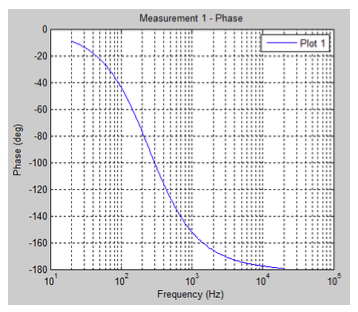

# Module Users Guide

## **SECOND ORDER FILTER SMOOTHED CASCADE**

This module contains several SecondOrderFilterSmoothed modules in series. This can be used to implement a more complicated EQ with only a single module. Under module properties, specify the number of stages of filtering. If the number of stages is set to 1, then this module is equivalent to the SecondOrderFilterSmoothed module. When there are multiple stages, the inspector expands as shown right:**Introduction**

This document is an overview of the audio modules included in Audio Weaver. It is intended for training users how to get the most out of the module library by providing a high-level overview with in depth examples of the modules. Modules build up sophisticated audio functions and systems in a matter of clicks, similar to circuit design or using lego blocks. Further information is available in the detailed HTML documentation provided with the Audio Weaver installer. For more information about a specific module, run Audio Weaver Designer and right click a module to view its “Help” file.

### How to use this guide

This guide is separated into sections as outlined in the table of contents: Chapter 2 starts us off with basic module concepts. It also discusses designer workflow including the module properties window and adjusting parameters. Chapter 3 explains each module folder in the browser, as well as how to pick the correct module as many of the modules are similar. To be clear about the differences between the modules, the end of each section in Chapter 3 includes a table that summarizes the differences between the modules in that folder. Chapter 4 provides in depth examples of common processing techniques and algorithms so the user can have a taste of the capabilities of Audio Weaver. **Usage tips are bolded throughout this guide for ease of reference.**

### Other Audio Weaver Documents

This document describes the Audio Weaver modules and module library. The MATLAB scripting interface is described in [Audio Weaver Matlab API](../../matlab-api.md). Read more about the graphical designer in [Audio Weaver Designer User’s Guide](../../audio-weaver-designer/users-guide.md).



### Module Library Organization

Audio samples are represented as 32-bit values. Several different data types are available:

* **Float32** – standard 32-bit floating-point with 1 sign bit, 8 exponent bits, and 23 mantissa bits.
* **Int32** – Standard twos complement 32-bit integer. The signed values are in the range $$[-2^{31},+(2^{31})]$$. 
* **Fract32** – Fractional representation where values are scaled in the range $$[-1 +1)$$ . This is standard integer representation with an implied scale factor of $$2^{-31}$$ .  

**At the top of the module browser, there is a checkbox to filter based on the different module data types** \(_see above_\). This will filter out modules for hardware that operates on specific sample data type \(fract32 for fixed-point\). The integer module libraries are typically used for control operations and work on both fixed-point and floating-point targets. The type convert module allows any data type to transfer into the others. This may be destructive if converting to a type with lower resolution.

### Module Browser overview

Audio Weaver modules are organized into separate browser folders based on their function. The folders are arranged in alphabetical order titled with a short description of the contents. A search bar can be found directly above the browser window. **To use the search bar, type the name or some common tag for the wanted module and press enter.**

## Basic Module Concepts

Audio Weaver Designer has two modes: Design mode and Tuning mode. In Design mode, design signal flow: by adding modules, making connections, and setting parameters. Tuning mode occurs when the designed layout is run. **The layout can only be run if all modules have valid connections. Run the layout by clicking the play button at the top or by right clicking the canvas and selecting “Build and Run.”** Tuning mode allows for parameter changes only: no changes to the wiring or structure of the block diagram.

### Viewing Module Properties

An audio module gets instantiated when dragged to the canvas from the Module Browser, located on the left hand side of the canvas. **Module** _**arguments**_ **can only be changed in Design mode and affect memory allocation, pins, and wiring. Module** _**variables**_ **are tunable parameters which can be changed in either mode.** Arguments tend to define memory allocation for the module, which can’t be changed during runtime. For example, in an FIR filter, the length of the filter \(number of taps\) is specified as an argument. This length affects memory allocation and as a result setting these arguments is only allowed in Design mode. The FIR coefficients \(a variable\) can change at any time.

After a module is instantiated, change its arguments and variables by right-clicking and selecting “View Properties” \(see above\) which will open up the properties manager at the bottom \(see below\).

In the Matlab code for an FIR module, the module properties maps directly to the function arguments: `M=fir_module(NAME, L)`

### Tunable Variables and Inspectors

Most modules also have an associated _Inspector._ The inspector allows changing of the module’s tunable parameters. Inspectors can be used in Design mode and Tuning mode by double-clicking on a module, or by right-clicking and selecting “Inspector.” The inspector for an FIR filter holds the filter coefficients \(see above\). These parameters can also be changed under the “Variables” tab in the module properties window.

**Save a set of inspectors for later by using inspector groups.** Usually, many inspectors are shown at the same time. To use an inspector group, click ‘Inspector’ on the top menu of Designer. Here inspector group names are managed. The inspector group will save the inspector configuration, including positioning. To reposition an inspector group, simply adjust the inspectors and save the group again with the same name.

### Step Values and Fine Controls

Within the properties window, in the variables tab, many modules will have range attributes, with an optional ‘step’ to determine adjustable resolution for the slider or knob control. The Max and Min values determine the allowable tuning range, and can be adjusted at any time.

Fine controls of the tuning interface relies on a hotkey and click combination. _**Press and hold ctrl**_ **and scroll the mouse wheel on the knob/slider to use fine tuning.** For coarse tuning, hold shift and do the same. For adjusting with mouse clicks, the tuning is controlled by distancing the cursor away from the knob while tuning. This will allow for smaller changes to occur, as more distance is needed to create the angle.

### Viewing Module Variables on Canvas

A useful design feature is to see variable values without having to open all of the inspectors. The original design appears as:

**To show variable values, select “Module Variables” under the View menu.** With variables shown, it appears as:

### Module Status

Each module has an associated runtime status with 4 possible values:

_**Active**_ –The module's processing function is being called. This is the default behavior when a module is first instantiated.

_**Muted**_ – The module's processing function is not called. Instead, all of the output wires attached to the module are filled with zeros.

_**Bypassed**_ –The module's processing function is not called. Instead, the module's input wires are copied directly to its output wires. Some modules use an intelligent generic algorithm which attempts to match up input and output wires of the same size. Other modules implement custom bypass functions.

_**Inactive**_ –The module's processing function is not called and the output wire is untouched. This mode is used almost exclusively for debugging and the output wire is left in an indeterminate state. _**Use with caution!**_

Changing the module status is useful for debugging and making simple changes to the processing at run-time. The module status can be changed in both Design mode and Tuning mode.

**The Module Status can be changed by right-clicking on a module and selecting “Module Status** $$\to$$ **”.** To change the module status of a group, **select multiple modules\(including subsystems\) with drag and select or by pressing ctrl**, and right-click to change the status of all selected modules.

### Wires and Control Signals

Connections between audio modules are called _wires_ and correspond to buffers of data on the target. A wire has the following properties:

* number of channels
* block size
* sample rate
* complexity \(real or complex values\).

**Most modules can operate on an arbitrary number of channels, block size, and sample rate.** The number of channels and block size of a wire is called its _size._ Show wire properties using the View $$\to$$ Wire Types menu item.

#### Pin propagation

Wire information is resolved through a process known as _pin propagation._ The wire information is known from the system input and this information is propagated in module order until it reaches the system output pin. **To trigger pin propagation, click on the Propagate changes button \(**  **\) on the toolbar.** Alternatively, right-click on an empty part of the canvas and select “Redraw” from the context menu. If there is a wiring error and pin propagation is unable to complete, an error sound will play. To find out more details to this error, run the system.

#### Feedback Wires

Feedback occurs when a wire is routed backwards to an input earlier in the system. Feedback wires must be manually specified. \[The manual specification of feedback wires is a limitation of the way that Audio Weaver resolves wiring information. Recall that Audio Weaver starts at the input of the system and then propagates wire size information module-by-module. When it first reaches a feedback point, it will have not yet resolved the size information for that wire and cannot proceed further. As a result, wires must be manually marked as feedback.\] **To make a feedback wire, right click a wire and select “Feedback”.** The wire will turn blue to indicate that it is a feedback wire. For each marked feedback wire, Audio Weaver will create a dedicated buffer to store its data. At system startup, data in the wire is initialized to all zeros. 



If a feedback wire is left _unmarked_, the following error will appear after an attempt to build the system:

To solve this, locate the feedback point in the block diagram and then mark the feedback wire.

**Wire size information must be set using the “Feedback Properties” dialog which is reached by right-clicking on the feedback wire.** The following dialogue box opens, allowing the ability to set the wire’s block size, number of channels, sample rate, data type, and whether or not it is complex. This should match the pins that the wire is connecting.

### Block Size

Each hardware target has a fundamental block size to specify how many samples per block are handled by the real-time audio I/O functions. This is shown on the Server window when the Server launches. \(See below.\)

Layouts can use any multiple of the target’s fundamental blockSize. **Change blockSize at any time by adjusting the hardware input parameters in SYS\_in**. BlockSize information is propagated from the input pin, through the modules, to the output pin. **The blockSize of the output pin is set by pin propagation**. \[The exact behavior is controlled by the checkbox “Validate system output pin” in Layout-&gt;Layout Properties dialog. There is the option of inheriting the output pin size from the wire attached to it \(Validate system output pin unchecked; this is the default\). Or force the wire to match the output pin \(Validate system output pin checked.\)\]

**Interpolator and decimator modules increase or decrease the blockSize**. Some modules also output a single value _control signal_ \(blockSize = 1\). For example, the BlockStatistics module can be configured to output the average value of a block of samples. This data will be one value per block. Control signals are drawn with dashed lines instead of solid lines.

In the example below, the `BlockStatistics1` module computes the RMS level of the signal and a lookup table \(TableInterp1\) turns this into a linear gain to be applied by Scaler1. The signals into and out of the lookup table module are control signals.

### Smoothed modules

Some modules have built in smoothing to prevent pops and clicks during tuning. Smoothing is implemented using a first order IIR filter:

𝑔𝑛=1−𝛼𝑔𝑛−1+𝛼𝑡\[𝑛\]

where 𝑔\[𝑛\] is the instantaneous smoothed gain and _t_\[𝑛\] is the discontinuous target gain. The coefficient controls the smoothing process and depends upon the _smoothingTime_ and the sampling rate. Smoothed modules take additional processing: only use these when tuning is needed during runtime.

The figure below shows a ScalerSmoothed module with a 10 msec time constant. The blue line is the instantaneous gain change from 1.0 to 2.0 and the red curve is the result of smoothing.

Time constants correspond to the familiar definition of time constants used in analog filters:

                                                           𝑔𝑡=𝑒−𝑡/𝜏

Where 𝜏 is the time constant. After 1 time constant has elapsed the gain has decayed by by $$e^{-1}=0.3679$$ . After 3 time constants, the gain has decayed by 95%, because 𝑒−3=0.0498. Thus, it takes several time constants for the gain change to fully take effect and this is reflected in the figure above.

## Modules in Browser Order

Audio Weaver has over 400 different types of modules available. This section organizes the modules into standard types with brief descriptions of each. Our focus will be on how to use the modules, with information provided in tables to determine the differences between similar modules.

### Annotation

In order to keep notes within layouts, Designer supports text boxes, rectangle panels, and arrows. While there are many ways to use these, the standard is to break the layout file into “processing sections” with information on how to tune the design. Annotation is also good for keeping “presets” or “modes” written down on the canvas.

#### Documenting Layouts

To use the annotations, drag them onto the browser. Rescale them and position them accordingly. To edit a text box, double click it and type away on the canvas. To change text size or annotation color/width, check the properties panel for each annotation. In order to keep a standard across the design file, it is recommended to establish a standard annotation \(i.e. get the fonts/size/color set up\) and copy/paste this to keep the style throughout the annotations.  

### Delays

Delay modules hold the input signal for some amount of time using an internal circular buffer. This buffer is instantiated with a size _maxDelay_. At runtime, _currentDelay_ is set to control the time constant for the maxDelay buffer. Most delays update currentDelay instantaneously, but smoothed\(interpolated\) delays are provided if the final product needs a varying delay. 

Delay time type can be int or fract32 samples, int or fract32 milliseconds, or blocks. Input type also varies, meaning some modules take Float audio data, some take Fract32 audio, and some take any type \(including int\). 

For most cases, use Delay msec or Delay samples. Modulated delays come into play for making musical effects.

#### Allpass Delays

Allpass Delays use feedback and feedforward in order to vary the phase of a signal without changing its magnitude or its position in time. Our allpass delays have a coef variable which determines the amount of gain on the feedback/forward mix factor. Allpasses are commonly used in audio effects like chorus, flanger, reverb, and stereo effects. Our allpasses also have the option of outputting the delayed signal \(in cases where time position and phase should change\). 

#### Modulated Delays

Modulated Delays come with a modulation control pin. This control pin feeds the modulation factor _mod_, limited in depth by _modDepth_. A common use case is to provide the mod pin with a random or oscillator source that varies from -1 to 1, allowing the delay to vary. This oscillation reduces harmonic artifacts from feedback delay lines.

#### Delay Taps

Delay Taps create an evenly spaced N amount of delays, which are all interleaved into separate ‘delay channels.’ This is useful for adaptive FIR filters and prediction algorithms due to the consistency in delay length.

#### Low Memory Delays

Since delays tend to be memory intensive, memory efficient options are provided. Modules labelled with a 16 in the name use half of the bits \(compared to 32 bit data\). This results in about half the size on the heap, at a cost of lost amplitude resolution. Our most memory efficient delay for multiple lines is the Delay State Writer16. This uses a circular buffer and multiple pointers instead of multiple buffers in memory, all while using 16-bit resolution.

#### Table of Delay Modules

### DSP Concepts IP

#### Long FIR Filter

This **zero latency FIR** allows for large FIR filters by breaking a large convolution into multiple smaller convolutions. This module supports one channel of audio. **The larger the blockSize, the more efficient the processing**. It expects time domain FIR coefficients, and will automatically convert these into the frequency domain for processing. It is recommended to load the coefficients as a text file using the properties browser to edit the FIR array, rather than typing them in by hand. 

####  WOLA Forward Filterbank \(Analysis\)

This module is used to convert a time domain\(real number\) signal into frequency domain\(complex number\) bins. The output of this module will operate according to this blocksize. From this point on, the data is complex. See the Frequency Domain folder for modules that operate within the complex domain. The first and last bin represent DC, and have no complex data.

#### WOLA Inverse Filterbank \(Synthesis\)

This module will convert a block of frequency bin\(complex number\) data into the time domain\(real number\). This is normally paired with WOLA Forward Filterbank \(Analysis\). Be sure to keep the WOLA Forward and Inverse sizes the same. More information is provided in the Frequency Domain section.

### Dynamics

Dynamic modules de/emphasize the amplitude structure of data. AGC stands for Automatic Gain Control. It differs from standard gain modules in that the gain value changes by itself over time, and the gain can scale loud volumes separate from quiet volumes. This ‘warping’ of the volume information can regulate perceived volume, maximize output, add a safety stage before the signal hits the speakers, remove low volume noise, and manage sound source priority like ducking music behind a dialog track. This section of the guide will cover the modules in the AGC folder: compressor core, envelope followers, limiter core, expander\(and noise gate\), ducker, and agc core. It will then go over building a custom AGC, and finally optimize an AGC to run at reduced computation cycles.

  
The dynamics modules operate with different gain variation speeds and different magnitude reference signals. **All dynamics modules with the suffix \*\*\*Core do not generate audio data, but instead output volume data to be sent to a scaler control pin or an AGC Multiplier.** The following diagrams represent the typical input/output response for various AGC types. 

_**Compressor**_ – reduce the peak dynamic range of a signal

_**Downward expander \(and noise gate\)**_ – reduce small signal levels and behave as noise gates

_**Limiter**_ – restrict peak signal levels to avoid digital clipping _\(limiters generally have a horizontal or flat slope, which means high ratio\)_

_**Ducker**_ ****– use a trigger signal to determine when to boost or reduce gain of another signal.

_**AGC Core**_– adjust the gain to keep the signal within a specified RMS range

#### Compressors

A compressor reduces the signal’s dynamic range, meaning that it lowers the level of loud signals and boosts quiet ones, reducing the difference between loud and soft signals. Make-up gain is usually applied after for increasing the perceived loudness. This can be used for scenarios when keeping the overall volume low is desired but hearing small details is still important, such as night-time movie watching. The behavior of the compressor is best understood by looking at its input-output response:

Above the threshold the compressor reduces the signal level; below the threshold the compressor increases the signal level \(it’s expanding the system\). This brings all output signals closer to the threshold level and reduces the overall dynamic range. The AGCCompressorCore module is wired the same way as the limiter module, receiving its input from an Abs or MaxAbs module and outputting to a multiplier, as shown below:

#### Envelope Modulation

Envelope modulators control the impact that relative peaks have. The Attack Release module uses attackTimeInitial and attackTimeFinal to smooth peaks. The Attack Decay Sustain Release is similar, but also includes 2 stages in between the attack and release. Decay lowers the level into a hold that is based on the sustain level. After this hold ends, the release occurs.

#### Limiters

The AGCLimiterCore module is parameterized by its threshold, ratio, gain, knee depth, attack time, and decay time. The AGCLimiterCore module computes the time varying gain.

Take the absolute value of the signal so that the AGCLimiterCore module treats positive and negative signals equally. The first pin on the AGCMultiplier is the gain to apply and the second input is the audio signal itself.

When the input is below the threshold the line has a slope of 1 indicating that the signal level is unchanged. Above the threshold the slope drops indicating that the output level will be reduced compared to the input level. Limiters have a parameter called the “ratio” referring to the reciprocal slope of the gain ratio **above the threshold**. A high ratio provides hard limiting, close to 1 provides gentle limiting.

The limiter applies a piecewise function to determine its gain: at a specified threshold, the slope changes. The transition between sections is smoothed by a connecting polynomial section, often referred to as the “knee”. The knee provides a gentle polynomial interpolation between the threshold and the requested slope. The kneeDepth parameter controls the extent of the polynomial section. The polynomial starts at threshold-kneeDepth and ends at threshold+kneeDepth.

The speed with which a limiter responds to an increase in sound level is described by its “attack time”. The lower the attack time, the faster the limiter will respond to the sound level rising above its threshold. Similarly, decay \(or release\) time describes the speed with which the limiter’s effect is relaxed after the sound level drops back under its threshold. The time behavior of the dynamics processors is implemented with first order IIR smoothers with different attack and decay coefficients. The above image shows example attack and decay curves.

#### Downward Expander

The DownwardExpanderCore module is also a limiter with a piecewise gain, but its piecewise function is different. Whereas most limiters use a slope of 1 below a threshold and a reduced slope above it, this module features a very steep slope below its threshold and a slope of 1 above it. Rather than reducing the level of loud signals, this reduces the level of quiet signals. The DownwardExpanderCore module’s response behavior is shown below:

One use of this module is for filtering out low-level noise while retaining a louder signal. This is very useful for eliminating “hiss,” low level background noise in a signal. Like most dynamic processing modules, the DownwardExpanderCore is designed to take its input from the MaxAbs module and output its gain as an input to the AGCMultiplier module. Shown below is an example of a noise gate which eliminates low level signals.

#### AGC Core

This module has a slowly varying volume control which transfers the **input signal** level towards a targetLevel, a specified RMS level. The input RMS is smoothed via the smoothing time variable. This allows the gain to change gradually. The gain is limited to the range \[-maxAttenuation and maxGain\]. The ratio control determines the speed of the gain change for all signals above the **activation Threshold**. When the level of the input signal falls below **activationThreshold**, the AGCCore holds the last gain setting. If the enableRecovery checkbox is checked, the gain will slowly return to 0 dB when not activated. The rate of return is governed by recoveryRate.

The Audio Weaver Filters folder lists over 60 filters. They have been broken down according to user needs, with the folder labels Adaptive, Calculated Coeffs, Controllable, High Precision, Raw Coeffs, and list the most commonly used filters. The Adaptive folder contains the LMS module, an adaptive filter with tracking capabilities. For those users less experienced with designing filters, the Calculated Coeffs filters take in frequency information, Q, Gain, and type, similar to tuning a filter in a DAW. Users with more DSP background can use the Raw Coeffs filters to tune filters with mathematical information. The most frequently used filters are the ButterworthFilter \(highpass, lowpass, allpass\), SecondOrderFilterSmoothed, with 20 different filter types, and the SecondOrderFilterSmoothedCascade: multiple 2nd order filters in series.

#### Adaptive \(LMS\)

The LMS filter predicts the FIR of a system whose transfer function is not given. It’s input and output adapt or “predict” what the system response is. Filter weights are updated over time based on mu speed, higher numbers being the faster update speed. Higher numtaps give higher chance to converge with the optimum filter weight\(meaning less error\). The error can be tracked realtime with the errorSignal output. The module comes with an option to output the predicted “coeffs”. The following system shows white noise being ran through a 10 point FIR. The LMS will predict the FIR coefficients, and sinks will display the error and coeff function.

This sink shows the coeff prediction.

The Error2 display shows a value of -125 dB, which means that our signal is very accurate. The sink to the right displays this as well.

#### Filters with Calculated Coeffs

Audio Weaver has a several filters with built-in design equations. These filters are implemented using Biquad or BiquadCascade modules behind the scenes and the filter coefficients are computed by the design equations based on high-level filter specifications. The design equations use the sample rate on the input wire when computing coefficients. The following sections describe each of the calculated coeffs modules.

**AllPass Pair**

The Allpass Pair module creates a pair of allpass filters with the special property that their sum and difference form a doubly complementary highpass-lowpass filter pair. When used in conjunction with the Sum and Difference module \(available in the Math folder\) this Allpass Pair module can be used to construct more complex structures such as N-way crossovers and filter banks. The following design mixes one channel of white noise into two “bands” of white noise using this technique. The sink is an FFT showing the frequency response of the signal.

**Audio Weighting Filters**

The AudioWeighting module is located under Filters/Calculated Coeffs This module applies different standard audio weighting to a signal. The available weightings are selectable from the inspector and include: A, B, C, and D-weighting, as well as ITU468, LeqM, and ITU 1770. The WeightingFilter is used for noise measurements and broadcast loudness applications. The following frequency responses display each weighting’s filter.

A crossover is a special type of filter that splits a signal into multiple bands, while sustaining a total gain of 0 dB. It will boost the level of one frequency band as the other drops to compensate to 0 dB gain. This behavior is shown in the figure below.

Crossovers are used in loudspeaker applications to separate signals into different frequency bands to be output via woofers, mid-range, and tweeter speakers. They are implemented using ButterworthFilter \(odd-order\) or Linkwtiz-Riley \(even-order\) filters. Crossover filters can be made manually using individual filters. By cascading filters and applying an allpass filter during other lane filter stages \(shown below\), more crossover points can be added and the signal split into more frequency bands, while retaining the unity gain property.

Alternatively, use the crossover module which contains all of the needed filters. The Crossover Filter module allows the user to set the type of filter, number of output bands, and filter order, specified in the module’s properties. Crossovers are used for separating different frequency bands of a signal. The example below demonstrates a crossover module being used to split a signal into a high band above 250 Hz and a low band below 250 Hz. The sum of the levels of the two bands is always 0 dB. As the input frequency changes near 250 Hz, one channel’s level drops and the other smoothly increases to compensate to 0 dB.

This is the same behavior as using two ButterworthFilter filters:

The Crossover Filter module allows the configuration of 2 or more output channels. The module will then be drawn with 3 output pins. The top pin is the low frequency; the center pin is the mid-range, and the bottom pin is the high frequencies. The inspector shows two cutoff frequencies: between the low and mid-range; and between the mid-range and high frequencies. For example, if implementing a 3-way loudspeaker crossover, configure it as:

**Emphasis Filter**

The EmphasisFilter ****module implements a pre-emphasis or de-emphasis, used for noise reduction. The cutoff frequency is specified by the time constant tau, which is set in the inspector. The examples below show emphasis and de-emphasis filters with 75 microsecond time contants.

**GRAPHIC EQS**

The GraphicEQ module splits up a signal into different bands and independently attenuates or amplifies each band. Under module names and arguments, the number of bands and the order of each filter are set. The bands are logarithmically spaced across the Nyquist frequency of the input signal. Each band’s gain can be set in the inspector. This EQ can automatically adjust its bands based on the lowEdge and highEdge arguments. After setting this to the desirable range, change the resetCenterFreqs flag to ‘1’. This will recalculate the bands, throwing away all slider data \(so change the bands before tuning\). 

**TIP – The more bands there are, the higher the filter order should be to better isolate the bands.** 

The GraphicEQBand module applies a gain to a specific frequency band. This module is the building block of the GraphicEQ. In the inspector, the gain, lower edge frequency and upper edge frequency are specified. The filter order is specified from by the module properties. This module is not typically used directly; use GraphicEQ instead.

**Hilbert**

The Hilbert module can be considered a filter which simply shifts phases of all frequency components of its input by -n/2 radians. This operates on complex \(real and imaginary\) data input and output.

**Pink Filter**

The PinkFilter is a low pass filter with a -3dB/octave slope. It is used to generate pink noise from white noise.

**Three Band Tone Control**

The ThreeBandToneControl module is similar to the GraphicEQ except there are only 3 bands. The low, mid, and high bands’ middle frequency and gain are set in the inspector. The ThreeBandToneControl module is very efficient and uses first order shelf filters for the low and high frequency gain adjustments. The middle band is a simple gain and the net result is that the ThreeBandToneControl takes as much computation as a single BiquadSmoothed filter.

#### Controllable Filters

The filters presented thus far get their high level design parameters from the inspectors. At times, it is useful to have a filter whose parameters are controlled by other signals or modules in the layout, such as a source or a hardware input pin. This is called a _controllable filter_. The controllable filters folder includes a first and second order filter, along with a lowpass filter, which all have control pins for their frequency. The second order filter can also enable more pins, like Q and Gain depending on the module arguments.

**First Order Filter Control**

The FOFControl module implements a first order lowpass or highpass filter. The control pin specifies the cutoff frequency of the filter and the design equations are executed every block allowing very rapid updates. 

#### LPF Control

The LPF Control module is a time varying first order low pass with smoothly varying frequency based on the input pin.

**Second Order Filter Control**

The SOFControl filter is built upon the SecondOrderFilterSmoothed ****module. It has a fixed filterType which is specified on the inspector. Under module arguments, specify which of the filter design parameters should be obtained via input pins:

Parameters which aren’t specified by input pins are specified via the variables and properties tab. The SOFControl module uses deferred processing to compute the filter coefficients. That is, the design equation is not executed every block. Rather, when the control data on the input pin changes, the module sets a bit in its instance structure which causes the design function to be called from non-real-time code. This reduces the peak CPU load at the expense of having a slower update rate. In typical applications, the module will update every few 10s of milliseconds. If updating needs to happen more quickly, then use the FOFControl module or the ParamSetmodule coupled with a SecondOrderFilterSmoothed module.

A very common use of the SOFControl module is within a perceptual volume control. As the volume of the system is reduced, overall spectral balance should be maintained. Due to the sensitivity of the human auditory system, low frequencies and high frequencies appear to drop off more quickly than mid frequencies. Thus, to maintain the overall spectral balance, boost low and high frequencies as the volume level decreases. The VolumeControl module accomplishes this with a fixed boost table. For finer control over the boost, use a TableInterp module together with a SOFControl filter as shown below. The control signal “Volume” specifies the listening level and ranges from 0 \(loud\) to -80 \(soft\). The lookup tables convert the Volume setting into low frequency and high frequency boosts which are applied using the SOFControl module. The low frequency SOFControl module implements a peaking filter at 40 Hz and the gain is taken from the control pin. The high frequency SOFControl module implements a high shelf in which the gain is taken from the control pin.

#### Filters with Raw COEFFS

Audio Weaver contains several filter types which operate on raw coefficients. These filters are for expert users who understand DSP and know how to calculate the filter coefficients. \[Matlab is often used by expert Audio Weaver users to compute coefficients and then update them in the block diagram.\] There are two types of filters – Finite Impulse Response \(FIR\) and Infinite Impulse Response \(IIR\). Although Audio Weaver supports both types of filters, the majority of the filters used in audio applications are IIR due to their computational efficiency.

The most basic IIR filter is the Biquad and it is implemented with the difference equation:   

                                             𝑎0𝑦𝑛=𝑏0𝑥𝑛+𝑏1𝑥𝑛−1+𝑏2𝑥𝑛−2−𝑎1𝑦𝑛−1−𝑎2𝑦𝑛−2

There are 5 coefficients that the user must set: $$b_0$$, $$b_1$$, $$b_2$$, $$a_1$$ , and $$a_2$$ \( $$a_0$$ is always assumed to be 1\). Audio Weaver does not check for stability and care must be used when computing the filter coefficients. There are several variants of Biquad filters. The simples – Biquad – has a single stage and implements the different equation shown above. BiquadCascade implements N stages of filtering with each channel using the same coefficients. BiquadNCascade implements N stages with each channel have its own set of coefficients. Finally, BiquadSmoothed implements a single Biquad stage with coefficient smoothing on a block-by-block basis.

#### High Precisions Filters

Audio Weaver contains a variety of Biquad filters for equalizing audio. Some filters require raw coefficients \(such as Biquad or BiquadCascade\) while others contain built-in design equals \(such as the SecondOrderFilter or ButterworthFilter\). These filters are implemented using a Direct Form 2 \(DF2\) structure:

All Biquad filters including the DF2 have 5 coefficients. The advantage of the DF2 structure is that it requires only 2 state variables per filter as compared to 4 state variables for the DF1 structure.

These Biquad filters are implemented using floating-point arithmetic and are generally fine for most audio applications. Floating-point arithmetic, though, is not a panacea for all numerical issues and these filters can still suffer from quantization noise. The noise manifests itself as low-level noise correlated with the level of the input signal. Quantization noise is exacerbated by high sampling rates \(96 kHz and above\) and by having poles very close to the unit circle and this usually arises when making very low frequency EQ changes.

To solve these noise issues Audio Weaver includes a High Precision filter modules. These modules use floating-point input and output data and are compatible with the other floating-point modules. Internally the high precision filters use a proprietary DSP Concepts filter structure which significantly reduces quantization noise. The filters are also efficient with a typical Biquad requiring 7 MAC operations vs the 5 needed in a DF2 Biquad.

The High Precision modules are designed to be drop in replacements for the non-high precision filters. That way, numerical problems can be resolved by replacing the offending filter with its high precision version.

The crossover filter module \(XoverNway\) is actually a subsystem consisting of multiple individual modules. The module properties give the option to construct the crossover using standard Biquads or high precision Biquads:

The graphic equalizer gives the option of using standard precision or high precision filters.

Here is an example of the benefits of the high precision filter. The system in the example has a peaking filter at 20 Hz with a gain of 6 dB and a Q of 2 and operates at a 48 kHz sample rate. The total harmonic distortion and noise \(THD+N\) for different input frequencies is plotted below. First for standard Biquad filters.

And now with a high precision filter, notice that the noise floor is reduced significantly – by up to 90 dB at low frequencies.

For the interested reader, this measurement is performed by passing sine waves of different frequencies through the filter. Apply a notch filter at the output which removes the sine wave and then measure the RMS energy in the residual. This residual energy equals the THD+N. The measurement is repeated for many different frequencies and the plot reflects the measured THD+N at each input frequency.

#### Common Filter Modules

The following filters are found as modules with no folder in the Filters directory. This is because they are the most common types of filters, which cover most general cases of filtering needs.

**Butterworthfilter**

This module implements lowpass, highpass, or allpass filters using a Butterworth design. The filters have a gain of 0 dB in the passband and are then monotonically decreasing in the stopband. The filter order is specified under module properties and ranges from 1st order \(6dB/octave\) to 10th order \(60dB/octave\). The filter order can only be changed in Design mode. Specify the filter type on the inspector \(lowpass, highpass, or allpass\) as well as the cutoff frequency, in Hz. Since these parameters are on the inspector, the filter type and cutoff frequency can be changed at run-time. Unfortunately, the ButterworthFilter does not have coefficient smoothing and there may be discontinuities when coefficients are updated.

**SecondOrderFilterSmoothed**

  
This module is the most frequently used filter among all of the Audio Weaver modules. It implements a 2nd order Biquad filter and includes design equations for 20 different filter types. The filter type and high-level design parameters \(frequency, gain, and Q\) can be changed at run-time using the inspector:

Depending on the filter type, some parameters are not used. See the table below for the filter types available and which control parameters are applicable.

**Pass Through**

filterType = 0

Applicable parameters: none.

Biquad coefficients are set to b0=1, b1=0, b2=0, a1=0, and a2=0. The filter runs and consumes processing but the output equals the input.

**Gain**

filterType = 1

Applicable parameters: gain

A simple gain with coefficients set to b0=undb20\(gain\), b1=0, b2=0, a1=0, and a2=0

**1st order Butterworth lowpass filter**

filterType = 2

Applicable parameters: freq

**2nd order Butterworth lowpass**

filterType = 3

Applicable parameters: freq

**1st order Butterworth highpass**

filterType = 4

Applicable parameters: freq

**2nd order Butterworth highpass**

filterType = 5

Applicable parameters: freq

**1st order allpass**

filterType = 6

Applicable parameters: freq

**2nd order allpass**

filterType = 7

Applicable parameters: freq and Q

**2nd order low shelf**

filterType = 8

Applicable parameters: freq and gain

Use as a low frequency tone control

**2nd order low shelf with Q**

filterType = 9

Applicable parameters: freq, gain, and Q

**2nd order high shelf**

filterType = 10

Applicable parameters: freq and gain

Use as a high frequency tone control

**2nd order high shelf with Q**

filterType = 11

Applicable parameters: freq, gain, and Q

**2nd order peaking / parametric**

filterType = 12

Applicable parameters: freq, gain, and Q

Commonly used for generic equalization since it has controllable frequency, gain, and Q settings.

**2nd order notch**

filterType = 13

Applicable parameters: freq and Q

**2nd order bandpass filter**

filterType = 14

Applicable parameters: freq and Q

**1st order Bessel lowpass filter**

filterType = 15

Applicable parameters: freq

**1st order Bessel highpass filter**

filterType = 16

Applicable parameters: freq

**1st order asymmetrical low shelf**

filterType = 17

Applicable parameters: freq and gain

**1st order asymmetrical high shelf**

filterType = 18

Applicable parameters: freq and gain

**1st order symmetrical low shelf**

filterType = 19

Applicable parameters: freq and gain

**1st order symmetrical high shelf**

filterType = 20

Applicable parameters: freq and gain


  
The Butterworth filter from SecondOrderFilterSmoothed is the same as the ButterworthFilter ****module of equal filter order. However, SecondOrderFilterSmoothed only implements 1st and 2nd order Butterworth filters. **Higher order Butterworth filters can only be implemented by the ButterworthFilter module.**

The SecondOrderFilterSmoothed implementation of the first order Butterworth filter is more computationally efficient than the ButterworthFilter ****module.

Low/high shelf filter and low/high shelf filter Q are identical if Q is set to 0.707 \($$\sqrt{0.5}$$ \).


**Second Order Filter Smoothed Cascade**

This module contains several SecondOrderFilterSmoothed modules in series. This can be used to implement a more complicated EQ with only a single module. Under module properties, specify the number of stages of filtering. If the number of stages is set to 1, then this module is equivalent to the SecondOrderFilterSmoothed module. When there are multiple stages, the inspector expands as shown below:

#### Table of Filter Modules

### Frequency Domain

#### Frequency Domain Modules

Modules for processing signals in the frequency domain are found in the Frequency Domain folder. Frequency domain processing yields novels solutions to audio processing problems and may also lead to more efficient implementations. This section describes the main concepts behind frequency domain processing, then Filterbank Processing describes more sophisticated processing using weighted-overlap short-term Fourier transform filterbanks.

**Complex Data Support**

Audio Weaver natively supports complex data within wire buffers. The data is stored in an interleaved fashion:

                                                ****real\[0\], imag\[0\], real\[1\], imag\[1\], real\[2\], etc

For multichannel data the interleaving of real and complex data happens at the lowest level. For example, interleaved stereo data is stored as:

             L\_real\[0\], L\_imag\[0\], R\_real\[0\], R\_imag\[0\], L\_real\[1\], L\_imag\[1\], R\_real\[1\], R\_imag\[1\], etc.

Two modules are provided to convert between real and complex data

The system below essentially does nothing except convert two mono signals into complex and then back again. If view wire info is enabled, \(“View $$\to$$ Data type”\) it will mark complex wires with a “C”.

**Transform Modules**

Audio Weaver provides 3 different transform modules for converting between the time and frequency domains.

The complex FFT takes a complex N-point input and generates a complex N-point output. The module is configured on the module properties as either a forward or inverse transform.

The Fft and Ifft modules are designed to operate on real signals. The Fft modules takes an N-point real input and generates an N/2+1 point complex output. The output signal contains frequency samples from DC \(ω=0\) all the way up to and including the Nyquist frequency \(ω=π\). A property of the real FFT is that the samples at DC and Nyquist contain real data only and the imaginary components are guaranteed to be zero. _These samples are still stored as complex values but the imaginary component is zero._ The output of the real FFT will therefore consist of the samples:

X\[0\]                        real

X\[1\]                        complex

X\[2\]                        complex

…

X\[N/2-1\]               complex

X\[N/2\]                   real

The Ifft takes N/2+1 complex samples and returns a real N-point sequence. The Ifft ignores the imaginary component of the DC and Nyquist samples.

**Windowing**

Before an FFT is computed the signal is typically windowed to prevent edge effects from influencing the results. There are 3 modules which perform windowing.

The windowing modules are for advanced users who use Matlab to compute window coefficients.

The Window module can compute a large number of different window functions. Under module properties, specify the length of the window to apply. Then on the inspector, specify the starting and ending indexes of the window as well as the window type and an optional amplitude.

Allowing the ability to change the starting and ending indexes of the window is more flexibility than is usually needed.

The WindowOverlap module has an internal FIFO that buffers up data into overlapping blocks. For example, a 64-sample input block size with a 50% overlap turns into 128 sample blocks, to be windowed. Essentially, the WindowOverlap module contains a Rebuffermodule combined with a Window module. The module has an internal array of window coefficients. This array is initialized to a Hamming window \(raised cosine\) at instantiation time. To change the window coefficients use the Matlab scripts.

The WindowAlias module applies a window followed by time aliasing the sequence to a shorter length. This module is used in the analysis back of short-term Fourier transform based filterbanks. 

The OverlapAdd module performs the opposite of the Rebuffer module. The module has a large input block size and a smaller output block size. The module contains an internal buffer equal to the input block size. The module takes the input data, adds it to the internal buffer, and then shifts out one block of output data. The data in the internal buffer is also left shifted and the leading samples are filled with zeros. The OverlapAdd module finds use in fast convolution algorithms.

The RepWinOverlap module is for advanced users building synthesis filterbanks. The module replicates a signal N times, applies a window, and then performs overlap add.

The ZeroPad module inserts zeros at the end of a signal. Specify the length of the output buffer under module properties. If the output is longer than the input then the signal is zero padded. If the output is shorter than the input then the signal is truncated.

The ZeroPad module inserts zeros at the end of a signal. Specify the length of the output buffer under module properties. If the output is longer than the input then the signal is zero padded. If the output is shorter than the input then the signal is truncated.

**Complex Math**

The frequency domain modules have a large number of modules which operate on complex data. The modules here are listed without detailed explanations because the underlying functions are basic and easily understood.

The modules listed above operate on complex data only. A few of the other Audio Weaver modules found outside the Frequency Domain folder are also able to operate on complex data type:

BlockConcatenate                   Combines blocks of complex data

BlockDelay                        Delays by multiples of the block size

BlockExtract                     Extracts a portion of the complex data

BlockFlip                           Frequency flips data

Deinterleave                    Pulls apart multichannel complex signals into individual mono complex signals

Demultiplexor                 Outputs complex data to one output pin; zeros the rest

Interleave                 Combines multiple mono complex signals into a single multichannel complex signal

Multiplexor                               Selects one of N complex signals

ShiftSamples                            Left or right shifts complex signals

Adder                                          Adds two complex signals

ClipAsym                                    Clips the real and imaginary components

Invert                                    Multiplies by + or -1. Set smoothingTime = 0.

Mixer                                    Mixers together complex signals

MixerDense                        - Mixers together complex signals

MuteSmoothed                  Multiplies by +1 or 0. Set smoothingTime = 0.

ScaleOffset                        Scale both the real and imaginary components and adds an offset

ScalerDB                           dB gain without smoothing

Scaler                                Linear gain without smoothing

Subtract                           Subtracts two complex signals

SumDiff                           Adds and subtracts complex signals

WhiteNoise                    Generates uncorrelated noise in both real and imaginary components

ScalerDBControl           dB gain with gain value taken from a control pin. Set smoothingTime = 0.

ScalerControl                Linear gain with the gain value taken from a control pin. Set smoothingTime = 0.

 

