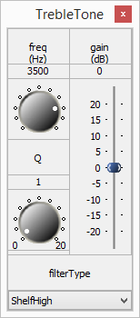
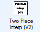

# Examples

### Speaker Spreader

Below is an example of a speaker spreader system and a discussion of how it is built up from individual modules.

A speaker spreader widens the image of a stereo signal. To accomplish this, some mathematical modules are used.

First, a Deinterleaver module must be used to separate the channels. The separate left and right channels are then fed into a SumDiff module. The SumDiff module takes two inputs and outputs both half their sum and half their difference, as shown below.

If Inputs 1 and 2 are the left and right channels, then Outputs 1 and 2 have special properties. Output 1 \(the sum\) is the portion of the signal that forms the center image, while Output 2 \(the difference\) is the stereo or wide portion[\[7\]](). By boosting or reducing these, stereo image width increases and decreases. The Scaler modules that follow will be used to control the system in real-time \(hence the smoothing\).

After scaling, the signals are then passed through another SumDiff module to help us return to proper Left and Right channels, shown below.

Mathematically, the signals are now half the level they started out as, so after the Interleaver module recombines the channels, a Scaler module applies a linear gain of 2.

The Multiplexor module is used to show the difference the speaker spreader makes. By selecting and deselecting its index, the module toggles between the spreader and the unprocessed signal in real-time. Increasing the gain on the difference channel should spread the sound image.

### Loudspeaker Processing - Stereo

Below is an example of a system for loudspeaker processing, followed by a discussion of its components.

The BassTone and TrebleTone modules are SecondOrderFilterSmoothed modules achieve bass and treble boost, respectively. The bass boost SOF module is set to ShelfLow with a frequency of 200Hz, and the treble boost SOF module is set to ShelfHigh at a frequency of 3.5 kHz. This way, they can be used to separately control the gains of the bass and treble frequencies.

 

The Volume module is then used to set the volume for the system once bass and treble are set to their desired levels.

The next SecondOrderFilterCascade module is the speaker EQ. It has four separate filter stages. These filters are set to bypass but they can be configured based on the characteristic of the speaker.

The final portion of the system implements speaker protection using a limiter.

In this design, the MaxAbs modules takes the left and right channels, computes the absolute value, and then chooses the last of the left and right channels. The output of the MaxAbs module represents the loudest channel in the system. The AGCLimiterCore module then computes a time varying gain which is used to restriction the signal level. The AGCLimiterCore has the standard controls of threshold, attackTime, decayTime, and an optional soft knee. The output of the AGCLimiterCore module is a time varying gain and this multiplies the original left and right channel. The DelayMsec module is a “look ahead delay” and allows the limiter to adjust its gain in advance of sharp signal transients. The look ahead time in this example is set to 2 msec.

In the design above, the left and right channels are limited simultaneously based on the signal level in the louder channel. The advantage to this design is that it preserves the stereo image of the signal. If the goal is to maximize the output SPL level then use independent limiters on the left and right channels as shown below:

The AGCLimiterCore module has time constants and it is still possible for the module to miss sudden transients which could cause the output level to exceed 1.0. Use a SoftClip module as shown below to ensure that the output never exceeds 1.0.

The SoftClip module acts as a point nonlinearity. Signal values below the threshold are unaffected. Values above the threshold are scaled do and will never exceed 1.0.

### Oversampling Peak Detection

A digital audio signal contains samples of the underlying analog wave form. Although the digital samples may form an accurate representation of the signal, the digital samples may miss some behavior of the analog signal _between samples values._ This can usually be ignored but it can be important if the signal is to be output to a DAC. Consider the waveform shown below.

If only the digital sample values are seen, the true peak is missed and it is possible for this signal to clip when converted to analog. The analog signal is exceeding the allowable range, and can harm the playback system.

In order to prevent this, first see what is happening between samples. This can be accomplished using oversampling together with a RunningMinMax module. Oversampling is used in the layout below by factors of 2 and 4 using the FIRInterpolator module. The RunningMinMax module is used to compare the sample value in the original 44.1 kHz waveform against the peak found in the 88.2 kHz and 176.4 kHz oversampled signals.

Missing the peak only occurs if there is high frequency content in the signal; something with cymbals is ideal. In our test, a piece of processed pop music was played. The peak value in the 44.1 kHz signal is 0.999969 – basically full scale. The true peak is actually 1.00489, or 0.042 dB. _To prevent digital clipping of the analog waveform reduce the signal level by this amount or set the limiter threshold 0.042 dB lower._

### Automatic Gain Control

Automatic Gain Controls or AGC are commonly found in volume leveling and microphone applications. The function of an AGC is to intelligently adjust the level of a signal and manipulate the dynamic range of a signal. This section provides several different AGC designs that are applicable in a wide range of application.

#### Simple AGC

The most basic system utilizes the AGCCore module which was introduced in the Dynamics section. This modules computes the smoothed RMS level of the signal and steers the gain of the signal towards the specified targetLevel. In this example, the targetLevel is set to -20 dB and use a smoothingTime of 500 msec for slow and steady adjustment. The ratio is set to 100 indicating that the AGC will adjust the level of the signal so that the output RMS level is close to -20 dB.

#### Perceptual AGC

A natural step is to have the AGC take into account the perceived loudness of the signal. This is easily done by adding an equalizer in the side chain. A natural choice would be the AudioWeighting module found in the Filters folder. The ITU468 filter setting is designed to match the loudness perception of the human auditory system.

The AudioWeighting module can also do standard weightings like A-weighting, C-weighting, etc.

#### Two Stage AGC

The AGCCore module is designed to operate slowly on audio signals; it is analogous to turning the volume setting on the sound system. It works well over long periods of time but over shorter intervals it may let some loud peaks through. To prevent this reduce the smoothingTime of the AGCCore but this is not a good solution since artifacts will be heard.

A better solution is to add a second stage of processing – a limiter – with a faster time constant. The limiter is configured to have a threshold of -15 dB and a ratio of 2. The time constants are faster with an attackTime of 30 msec and a release time of 200 msec. When there is a sudden loud peak the limiter kicks in until the AGC has had time to make gross level changes.

#### Three Stage AGC

The limiter in the two stage design catches _most peaks._ The AGCCore module can add gain to the signal and when a loud passage follows the signal level after the AGCLimiter core may still exceed 0 dB and clip. To prevent this, add a final fast limiter stage and a soft clipper. These two modules only act on the sudden peaks and prevent clipping of the output.

#### Multiband AGC

All of the AGCs thus far are single band and operate on the entire signal at each stage. This can lead to pumping in which a loud low frequency signal \(like a drum beat\) can cause the entire signal to reduce in level. Instead, it is better to treat the low and high frequencies separately especially since there is so much energy in the low frequency. This brings us to a multiband approach in which the signal is split into two components using a crossover and treat the high and low frequencies individually.

The three stage AGC above will be used as a starting point. For the multiband approach, the Limiter\_Slow subsystem is capable of operating in two bands. The crossover module and two separate limiters are shown below. The crossover frequency is set to 200 Hz which does a good job separating out drum beats. The limiters are tuned so that the one operating on low frequencies has slower time constants then the one at higher frequencies.

#### Discrete Dynamics Processors

So far, dynamics processors have been built using several “core” modules: AGCLimiterCore, AGCCompressorCore, and DownwardExpanderCore. For more control, it is possible to build these “core” modules out of several discrete modules. We’ll model the AGCLimiterCore and similar approaches can be used for other modules. The block diagram is shown below:

The main steps are:

1. As with the limiter module, the Abs or \(MaxAbs for stereo\) module is used to find the maximum level of the signal in real-time. This maximum level is fed into the AGCAttackRelease module, which creates an envelope detector with specified attack and release times, in the same way that the attack and release times can be set in the limiter module.
2. The Db20 module converts a linear input to decibels. The gain calculation will be performed in dB units, and then the Undb20 module will be used to convert back to linear units before the computed gain is used to modify the audio.
3. The TwoPieceInterp module applies a piecewise function made of two lines with different slopes, connected by a smoothing polynomial \(the knee\). With a slope of 1 below the threshold and less than 1 above it, this will allow the system to reduce the level of the signal once it crosses the threshold, just like the limiter module.
4. This computed value is subtracted from the original to produce the correct gain \(this may sound counterintuitive, but remember that as the level _increases_, a _larger_ amount must be _subtracted_ from the gain to produce a limiting effect\).
5. Finally, the computed gain in dB must be converted back to linear units with the Undb20 module and fed into the AGCMultiplier module.

The modules used are:

|  | Icon | Name | Description |
| :--- | :--- | :--- | :--- |
|  |  | AGCAttackRelease | Creates envelope detector with specified attack and release times |
|  |  | Db20 | Converts from linear units to dB |
|  |  | TwoPieceInterp | Applies two-piece piecewise function |
|  |  | TableInterp | Applies function from specified table interpolation |
|  |  | Subtract | Dynamically determines a gain based on a piecewise function in order to limit a signal |
|  |  | Undb20 | Converts from dB to linear units |

With the TwoPieceInterp module specify the slow of the gain curve above and below the threshold. One simple change can expand the functionality even further. Using a TableInterp module instead of the TwoPieceInterp allows the user to visually map out exactly the desired behavior:

Use the TableInterp module to “draw” the input / output gain curve as shown below:

This allows for the building of highly custom dynamics processors with designed behaviors such as expansion, compression, and limiting occurring over different gain ranges.

#### Computationally Efficient Dynamics Processors

With the exception of the AGCCore module, the rest of the dynamics processors operate on a sample-by-sample basis and require complex mathematical calculations \(dB, undB, etc.\). Dynamics processors can easily consume a large amount of processing, but Audio Weaver allows for a much more efficient variation. This general technique can be used to improve the efficiency of many types of algorithms.

The main problem with the dynamics processors is that the gain calculation occurs every sample. If the time constants are on the order of several milliseconds then there is really no need to update the gains this quickly. Instead, it is possible to perform the gain calculation at a decimated rate and this is achieved using the SubblockStatistics module.

The decimation factor is specified on the module properties as the subblockSize argument:

The decimation factor must be chosen so that it evenly divides the input blockSize. Next, specify on the inspector exactly which statistic is computed per subblock. The choice mirrors the ones available in the BlockStatisticsModule.

For a limiter, choose the MaxAbs statistic. Suppose that the input blockSize is 32 samples and the decimation factor is 8. The output blockSize will then be 4 samples and each sample will contain the MaxAbs value of the corresponding set of 8 input samples. A limiter built using the SubblockStatistics module is shown below. The arrangement is more efficient since the limiter is only doing 1/8 as much work as before. The Multiplier module is no longer being used. The Multiplier module requires that the blockSizes of the gain and signal pins be the same. Instead, the ScalerV2 module is used which can accept subsampled gain values.

If the signal can be decimated for the limiter even further, considering using a BlockStatistics module instead of a SubblockStatistics. This is shown below and the gain calculations are done with a blockSize of 1 sample. These signals are referred to as control signals and are described in the Logic section.

### Microphone De-essing

A common complaint of microphone recordings is that the sibilant sounds \(“s”, “z”, and “sh”\) are too prominent and harsh. This is because the microphone is very close to the talker and picks up more of these high frequencies. The problem area is in the range from 4 kHz to 10 kHz and depends on the talker. A fairly common frequency to concentrate on is around 8 kHz. An overview of the problem and approaches can be found at [http://en.wikipedia.org/wiki/De-essing](http://en.wikipedia.org/wiki/De-essing).

#### Broadband De-Essing

In the broadband approach the entire signal level is reduced when harsh high frequencies are detected. A standard AGCLimiterCore can be used with a sidechain EQ which accentuates the 8 kHz problem frequencies.

The downside of this approach is that when sibilants are detected the gain of the entire signal is reduced; this is not ideal.

#### Split Band De-Essing

One improvement is to use a crossover and treat sibilant and non-sibilant frequencies separately. A 2-way crossover with a cutoff frequency of 6 kHz is used. A limiter then acts on the high frequency signals and reduces the gain, if necessary; the low frequencies are untouched.

#### Dynamic Equalizing De-Essing

It is still possible to do better. In the Split Band De-essing all signals above 6 kHz are reduced in gain if sibilants are detecting. The design below is even more precise. A bandpass filter around 8 kHz detects sibilants.

The output of the bandpass filter drives a limiter core and this in turn reduces the gain of a controllable second order peak filter. This limits the gain reduction to the range of frequencies from 6 to 10 kHz. The entire system is shown below:

### Microphone De-Popper

Another problem with microphones is that if the talker is too close then every plosive \(a consonant with a puff of air like a “p”\) causes a mini explosion. This also occurs with fixed microphones if the speaker bangs their hand on the podium. The solution to this problem is a “De-Popper” which is another form of dynamics processor. Instead of focusing on high frequencies like the De-Esser the focus will be on low frequencies below 150 Hz. The derivative of low frequency energy \(i.e., changes in energy over time\) engages the limiter only for positive slopes. The block diagram is shown below:

The RMS module computes the energy over a 40 msec running window and the derivative module looks for changes in energy. Constant low frequency energy doesn’t trigger the limiter at all.

### Feedback Example

Below is an example of a system using feedback. This system creates a series of echoes by adding to the audio a delayed, scaled down copy of itself. The wire from the output of the ScalerV2 module to the top input of the Adder module is feedback:

Build and run the system to see the build error shown above. The problem occurs because Audio Weaver is unable to determine that there is feedback in the system; this must be manually indicated.

Right-click on the wire at the output of the ScalerV2 module, select “Feedback,” and then specify the feedback properties. In this case, the feedback wire is stereo and has the properties shown below.

The system can then be redrawn and the feedback wire will be marked in blue.

A simple addition of an ImpulseMsecSource and Interleave module to this system allows for an excellent demonstration of the echo property caused by the feedback:

With the impulse set to a period of 1000 msec, the delay module set to 100 msec, and the first scalar module set to -3dB \(the second scalar should be set around -10dB to lower the level – remember, sources are very loud\), the echo should be very clearly audible. Those settings can be changed to explore their effects on the echo, but be warned that if the first scalar’s gain surpasses 0dB, it will cause instability as it will increase the level of the signal that eventually feeds back into itself! A gain lower than 0dB will cause the echoes to gradually fade. The multiplexor can be used to switch between the impulse source and sample audio.

A more sophisticated example of feedback can be seen in the Audio Weaver Reverb example, found with the path: Examples/Designer/Float/FX/Reverb\_Example.awd:

Double-click on the Reverb subsystem to open it and scroll to the right to see a very large \(8-channel\) blue feedback wire used to create the semi-random echoes that constitute the reverberation:

