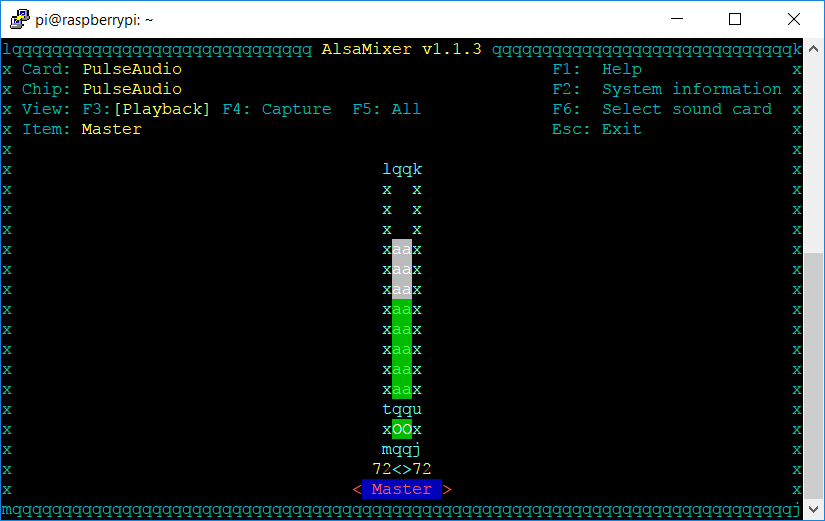
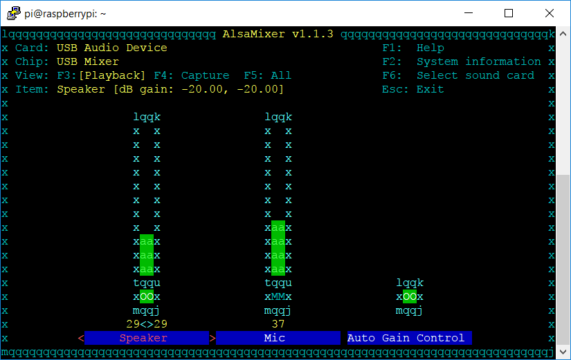
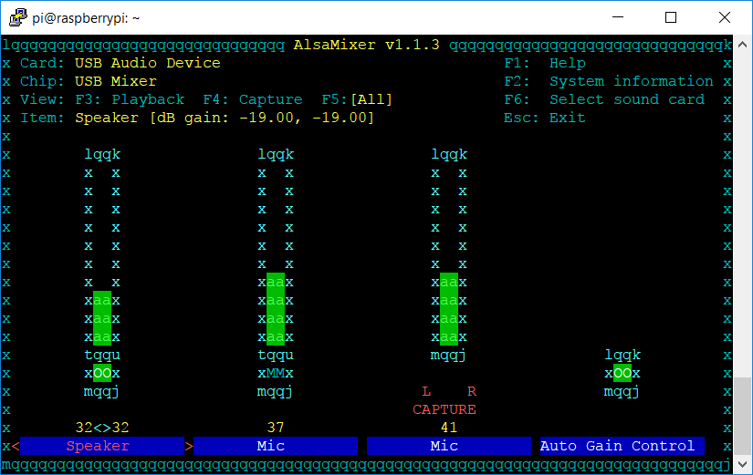
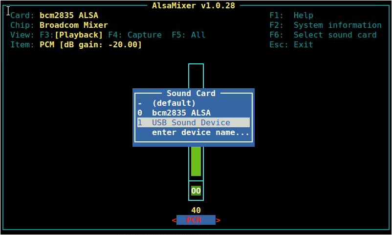

# todo: Command Line Server

## Introduction

This document describes how to integrate the Audio Weaver Command Line Server \(AWE CLS\) application on Linux platforms. The CLS is a standalone Linux application which connects to ALSA devices for real-time processing of audio signals. The Audio Weaver Designer PC tools connect to the AWE CLS for designing audio systems on Linux targets. Much of the information in this document concerns ALSA audio devices. In our experience, many users are unfamiliar with these devices and incorrect use leads to audio drop outs or no sound at all.

The purpose of this document is to show how to use the capabilities of AWE server - mainly through editing its INI file - to setup AWE on a specific platform. We will use the Raspberry Pi3 as an example since it is widely available, then discuss more difficult cases.

AWE has some requirements which are usually easy to meet:

* ALSA audio devices
* All ALSA devices used by AWE must be on the same crystal clock[\[1\]]()
* The platform must support Ethernet sockets and an external Ethernet PHY
* The minimum audio configuration is a single output device

The simplest platforms are those that use a single codec part to provide both an input and output device. Since the part is driven from a single crystal \(often the CPU crystal\) the first two requirements are met. Almost all Linux platforms have an Ethernet PHY \(we know none that do not have a PHY\), so we will take the third as being always met. Some platforms such as Pi3 only have audio output devices, and to fully use AWE, external audio devices must be used. This will also expose issues where devices are not on the same crystal. Note that AWE has no means of determining whether input and output devices are on the same crystal, and if configured to use devices for which this is not the case, will periodically overrun or underrun[\[2\]](). There is currently no means to mitigate this. This means the user has to know from data sheets or testing if all audio clocks are locked, and avoid input/output combinations not on the same crystal.

## Basic Execution of the Command Line Server on the Target

In this section we will set up the CLS on the target hardware. For concreteness, we will assume that the target is the Raspberry Pi 3. Most ARM Linux variants will use a similar procedure.

Although the CLS designed to process audio in real-time, the easiest way to get started is to use file input and output. To do so, follow these steps

### Extract the executable

Obtain a tar archive containing the CLS. Mine was named linux-raspberrypi3-master-build98-AWE-CL.tar.bz2\) and was on a USB drive. It was extracted by entering the following commands at the Pi 3 prompt:

#### Create a home for Audio Weaver Command Line Server 

#### Grab the archive from the drive and extract it


###  Getting familiar with the CLS

In order to test the CLS with file I/O, you will need a wav file for input. The file bell.wav is on my USB drive, but any wav file will do.


Now execute the CLS \(AWE\_command\_line\):


The splash screen contains information about the target platform. Note that the Raspberry Pi 3 has no build in audio inputs and 2 audio outputs. For now let us verify that the CLS will pass audio.

The CLS accepts commands at its prompt. A detailed list of commands is available elsewhere in this document. The only two commands we need now are audio\_pump and audio\_stop. The audio\_pump command executes an Audio Weaver layout that has been loaded into the CLS. The audio source and sink may be either a sound card or a file. \(Note that if the audio sink is a file, its size may increase without bound.\) If no layout has been loaded, audio is passed from input to output. The audio\_stop command stops the audio processing. In the following, we execute audio\_pump, wait 10 seconds, then execute audio stop.


It can be seen that the output file has been generated. To listen to it, use aplay outbell.wav. Alternatively, outbell.wav can be viewed in an audio editor like Audacity:


### Executing a script file with fileIO

The previous example simply passed input audio to output. This example is slightly more complicated. Consider the following Audio Weaver layout. Its main feature is a Scaler that applies a gain to the input signal before it is output.


 The simplest way to execute this system on the target is to use your favorite editor to copy the following lines into a file called `ScalerExample.aws` in `/home/pi/AudioWeaver/AWE_CL`.

```text
destroy
0,create_wire,wire1,48000,2,32,0,32,0,4,0,0
0,create_wire,wire2,48000,2,32,0,32,0,4,0,0
0,create_wire,wire3,48000,2,32,0,32,0,4,0,0
0,bind_wire,wire1,Input
0,bind_wire,wire2,Output
0,create_module,SYS_toFloat,ModuleTypeConversion,1,1,0,wire1,wire3,1,0
0,create_module,Scaler1,ModuleScalerV2,1,1,0,wire3,wire3,0.0,10.0,1,1.0,1.0,0.00208116462
0,create_module,SYS_toFract,ModuleTypeConversion,1,1,0,wire3,wire2,0,1
0,create_layout,theLayout1,1,3
0,add_module,theLayout1,0,SYS_toFloat,Scaler1,SYS_toFract
audio_pump
```

\*\*\*\*

Now, execute `./AWE_command_line` and enter the following commands:


There are several things to note here. First, the gain value \(in dB\) of the Scaler module can be written and read from the AWE\_command\_line prompt. This is convenient for testing. Also, the module and member names are case sensitive. Finally, don’t forget to issue an audio\_stop command after a few seconds.  
Executing aplay outbell.wav from the linux command line will result in a bell sound that is 20 dB softer than that of the first example.

### Remote Control via a socket

In the previous example, the Scaler’s gain was changed from the AWE\_command\_line prompt. This is convenient for certain tasks, but will not work if a parameter must be changed in real-time while the layout is in operation. For example, the ScalerExample.aws system could be used as rudimentary volume control if we could set the gain while the layout is running. To allow for real-time tuning of layout parameters, AWE\_command\_line has a socket interface that accepts commands. As we will see, it is easy to remote control an Audio Weaver layout via this socket interface. The use of the socket interface can be illustrated with a simple Python script. The script opens a socket connection to AWE\_command\_line and sends a couple of commands. Of course, method for communicating over a socket should work. \(A word of warning: the socket commands have different syntax than command prompt commands.\)

#### Customize your control script

Open a second terminal window to your Raspberry Pi and make a python script called remoteControl.py in /home/pi/AudioWeaver/AWE\_CL containing the following code:

\# coding: utf-8

\# Remember to terminate all commands with the newline character.

import socket

import time

TCP\_IP = 'localhost'

TCP\_PORT = 15007

BUFFER\_SIZE = 4096

\# Open a TCP socket

s = socket.socket\(socket.AF\_INET, socket.SOCK\_STREAM\)

print s

\# Disable the Nagle algorithm

s.setsockopt\(socket.IPPROTO\_TCP, socket.TCP\_NODELAY, 1\)

\# recv receives data from the socket. The return value is a string

\# representing the data received. The maximum amount of data to be

\# received at once is specified by bufsize. See the Unix manual page

\# recv\(2\) for the meaning of the optional argument flags; it defaults

\# to zero.

s.setsockopt\(socket.SOL\_SOCKET, socket.SO\_SNDBUF, BUFFER\_SIZE\)

s.connect\(\(TCP\_IP, TCP\_PORT\)\)

\# Send this server command to connect to the target thru the server

msg = '0,connect,localhost,12001\n'

s.send\(msg.encode\(encoding='utf-8'\)\)

data = s.recv\(BUFFER\_SIZE\).decode\('utf-8'\)

print data

msg = '0,set\_value,Scaler1.gain,0\n'

s.send\(msg.encode\(encoding='utf-8'\)\)

data = s.recv\(BUFFER\_SIZE\).decode\('utf-8'\)

print data

msg = '0,get\_value,Scaler1.gain\n'

s.send\(msg.encode\(encoding='utf-8'\)\)

data = s.recv\(BUFFER\_SIZE\).decode\('utf-8'\)

print data

time.sleep\(5\)

msg = '0,set\_value,Scaler1.gain,-20\n'

s.send\(msg.encode\(encoding='utf-8'\)\)

data = s.recv\(BUFFER\_SIZE\).decode\('utf-8'\)

print data

msg = '0,get\_value,Scaler1.gain\n'

s.send\(msg.encode\(encoding='utf-8'\)\)

data = s.recv\(BUFFER\_SIZE\).decode\('utf-8'\)

print data

time.sleep\(5\)

msg = '0,set\_value,Scaler1.gain,0\n'

s.send\(msg.encode\(encoding='utf-8'\)\)

data = s.recv\(BUFFER\_SIZE\).decode\('utf-8'\)

print data

msg = '0,get\_value,Scaler1.gain\n'

s.send\(msg.encode\(encoding='utf-8'\)\)

data = s.recv\(BUFFER\_SIZE\).decode\('utf-8'\)

print data

time.sleep\(5\)

msg = '0,audio\_stop\n'

s.send\(msg.encode\(encoding='utf-8'\)\)

data = s.recv\(BUFFER\_SIZE\).decode\('utf-8'\)

print data

s.close\(\)

Note that the lines starting with msg define command strings. Lines beginning with data are responses from AWE\_command\_line. This simple script changes the gain from 0 dB to -20 dB to 0 dB every 5 seconds then stops the audio.

To see how this works, start AWE\_command\_line in one window, load the ScalarExample.aws and pump. Then in the other window, execute remoteControl.py. You should get the following output from window 1:

 In the second window you should see:


The resulting output signal is:


Note that the center section of the signal is attenuated by a factor of 10 as expected.

In this case the python script terminates after 15 seconds. A real user interface would repeatedly poll a volume control and send the resulting gain value to to AWE\_command\_line via the socket interface.

#### Remote control from another machine

If your Raspberry Pi will accept external connections, the same code above can be used to remote control from a remote machine. Just replace “localhost” in the Python script with the ip address of your Pi. This is a very powerful mechanism for automation and tuning. More details on setting up Ethernet are provided in Section 4.

## Real-time Audio Processing on the Target

The previous sections described how to process audio contained in a file and how to remote control signal processing parameters via the socket interface. This section describes how to process real-time audio signals. However, before we do that, we need sources and sinks for real-time audio. For this purpose, the CLS uses ALSA, the Advanced Linux Sound Architecture. Configuring ALSA can be [a bit involved](http://www.volkerschatz.com/noise/alsa.html) but luckily we really only need to know which input and output ALSA devices exist on the target. For this purpose we will use two utilities that are typically available on systems supporting ALSA -- **arecord** and **aplay.**

It turns out that the RPi3 does not have an audio input device that is easy to access, so I am using a [Plugable USB Audio Adapter](https://www.amazon.com/Plugable-Headphone-Microphone-Aluminum-Compatibility/dp/B00NMXY2MO/ref=sr_1_3?ie=UTF8&qid=1513728347&sr=8-3&keywords=plugable+usb+audio+adapter) for this example.

### Configuring Audio Outputs

To determine output devices, execute the following in a command shell:

aplay -l

On a Pi3 you will get this result:

pi@raspberrypi:~$ aplay -l

\*\*\*\* List of PLAYBACK Hardware Devices \*\*\*\*

card 0: ALSA \[bcm2835 ALSA\], device 0: bcm2835 ALSA \[bcm2835 ALSA\]

 Subdevices: 8/8

 Subdevice \#0: subdevice \#0

 Subdevice \#1: subdevice \#1

 Subdevice \#2: subdevice \#2

 Subdevice \#3: subdevice \#3

 Subdevice \#4: subdevice \#4

 Subdevice \#5: subdevice \#5

 Subdevice \#6: subdevice \#6

 Subdevice \#7: subdevice \#7

card 0: ALSA \[bcm2835 ALSA\], device 1: bcm2835 ALSA \[bcm2835 IEC958/HDMI\]

 Subdevices: 1/1

 Subdevice \#0: subdevice \#0

card 1: Device \[USB Audio Device\], device 0: USB Audio \[USB Audio\]

 Subdevices: 1/1

 Subdevice \#0: subdevice \#0

This shows us that the hardware has three audio output devices. The first, denoted \[bcm2835 ALSA\], has 8 subdevices, one of which is connected to the 3.5mm audio jack on the Pi3. The second, denoted \[bcm 2835 IEC958/HDMI\], has 1 subdevice and is connected to the HDMI interface on the board. The third, denoted \[USB Audio\], has 1 subdevice and is the USB device that we will use in this example.

 Since this is device 1, subdevice 0, ALSA utilities will refer to it as hw:1,0 \(hw:dev,subdev\). Plug some headphones or a speaker into the USB audio adapter and execute the following the following in a command shell:

pi@raspberrypi:~$ speaker-test -D hw:1,0 -c 2

The ‘-c 2’ option indicates that the device has 2 channels to test. This will play pink noise through the audio device. Alternatively, you can use the aplay command to play a wav file if speaker-test does not exist on your system.

pi@raspberrypi:~$ aplay -D hw:1,0 file.wav

If the audio device is muted or too soft, use the alsamixer utility to change the volume:

pi@raspberrypi:~$ alsamixer



Choose F6 to select your sound card


Then select the USB Audio Device



Note that the speaker level is low. You can use the up/down-arrow keys to adjust the levels. Note that different sound cards may expose different control through alsamixer so don’t worry too much if your display looks different. Just find the correct setting, adjust it, then hit Esc to exit alsamixer.

### Configuring Audio Inputs

To determine input devices, execute the following in a command shell:

arecord -l

On my Pi3 setup, I get this:

pi@raspberrypi:~ $ arecord -l

\*\*\*\* List of CAPTURE Hardware Devices \*\*\*\*

card 1: Device \[USB Audio Device\], device 0: USB Audio \[USB Audio\]

 Subdevices: 1/1

 Subdevice \#0: subdevice \#0

This shows us the Pi3 has one audio input device.

This shows us the Pi3 default output gain is -20dB and the device is not muted. You may find that you need more gain, although the default usually works well. On Pi3 we need do nothing, so hit Esc to terminate.

To test the microphone we use the arecord command. For a first check, plug a microphone into the USB audio adapter and execute the following in a command window :

pi@raspberrypi:~ $ arecord -V mono -r 44100 -f S16\_LE -D hw:1,0 /dev/null

Recording WAVE '/dev/null' : Signed 16 bit Little Endian, Rate 44100 Hz, Mono

\#+ \| 00%

This will dump all of your recorded audio to /dev/null, but will provide a handy VU meter. When you speak into the mic, the VU meter should move:


Next record 10 seconds of audio from the mic using

arecord -V mono -r 44100 -f S16\_LE -D hw:1,0 -d 10 outfile.wav

and play it back using In either case, you use the above command to test each input device, and then you use:

aplay -D plughw:1,0 outfile.wav

to play what you just captured to speakers. Note that the hardware device this time is plughw:1,0 . This device does some automatic format conversion which may be required on some output devices.

As with output, you may need to use **alsamixer** to examine the input device settings to ensure they are not muted and have reasonable gains before you can record. For example:



## Getting Ethernet set up

You must ensure the target is on the same Ethernet subnet as your PC, that your PC can ping your target and your target can ping the PC, and you know the IP address of the target. To determine the IP address of the target run:

ifconfig

in a target shell. To determine the IP address of the Windows PC, run:

ipconfig

in a command box. Once you know the address of both, from each you issue:

ping &lt;ip\_address&gt;

in the shell/command box, and both should report once a second a packet was sent. Windows ping does this 4 times. Linux ping does it forever, and you must use ^C to kill it.

We will refer to this again later when we connect Designer to the target, and assume you have already done this.

## Command Line Server

The AWE command line server offers a detailed help with the option --help looking like this:

Audio Weaver Server 6.1

Copyright \(c\) DSP Concepts 2006-2017

Usage: AWE \[args\] where:

-help or --help this help

-nocmd not interactive - for use as a daemon

-deamon do not use audio - we are a daemon

-script:path load AWS script during start

-binary:path load AWB file during start

-insamp:N input sample count default 256

-outsamp:N output sample count default 256

-inbuff:N input ring buffer size default 1024

-outbuff:N output ring buffer size default 1024

-ml\_port:N Matlab control port default 15001

-cl\_port:N client port default 15003

-ut\_port:N utlility port default 15005

-norate supress stdout rate report during play

-savedir:path path to save files - default current dir

-cachedir:path path to save class cache - default current dir

-priority:N audio thread priority - must be root to use

-delay:N audio thread delay in uSec - must be root to use

The options that are most useful are highlighted and discussed later. Those that are not are advanced options only, for overriding values usually obtained from the INI file, and you should not use them unless you know exactly what you are doing and why.

By default, the server is interactive, and offers a command line prompt. There a several useful commands you can issue at this prompt:

* list - lists all possible commands you can use at the prompt
* devices - list all ALSA devices server finds
* modules - list all audio modules in the server
* script file.aws - execute an AWS script file as though received from Designer
* audio\_pump - run the audio I/O sub-system to copy input to output
* audio\_pump file.wav - run the audio I/O sub-system by playing a WAV file to output
* audio\_stop - stop running audio
* exit - terminate server, stopping audio if needed first

Examples of these commands will be given later.

Server ships with a default INI file **AWE\_CmdLine.ini**. This configures many useful options of server described later. See also the appendix. The default version sets up server to:

* use 256 sample I/O with 1024 sample ALSA ring buffers
* perform ALSA device enumeration
* do basic logging only to /tmp/awelog.txt

Server listens on several sockets for commands. These are by default \(and configured as default in the INI file\):

* 15001 - Matlab command socket, do not use or change
* 15002 - Binary command socket, change if needed
* 15003 - Designer command socket, do not use or change
* 15005 - Special socket, do not use or change
* 15007 - First user socket, change if needed, use as needed
* 15009 - Second user socket, change if needed, use as needed
* 15011 - Second user socket, change if needed, use as needed

Matlab/Designer uses the ports 15001 and 15003. The default binary command socket is 15002, and should only be changed if really needed. 15005 is reserved for internal testing purposes only, and should neither be used or changed. The user sockets are provided to allow up to 3 user processes to be concurrently sending tuning commands to server. Change these only if you have a compelling reason to use other port numbers.

Default simple logging is written to /tmp/awelog.txt. This file can be written elsewhere if needed by changing the INI file. The file is deleted if it exists on server start, and then created to log the current server session. The purpose of the file is to communicate to DSP issues that might arise in use with bug reports. It also logs information about ALSA device enumeration that can be useful as described later.

Server, like all Linux programs may be used with command line arguments. For testing and development, none should be needed. When used in production, the usual command line will be:

./AWE\_command\_line -binary:file.awb -nocomd -norate&

issued from a boot script. This would cause server to load a Designer built AWB layout file, start audio running, disable the command prompt, disable reporting audio sample rate and CPU usage to stdout, and cause the process to run in the background. Since it will start audio, it should be the very last thing started in boot after all other drivers, processes and services that ALSA devices might require have been started.

## Audio Device Configuration

The default AWE tarball has the AWE binary, a default INI file, some shared libraries, and a small WAV file for testing - the default is bell.wav, a 48000 mono file a few seconds long. The default INI file configures AWE to enumerate all ALSA devices, and choose the first input/output pair it finds \(typically the default pair\) as the devices to use. While enumerating, it will explore for every device all standard sample rates from 8000 to 192000; sample bit widths of 16, 24, and 32; and channels from 1, 2, 4, 6, ..., 32. This is a large number of ALSA calls for each device, and on some platforms, especially those with debug or poorly written drivers, can take a while – as much as 20 minutes. If the audio devices are well written and able to quickly enumerate, then the process completes quickly. Enumeration is needed only upon system setup and there are INI files settings which allow enumeration to be bypassed entirely.

The result of enumeration is an internal table of the supported hardware capabilities of every available device, and written to the INI File at the end, a table that looks like this:

\[MergeOutputDevices\]

Device0=1\`bcm2835 ALSA\(0\)

Device1=0\`bcm2835 ALSA\(0\)\(2\)

Device2=0\`bcm2835 ALSA\(0\)\(3\)

Device3=0\`bcm2835 ALSA\(0\)\(4\)

Device4=0\`bcm2835 ALSA\(0\)\(5\)

Device5=0\`bcm2835 ALSA\(0\)\(6\)

Device6=0\`bcm2835 ALSA\(0\)\(7\)

Device7=0\`bcm2835 ALSA\(0\)\(8\)

Device8=0\`bcm2835 ALSA\(1\)

This example is from a standard Raspberry Pi3. This tells us that we found only output devices, there are two of them, and the first has 8 sub-devices.

By default when AWE starts, after enumerating it offers an interactive command prompt using '&gt;'. Single commands with space delimited arguments may be typed by the user. There are a few particularly useful commands for test and discovering what your system has. The command **devices** reports this on default Pi3:

&gt; devices

Input device details:

Output device details:

 bcm2835 ALSA\(1\): 2 48000 16 hw:0,1

 bcm2835 ALSA\(0\)\(8\): 2 48000 16 hw:0,0,7

 bcm2835 ALSA\(0\)\(7\): 2 48000 16 hw:0,0,6

 bcm2835 ALSA\(0\)\(6\): 2 48000 16 hw:0,0,5

 bcm2835 ALSA\(0\)\(5\): 2 48000 16 hw:0,0,4

 bcm2835 ALSA\(0\)\(4\): 2 48000 16 hw:0,0,3

 bcm2835 ALSA\(0\)\(3\): 2 48000 16 hw:0,0,2

 bcm2835 ALSA\(0\)\(2\): 2 48000 16 hw:0,0,1

\* bcm2835 ALSA\(0\): 2 48000 16 hw:0,0,0

 bcm2835 ALSA\(1\): 2 44100 16 hw:0,1

 bcm2835 ALSA\(0\)\(8\): 2 44100 16 hw:0,0,7

 bcm2835 ALSA\(0\)\(7\): 2 44100 16 hw:0,0,6

 bcm2835 ALSA\(0\)\(6\): 2 44100 16 hw:0,0,5

 bcm2835 ALSA\(0\)\(5\): 2 44100 16 hw:0,0,4

 bcm2835 ALSA\(0\)\(4\): 2 44100 16 hw:0,0,3

 bcm2835 ALSA\(0\)\(3\): 2 44100 16 hw:0,0,2

 bcm2835 ALSA\(0\)\(2\): 2 44100 16 hw:0,0,1

\* bcm2835 ALSA\(0\): 2 44100 16 hw:0,0,0

 bcm2835 ALSA\(0\)\(8\): 2 32000 16 hw:0,0,7

 bcm2835 ALSA\(0\)\(7\): 2 32000 16 hw:0,0,6

 bcm2835 ALSA\(0\)\(6\): 2 32000 16 hw:0,0,5

 bcm2835 ALSA\(0\)\(5\): 2 32000 16 hw:0,0,4

 bcm2835 ALSA\(0\)\(4\): 2 32000 16 hw:0,0,3

 bcm2835 ALSA\(0\)\(3\): 2 32000 16 hw:0,0,2

 bcm2835 ALSA\(0\)\(2\): 2 32000 16 hw:0,0,1

\* bcm2835 ALSA\(0\): 2 32000 16 hw:0,0,0

 bcm2835 ALSA\(0\)\(8\): 2 24000 16 hw:0,0,7

 bcm2835 ALSA\(0\)\(7\): 2 24000 16 hw:0,0,6

 bcm2835 ALSA\(0\)\(6\): 2 24000 16 hw:0,0,5

 bcm2835 ALSA\(0\)\(5\): 2 24000 16 hw:0,0,4

 bcm2835 ALSA\(0\)\(4\): 2 24000 16 hw:0,0,3

 bcm2835 ALSA\(0\)\(3\): 2 24000 16 hw:0,0,2

 bcm2835 ALSA\(0\)\(2\): 2 24000 16 hw:0,0,1

\* bcm2835 ALSA\(0\): 2 24000 16 hw:0,0,0

 bcm2835 ALSA\(0\)\(8\): 2 22050 16 hw:0,0,7

 bcm2835 ALSA\(0\)\(7\): 2 22050 16 hw:0,0,6

 bcm2835 ALSA\(0\)\(6\): 2 22050 16 hw:0,0,5

 bcm2835 ALSA\(0\)\(5\): 2 22050 16 hw:0,0,4

 bcm2835 ALSA\(0\)\(4\): 2 22050 16 hw:0,0,3

 bcm2835 ALSA\(0\)\(3\): 2 22050 16 hw:0,0,2

 bcm2835 ALSA\(0\)\(2\): 2 22050 16 hw:0,0,1

\* bcm2835 ALSA\(0\): 2 22050 16 hw:0,0,0

 bcm2835 ALSA\(0\)\(8\): 2 16000 16 hw:0,0,7

 bcm2835 ALSA\(0\)\(7\): 2 16000 16 hw:0,0,6

 bcm2835 ALSA\(0\)\(6\): 2 16000 16 hw:0,0,5

 bcm2835 ALSA\(0\)\(5\): 2 16000 16 hw:0,0,4

 bcm2835 ALSA\(0\)\(4\): 2 16000 16 hw:0,0,3

 bcm2835 ALSA\(0\)\(3\): 2 16000 16 hw:0,0,2

 bcm2835 ALSA\(0\)\(2\): 2 16000 16 hw:0,0,1

\* bcm2835 ALSA\(0\): 2 16000 16 hw:0,0,0

 bcm2835 ALSA\(0\)\(8\): 2 12000 16 hw:0,0,7

 bcm2835 ALSA\(0\)\(7\): 2 12000 16 hw:0,0,6

 bcm2835 ALSA\(0\)\(6\): 2 12000 16 hw:0,0,5

 bcm2835 ALSA\(0\)\(5\): 2 12000 16 hw:0,0,4

 bcm2835 ALSA\(0\)\(4\): 2 12000 16 hw:0,0,3

 bcm2835 ALSA\(0\)\(3\): 2 12000 16 hw:0,0,2

 bcm2835 ALSA\(0\)\(2\): 2 12000 16 hw:0,0,1

\* bcm2835 ALSA\(0\): 2 12000 16 hw:0,0,0

 bcm2835 ALSA\(0\)\(8\): 2 11025 16 hw:0,0,7

 bcm2835 ALSA\(0\)\(7\): 2 11025 16 hw:0,0,6

 bcm2835 ALSA\(0\)\(6\): 2 11025 16 hw:0,0,5

 bcm2835 ALSA\(0\)\(5\): 2 11025 16 hw:0,0,4

 bcm2835 ALSA\(0\)\(4\): 2 11025 16 hw:0,0,3

 bcm2835 ALSA\(0\)\(3\): 2 11025 16 hw:0,0,2

 bcm2835 ALSA\(0\)\(2\): 2 11025 16 hw:0,0,1

\* bcm2835 ALSA\(0\): 2 11025 16 hw:0,0,0

 bcm2835 ALSA\(0\)\(8\): 2 8000 16 hw:0,0,7

 bcm2835 ALSA\(0\)\(7\): 2 8000 16 hw:0,0,6

 bcm2835 ALSA\(0\)\(6\): 2 8000 16 hw:0,0,5

 bcm2835 ALSA\(0\)\(5\): 2 8000 16 hw:0,0,4

 bcm2835 ALSA\(0\)\(4\): 2 8000 16 hw:0,0,3

 bcm2835 ALSA\(0\)\(3\): 2 8000 16 hw:0,0,2

 bcm2835 ALSA\(0\)\(2\): 2 8000 16 hw:0,0,1

\* bcm2835 ALSA\(0\): 2 8000 16 hw:0,0,0

 bcm2835 ALSA\(0\)\(8\): 1 48000 16 hw:0,0,7

 bcm2835 ALSA\(0\)\(7\): 1 48000 16 hw:0,0,6

 bcm2835 ALSA\(0\)\(6\): 1 48000 16 hw:0,0,5

 bcm2835 ALSA\(0\)\(5\): 1 48000 16 hw:0,0,4

 bcm2835 ALSA\(0\)\(4\): 1 48000 16 hw:0,0,3

 bcm2835 ALSA\(0\)\(3\): 1 48000 16 hw:0,0,2

 bcm2835 ALSA\(0\)\(2\): 1 48000 16 hw:0,0,1

\* bcm2835 ALSA\(0\): 1 48000 16 hw:0,0,0

 bcm2835 ALSA\(0\)\(8\): 1 44100 16 hw:0,0,7

 bcm2835 ALSA\(0\)\(7\): 1 44100 16 hw:0,0,6

 bcm2835 ALSA\(0\)\(6\): 1 44100 16 hw:0,0,5

 bcm2835 ALSA\(0\)\(5\): 1 44100 16 hw:0,0,4

 bcm2835 ALSA\(0\)\(4\): 1 44100 16 hw:0,0,3

 bcm2835 ALSA\(0\)\(3\): 1 44100 16 hw:0,0,2

 bcm2835 ALSA\(0\)\(2\): 1 44100 16 hw:0,0,1

\* bcm2835 ALSA\(0\): 1 44100 16 hw:0,0,0

 bcm2835 ALSA\(0\)\(8\): 1 32000 16 hw:0,0,7

 bcm2835 ALSA\(0\)\(7\): 1 32000 16 hw:0,0,6

 bcm2835 ALSA\(0\)\(6\): 1 32000 16 hw:0,0,5

 bcm2835 ALSA\(0\)\(5\): 1 32000 16 hw:0,0,4

 bcm2835 ALSA\(0\)\(4\): 1 32000 16 hw:0,0,3

 bcm2835 ALSA\(0\)\(3\): 1 32000 16 hw:0,0,2

 bcm2835 ALSA\(0\)\(2\): 1 32000 16 hw:0,0,1

\* bcm2835 ALSA\(0\): 1 32000 16 hw:0,0,0

 bcm2835 ALSA\(0\)\(8\): 1 24000 16 hw:0,0,7

 bcm2835 ALSA\(0\)\(7\): 1 24000 16 hw:0,0,6

 bcm2835 ALSA\(0\)\(6\): 1 24000 16 hw:0,0,5

 bcm2835 ALSA\(0\)\(5\): 1 24000 16 hw:0,0,4

 bcm2835 ALSA\(0\)\(4\): 1 24000 16 hw:0,0,3

 bcm2835 ALSA\(0\)\(3\): 1 24000 16 hw:0,0,2

 bcm2835 ALSA\(0\)\(2\): 1 24000 16 hw:0,0,1

\* bcm2835 ALSA\(0\): 1 24000 16 hw:0,0,0

 bcm2835 ALSA\(0\)\(8\): 1 22050 16 hw:0,0,7

 bcm2835 ALSA\(0\)\(7\): 1 22050 16 hw:0,0,6

 bcm2835 ALSA\(0\)\(6\): 1 22050 16 hw:0,0,5

 bcm2835 ALSA\(0\)\(5\): 1 22050 16 hw:0,0,4

 bcm2835 ALSA\(0\)\(4\): 1 22050 16 hw:0,0,3

 bcm2835 ALSA\(0\)\(3\): 1 22050 16 hw:0,0,2

 bcm2835 ALSA\(0\)\(2\): 1 22050 16 hw:0,0,1

\* bcm2835 ALSA\(0\): 1 22050 16 hw:0,0,0

 bcm2835 ALSA\(0\)\(8\): 1 16000 16 hw:0,0,7

 bcm2835 ALSA\(0\)\(7\): 1 16000 16 hw:0,0,6

 bcm2835 ALSA\(0\)\(6\): 1 16000 16 hw:0,0,5

 bcm2835 ALSA\(0\)\(5\): 1 16000 16 hw:0,0,4

 bcm2835 ALSA\(0\)\(4\): 1 16000 16 hw:0,0,3

 bcm2835 ALSA\(0\)\(3\): 1 16000 16 hw:0,0,2

 bcm2835 ALSA\(0\)\(2\): 1 16000 16 hw:0,0,1

\* bcm2835 ALSA\(0\): 1 16000 16 hw:0,0,0

 bcm2835 ALSA\(0\)\(8\): 1 12000 16 hw:0,0,7

 bcm2835 ALSA\(0\)\(7\): 1 12000 16 hw:0,0,6

 bcm2835 ALSA\(0\)\(6\): 1 12000 16 hw:0,0,5

 bcm2835 ALSA\(0\)\(5\): 1 12000 16 hw:0,0,4

 bcm2835 ALSA\(0\)\(4\): 1 12000 16 hw:0,0,3

 bcm2835 ALSA\(0\)\(3\): 1 12000 16 hw:0,0,2

 bcm2835 ALSA\(0\)\(2\): 1 12000 16 hw:0,0,1

\* bcm2835 ALSA\(0\): 1 12000 16 hw:0,0,0

 bcm2835 ALSA\(0\)\(8\): 1 11025 16 hw:0,0,7

 bcm2835 ALSA\(0\)\(7\): 1 11025 16 hw:0,0,6

 bcm2835 ALSA\(0\)\(6\): 1 11025 16 hw:0,0,5

 bcm2835 ALSA\(0\)\(5\): 1 11025 16 hw:0,0,4

 bcm2835 ALSA\(0\)\(4\): 1 11025 16 hw:0,0,3

 bcm2835 ALSA\(0\)\(3\): 1 11025 16 hw:0,0,2

 bcm2835 ALSA\(0\)\(2\): 1 11025 16 hw:0,0,1

\* bcm2835 ALSA\(0\): 1 11025 16 hw:0,0,0

 bcm2835 ALSA\(0\)\(8\): 1 8000 16 hw:0,0,7

 bcm2835 ALSA\(0\)\(7\): 1 8000 16 hw:0,0,6

 bcm2835 ALSA\(0\)\(6\): 1 8000 16 hw:0,0,5

 bcm2835 ALSA\(0\)\(5\): 1 8000 16 hw:0,0,4

 bcm2835 ALSA\(0\)\(4\): 1 8000 16 hw:0,0,3

 bcm2835 ALSA\(0\)\(3\): 1 8000 16 hw:0,0,2

 bcm2835 ALSA\(0\)\(2\): 1 8000 16 hw:0,0,1

\* bcm2835 ALSA\(0\): 1 8000 16 hw:0,0,0

This is a lot. First, the '\*' in column 1 tells us the default device. Then follows the name of the device with disambiguating suffices in parentheses to distinguish the various subcomponents of devices from each other, then the channel count, then sample rate, then sample bit width, and finally the full ALSA device name. We see all devices support mono and stereo from 8000 to 48000, but only 16 bit samples are supported.

This also takes several seconds to complete enumeration. This is seen as a delay until the command prompt appears.

We can do better. For most users, there is interest in only one sample rate. We can reduce the enumeration search space drastically by adding to the INI file outside any existing section:

\[Filters\]

SampleRates=&lt;list of rates&gt;

Widths=&lt;list of widths&gt;

Channels=&lt;list of channels&gt;

where each list is a comma delimited list of allowed values. The empty default is of course all items. Stereo 16-bit audio at 48 kHz would be specified like this:

\[Filters\]

SampleRates=48000

Widths=16

Channels=2

This reduces the search space by a couple orders of magnitude. So terminate by typing **exit**, edit the INI file to add the above lines, and run again[\[3\]](). Now enumeration is nearly instant, and we get:

&gt; devices

Input device details:

Output device details:

 bcm2835 ALSA\(1\): 2 48000 16 hw:0,1

 bcm2835 ALSA\(0\)\(8\): 2 48000 16 hw:0,0,7

 bcm2835 ALSA\(0\)\(7\): 2 48000 16 hw:0,0,6

 bcm2835 ALSA\(0\)\(6\): 2 48000 16 hw:0,0,5

 bcm2835 ALSA\(0\)\(5\): 2 48000 16 hw:0,0,4

 bcm2835 ALSA\(0\)\(4\): 2 48000 16 hw:0,0,3

 bcm2835 ALSA\(0\)\(3\): 2 48000 16 hw:0,0,2

 bcm2835 ALSA\(0\)\(2\): 2 48000 16 hw:0,0,1

\* bcm2835 ALSA\(0\): 2 48000 16 hw:0,0,0

Much nicer, and demonstrates we have filtered out all but the 48000 and stereo cases. Be aware that AWE can only play using capabilities it has enumerated, or are externally supplied. Make sure that the filter values you specify match your system requirements.

We can now do a simple test of audio I/O. The default device above is the 3.5mm jack on the Pi3. Connect headphones or speakers, and then do:

audio\_pump bell.wav

The short 48000 mono file bell.wav will play through the left channel on repeat, and we get on the console a report looking like:

&gt; audio\_pump bell.wav

success,48000

Seconds=5, samples=240128, rate=48025.60

The success line is the reply, and shows that the command succeeded and is playing at 48000 as expected. The second line shows the time in seconds since play started, the total number of samples played, and the measured average rate. This last will slowly converge on the real rate while bouncing around slightly, because we measure once a second, and because the default I/O block size of 256 is not an integer divider of 48000.

Our next challenge is getting an input device, but Pi3 does not have one. So terminate the program with **exit**, and plug in a USB device able to support 48000 stereo input and output to one of the USB ports, then run again:

&gt; devices

Input device details:

\* USB Sound Device\(0\): 2 48000 16 hw:1,0

Output device details:

 USB Sound Device\(0\): 2 48000 16 hw:1,0

 bcm2835 ALSA\(1\): 2 48000 16 hw:0,1

 bcm2835 ALSA\(0\)\(8\): 2 48000 16 hw:0,0,7

 bcm2835 ALSA\(0\)\(7\): 2 48000 16 hw:0,0,6

 bcm2835 ALSA\(0\)\(6\): 2 48000 16 hw:0,0,5

 bcm2835 ALSA\(0\)\(5\): 2 48000 16 hw:0,0,4

 bcm2835 ALSA\(0\)\(4\): 2 48000 16 hw:0,0,3

 bcm2835 ALSA\(0\)\(3\): 2 48000 16 hw:0,0,2

 bcm2835 ALSA\(0\)\(2\): 2 48000 16 hw:0,0,1

\* bcm2835 ALSA\(0\): 2 48000 16 hw:0,0,0

We now have a problem that AWE can't detect. The input device is our USB \(it has an '\*'\), but the output device is the 3.5mm jack on the Pi3 board. All USB devices have their own internal crystals which differ from any CPU on board crystals. This configuration will not work and violates our second requirement. Lets **exit**, and look in the INI file and see how it changed:

\[MergeInputDevices\]

Device0=1\`USB Sound Device\(0\)

\[MergeOutputDevices\]

Device0=1\`bcm2835 ALSA\(0\)

Device1=0\`bcm2835 ALSA\(0\)\(2\)

Device2=0\`bcm2835 ALSA\(0\)\(3\)

Device3=0\`bcm2835 ALSA\(0\)\(4\)

Device4=0\`bcm2835 ALSA\(0\)\(5\)

Device5=0\`bcm2835 ALSA\(0\)\(6\)

Device6=0\`bcm2835 ALSA\(0\)\(7\)

Device7=0\`bcm2835 ALSA\(0\)\(8\)

Device8=0\`bcm2835 ALSA\(1\)

Device9=0\`USB Sound Device\(0\)

Notice the '1' following the '=' on the first lines of each section. This enables the device. We need to edit the INI file to replace the '1' with '0' on the first output line, and replace '0' with '1' on the last output line resulting in:

\[MergeInputDevices\]

Device0=1\`USB Sound Device\(0\)

\[MergeOutputDevices\]

Device0=0\`bcm2835 ALSA\(0\)

Device1=0\`bcm2835 ALSA\(0\)\(2\)

Device2=0\`bcm2835 ALSA\(0\)\(3\)

Device3=0\`bcm2835 ALSA\(0\)\(4\)

Device4=0\`bcm2835 ALSA\(0\)\(5\)

Device5=0\`bcm2835 ALSA\(0\)\(6\)

Device6=0\`bcm2835 ALSA\(0\)\(7\)

Device7=0\`bcm2835 ALSA\(0\)\(8\)

Device8=0\`bcm2835 ALSA\(1\)

Device9=1\`USB Sound Device\(0\)

The modified lines are highlighted. Now start again, and we get:

&gt; devices

Input device details:

\* USB Sound Device\(0\): 2 48000 16 hw:1,0

Output device details:

\* USB Sound Device\(0\): 2 48000 16 hw:1,0

 bcm2835 ALSA\(1\): 2 48000 16 hw:0,1

 bcm2835 ALSA\(0\)\(8\): 2 48000 16 hw:0,0,7

 bcm2835 ALSA\(0\)\(7\): 2 48000 16 hw:0,0,6

 bcm2835 ALSA\(0\)\(6\): 2 48000 16 hw:0,0,5

 bcm2835 ALSA\(0\)\(5\): 2 48000 16 hw:0,0,4

 bcm2835 ALSA\(0\)\(4\): 2 48000 16 hw:0,0,3

 bcm2835 ALSA\(0\)\(3\): 2 48000 16 hw:0,0,2

 bcm2835 ALSA\(0\)\(2\): 2 48000 16 hw:0,0,1

 bcm2835 ALSA\(0\): 2 48000 16 hw:0,0,0

This is as expected. Connect headphones or speakers to the USB output and:

&gt; audio\_pump bell.wav

success,48000

Seconds=12, samples=576000, rate=48000.00

The file plays. Now connect an audio source to the USB input - another PC running a media player is a simple test, or you could use microphones. Then:

&gt; audio\_stop

success

&gt; audio\_pump

success,48000

Seconds=21, samples=1007872, rate=47993.90

This time you will hear whatever your audio source is on the output. What's different is we did not give **audio\_pump** an argument. With a file argument, it replaces the input device\(s\) with a file player. Without, it uses the input devices\(s\) as the audio source. On a system with no input devices, using it without a file argument will fail, since the system has no audio source - which is why we needed a USB device for this test on Pi3.

Note that **audio\_pump** can be used two ways: without an AWE Designer layout it simply copies input to output. With an Audio Weaver block diagram \(called a “layout”\), it passes the input samples through the layout to the output device\(s\). The command with no layout is used for confirming proper operation of the audio I/O subsystem as a test case. Once you have verified your system hardware, you will not need to do this again.

But what if you did not get any sound played in the above test? Various audio devices have different defaults the first time they are used. Some devices start muted, some do not. Often those that start with muted inputs, although occasionally some outputs are muted too. It depends on the whim of the audio device driver author. The solution is to use the **alsamixer** utility, and if your Linux system does not have that, get an update that has it, or add it to your build image. The utility is a command line app that uses curses for drawing a character based GUI. You should see this:


Hit F6, and select your USB device:



Then hit Enter followed by F5. You should see something like this:


Here we see for this particular device, that the speakers are not muted, that line-&gt;speaker internal copy is disabled, as is mic-&gt;speaker internal copy, and that we will be capturing from mic input. Use the left and right arrow keys to explore the full range of input and output hardware the device offers. The above settings are fine. They may be very different for your device, and you may need to consult the vendor manual for guidance. Some rare device do not offer any controls, and are not muted.

When you are satisfied with your device configuration, hit Esc to terminate **alsamixer**. On most systems this will persist the configuration, on some it will not. You will have to determine by experiment whether the settings are persisted for you - power cycle your hardware, and run **alsamixer** again - if the settings changed, they were not persisted through power down. If they are not and you had to enable or change anything, then you will need to consider adding calls to the utility **amixer** - the command line equivalent of **alsamixer** - in your system boot script\(s\) to configure your devices prior to using AWE. It is outside the scope of this document to discuss **amixer** further. Consult the man pages.

You should also have the **arecord** utility. Again, if you do not, update or rebuild your image until you do. You use **arecord** to capture data from an input device to a WAV file. This allows you to confirm that **alsamixer** settings were correct for your device. You use it like this:

arecord -D &lt;full\_alsa\_name&gt; -f dat -d 10 out.wav

This will record 10 seconds of 48 kHz audio to the file out.wav from the specified device. Consult the man pages for full details. The device name you use should be that reported by **devices** above - it was **hw:1,0**.

After capture completes, play what was captured like this:

aplay -D &lt;full\_alsa\_name&gt; out.wav

Fewer arguments are needed because most parameters come from the file you play. The output device name is also **hw:1,0** above. This will play the captured fragment to your speakers. Repeat adjustments with **alsamixer** until this captures and plays some audio from your input. Once this passes, you can once more start AWE server, and the command **audio\_pump** will play your input audio to your speakers.

## Connecting Audio Weaver Designer

Designer as previously described connects to sockets 15001 and 15003 for a direct connection \(preferred\), or optionally from the Windows version of server as an Ethernet binary target on port 15002. This latter should not be used unless there are specific reasons the Windows GUI features are needed - doing so denies Designer the ability to test for needed data and audio files on the target.

In either case, you must ensure the target is on the same Ethernet subnet as your PC and you can talk to it, see earlier.

To connect Designer directly, start Designer on the PC \(make sure the target server is running\), and after it starts use File \| Global Preferences... from the menu, change the drop list reading Local Server to Remote Server, fill in the IP address of your target below, click Reconnect to Server, then OK to dismiss the dialog. Designer will then read information from the target including a list of all audio modules it has and prepare to use the target.

To connect Designer indirectly, start Designer, and after it comes up bring Windows server to the front, from the menu choose Target \| Change Connection..., from the drop list reading Native choose Ethernet, fill in the target IP address, leave the port as 15002 \(unless you changed it in the target INI file\), and click Connect. Windows server will connect to the target and report what it found in the text pane. Then switch to the Designer window, and from the toolbar find the Refresh Target Info button, and click it - a progress dialog will pop up briefly as it updates from the target. Be aware that in this mode Designer is unable to be aware of data or audio files on the target.

In either case, from here on any layouts you load or run are loaded and run on the target.

### Simple Smoke Test

When Designer starts, a default incomplete layout is provided for you. Complete this layout by connecting wires between Deinterleave and Interleave modules - or if the number of pins does not match, delete both of these modules and wire directly between the two converters. Then use Layout \| Layout Properties... on the designer menu, and make sure that the input is File and the file to play is bell.wav. Click OK to dismiss the dialog, then click Play on the toolbar - Designer will load this layout to the target and start it running, and you should hear the bell tone played on repeat out of the left speaker.

Pay close attention to the speakers and make sure the bell sound is clear and has no clicks or break ups. Look at the target console, and verify the sample rate is 48000 and is being updated once a second. The reported CPU usage should be extremely small.

Click Stop on the Designer toolbar. Use the Layout \| Layout Properties... menu, and change the input source to Line input, then click OK to dismiss the dialog. Connect an audio source to the target line in. Click Play on the toolbar, Designer will start the layout again. This time you should hear whatever source you connected to line in. Again, verify the output is clean, has no clicks or break ups. Look at the console again, and verify that the sample rate is 48000 and the CPU usage is as before.

Play sine waves out of the system

Make sure that the sine wave is at the expected frequency

Add a cycle burner to chew up CPU load

### Profiling. Differences between what AWE reports and what you see in top

When you profile a layout with Matlab, or view the CPU usage on the console, what you see is only the CPU load used to process audio. The I/O code calling ALSA is not reported.

When you use top or ps to view CPU usage, you get reported the total usage of the server process. Typically, ALSA I/O takes a few percent CPU, and the amount depends on the kernel, CPU speed, drivers, and how many ALSA devices are in use.

In addition top or ps report usage as a fraction of total CPU bandwidth. If your CPU has 4 cores, the report is the loading for all cores \(regardless of how many cores the process may actually be using\). The Designer and console reporting however is per core. This means that if you have AWE consuming apparently 40% CPU reported on the console, top on a 4 core system will report slightly more than 10%.

Be aware that unless the layout explicitly is designed to use multiple cores, it will use only one core. A single core can generally be loaded up to around 90% CPU, which will result in top reporting around 25% on a 4 core system. If you exceed around 90% on any core, audio will break up.

## Advanced Audio Device Configuration

### Using Multiple Audio Devices

It is often the case that you would like to process audio from multiple input devices, and occasionally render output to multiple output devices. This is only possible if all input and output devices you want to use are on the same crystal. Any that are not will cause periodic xruns which you will experience as repeated audio breakup or clicks heard on the speakers. The period can be quite long if the crystal frequencies are close - you need to run for at least 1/2 an hour, preferably an hour to ensure this is not happening if you have any concern that devices may be on different crystals.

Be aware that every USB device has its own crystal. It is not possible ever to use multiple USB devices concurrently, or to use a USB device concurrently with on board codecs.

To understand this issue, be aware that standard commercial crystals have a tolerance of +/-50ppm \(high grade ones may be +/-25ppm - vendors almost never specify the parts they use\). Now consider an input device at exactly 48000Hz and an output device of 48001Hz. This is an error of 20.8ppm, so well within crystal tolerances, and quite plausible - we've seen much larger errors with some USB devices.

Now consider what happens when we start playing with our default ring buffer sizes of 1024. We start with the output buffer half full and the input buffer 1/4 full. After playing for 128 seconds, the output has consumed 128 more samples than the input provided. At ~512 seconds, the output buffer is now empty, and the system xruns. This reinitializes the buffer to the startup state while causing an output glitch, and the cycle repeats. In this example, the glitch will occur every ~512 seconds, and we recommend listening to long periods of audio playback \(sine waves unfortunately\) to verify the integrity of the clocking.

A similar situation arises if the input is faster than the output, except in this case the input ring buffer fills up, and xruns when full. In either case, the time between xruns is similar although not the same. Also be aware crystals have a temperature coefficient, so results obtained shortly after power up may be quite different after the system reaches thermal equilibrium.

A different but similar case arises if two input rates differ, or two output rates differ. Both will result in xrun with a similar periodic pattern.

AWE supports merging multiple input devices together and multiple output devices together. The default is to not do this, you have to modify the INI file to obtain it. Your first step is to learn if all devices you'd like to merge are on the same crystal. If they are all on board devices, I2S, and using a common I2S clock, they will be. You may need to investigate your board schematic to verify this.

Once you know all device are on the same crystal, you edit the INI file you obtained by earlier tests. We can't demonstrate this on Pi3, so this must get somewhat theoretical. Suppose you ended up with:

\[MergeInputDevices\]

Device0=1\`Device A\(0\)

Device1=0\`Device B\(0\)

\[MergeOutputDevices\]

Device0=1\`Device A\(0\)

Device1=0\`Device B\(0\)

We'd get this from the above tests with a system having two input devices, and two output devices, perhaps implemented in two stereo codec parts. We'd like to use both concurrently. Assume that both devices are stereo at 48000. We edit the INI file like this:

\[MergeInputDevices\]

Device0=1\`Device A\(0\)

Device1=1\`Device B\(0\)

\[MergeOutputDevices\]

Device0=1\`Device A\(0\)

Device1=1\`Device B\(0\)

We now have a logical input device comprising the first two channels of A followed by the 2 cannels of B giving us 4 input channels, and the output is the same. From AWE's point of view it sees a single 4 channel input device and a single 4 channel output device.

### Avoiding Device Enumeration

By default AWE enumerates all ALSA devices when it starts, controlled by the \[Filters\] INI file section. You can prevent this, and directly provide the results of enumeration yourself. In order to do this, you must enumerate using \[Filters\] as you desire, and then exit AWE. You then open /tmp/awelog.txt in an editor, and amongst other logging you will find the internal capability tables that were enumerated. You may then use as many or as few of the items you find there in a manual capability table as needed. Let’s work through an example from Pi3. From earlier, we used a USB device at 48000 stereo 16 bit. We find in awelog.txt this fragment:

6678.433818: Output device details:

6678.433827: 02\`048000\`16\`USB Sound Device\(0\)\`hw:1,0

6678.433835: 02\`048000\`16\`bcm2835 ALSA\(1\)\`hw:0,1

6678.433843: 02\`048000\`16\`bcm2835 ALSA\(0\)\(8\)\`hw:0,0,7

6678.433850: 02\`048000\`16\`bcm2835 ALSA\(0\)\(7\)\`hw:0,0,6

6678.433866: 02\`048000\`16\`bcm2835 ALSA\(0\)\(6\)\`hw:0,0,5

6678.433873: 02\`048000\`16\`bcm2835 ALSA\(0\)\(5\)\`hw:0,0,4

6678.433880: 02\`048000\`16\`bcm2835 ALSA\(0\)\(4\)\`hw:0,0,3

6678.433887: 02\`048000\`16\`bcm2835 ALSA\(0\)\(3\)\`hw:0,0,2

6678.433894: 02\`048000\`16\`bcm2835 ALSA\(0\)\(2\)\`hw:0,0,1

6678.433901: 02\`048000\`16\`bcm2835 ALSA\(0\)\`hw:0,0,0

6678.433909: Input device details:

6678.433915: 02\`048000\`16\`USB Sound Device\(0\)\`hw:1,0

Ignore the starting numbers - they are the time in seconds/microseconds since the system was started. What counts is the lists of capabilities. For this case, we do not want to use the on board devices at all, only the USB device.

Armed with this, we now edit the INI file again. Find the section \[Settings\] and add a new item:

\[Settings\]

...

NoEnumeration=1

This suppresses ALSA enumeration, and now we must supply a table of values as though from enumeration in a new section like this:

\[AudioCapabilities\]

Inputs=02\`048000\`16\`USB Sound Device\(0\)\`hw:1,0

Outputs=02\`048000\`16\`USB Sound Device\(0\)\`hw:1,0

The Inputs and Outputs keys may have any number of enumerated values vertical bar delimited. In this case, only one item is in each list. We pasted the capabilities we wanted from the log into the INI file. Save the file, and restart AWE server, and this time:

&gt; devices

Input device details:

\* USB Sound Device\(0\): 2 48000 16 hw:1,0

Output device details:

\* USB Sound Device\(0\): 2 48000 16 hw:1,0

We no longer see the bcm2835 as we wanted. You also now have the opportunity to change the device names if you want instead of using those found by enumeration. For example:

\[AudioCapabilities\]

Inputs=02\`048000\`16\`Mic\`hw:1,0

Outputs=02\`048000\`16\`Spkr\`hw:1,0

You then have to change the \[Merge\*\] sections to refer to those names like this:

\[MergeInputDevices\]

Device0=1\`Mic

\[MergeOutputDevices\]

Device0=1\`Spkr

Doing so changes nothing in AWE, since it uses actual ALSA names internally. It can make your INI file easier to read, and it certainly makes the output of **devices** easier to read:

&gt; devices

Input device details:

\* Mic: 2 48000 16 hw:1,0

Output device details:

\* Spkr: 2 48000 16 hw:1,0

Finally, since there is no enumeration, the AWE start up time is reduced to the minim possible, at around 100mSec.

### Using Loopback Devices

ALSA provides an optional loopback device you can use. It may either be in a loadable device driver typically with the name snd-aloop.ko, or it may be compiled into the kernel when it was built. If its a loadable driver, you have to manually load it before use like this:

insmod snd-aloop.ko

This may not always work. On Pi3 sometimes it does not, in which case you have to find it first like this:

pi@~ $ find /lib \| grep aloop

/lib/modules/4.4.34+/kernel/sound/drivers/snd-aloop.ko

/lib/modules/4.4.34-v7+/kernel/sound/drivers/snd-aloop.ko

and then load it by its absolute path like this:

insmod /lib/modules/4.4.34-v7+/kernel/sound/drivers/snd-aloop.ko

You may have to prefix this command with **sudo** on some systems such as Pi3.

Once you have the device driver loaded, you now have 8 loopback input devices, and 8 loopback output devices. We can see them as before using the **devices** command providing enumeration is enabled:

&gt; devices

Input device details:

 Loopback\(1\)\(8\): 2 48000 32 hw:2,1,7

 Loopback\(1\)\(7\): 2 48000 32 hw:2,1,6

 Loopback\(1\)\(6\): 2 48000 32 hw:2,1,5

 Loopback\(1\)\(5\): 2 48000 32 hw:2,1,4

 Loopback\(1\)\(4\): 2 48000 32 hw:2,1,3

 Loopback\(1\)\(3\): 2 48000 32 hw:2,1,2

 Loopback\(1\)\(2\): 2 48000 32 hw:2,1,1

 Loopback\(1\): 2 48000 32 hw:2,1,0

 Loopback\(0\)\(8\): 2 48000 32 hw:2,0,7

 Loopback\(0\)\(7\): 2 48000 32 hw:2,0,6

 Loopback\(0\)\(6\): 2 48000 32 hw:2,0,5

 Loopback\(0\)\(5\): 2 48000 32 hw:2,0,4

 Loopback\(0\)\(4\): 2 48000 32 hw:2,0,3

 Loopback\(0\)\(3\): 2 48000 32 hw:2,0,2

 Loopback\(0\)\(2\): 2 48000 32 hw:2,0,1

\* Loopback\(0\): 2 48000 32 hw:2,0,0

 USB Sound Device\(0\): 2 48000 16 hw:1,0

 Loopback\(1\)\(8\): 2 48000 16 hw:2,1,7

 Loopback\(1\)\(7\): 2 48000 16 hw:2,1,6

 Loopback\(1\)\(6\): 2 48000 16 hw:2,1,5

 Loopback\(1\)\(5\): 2 48000 16 hw:2,1,4

 Loopback\(1\)\(4\): 2 48000 16 hw:2,1,3

 Loopback\(1\)\(3\): 2 48000 16 hw:2,1,2

 Loopback\(1\)\(2\): 2 48000 16 hw:2,1,1

 Loopback\(1\): 2 48000 16 hw:2,1,0

 Loopback\(0\)\(8\): 2 48000 16 hw:2,0,7

 Loopback\(0\)\(7\): 2 48000 16 hw:2,0,6

 Loopback\(0\)\(6\): 2 48000 16 hw:2,0,5

 Loopback\(0\)\(5\): 2 48000 16 hw:2,0,4

 Loopback\(0\)\(4\): 2 48000 16 hw:2,0,3

 Loopback\(0\)\(3\): 2 48000 16 hw:2,0,2

 Loopback\(0\)\(2\): 2 48000 16 hw:2,0,1

\* Loopback\(0\): 2 48000 16 hw:2,0,0

Output device details:

 Loopback\(1\)\(8\): 2 48000 32 hw:2,1,7

 Loopback\(1\)\(7\): 2 48000 32 hw:2,1,6

 Loopback\(1\)\(6\): 2 48000 32 hw:2,1,5

 Loopback\(1\)\(5\): 2 48000 32 hw:2,1,4

 Loopback\(1\)\(4\): 2 48000 32 hw:2,1,3

 Loopback\(1\)\(3\): 2 48000 32 hw:2,1,2

 Loopback\(1\)\(2\): 2 48000 32 hw:2,1,1

 Loopback\(1\): 2 48000 32 hw:2,1,0

 Loopback\(0\)\(8\): 2 48000 32 hw:2,0,7

 Loopback\(0\)\(7\): 2 48000 32 hw:2,0,6

 Loopback\(0\)\(6\): 2 48000 32 hw:2,0,5

 Loopback\(0\)\(5\): 2 48000 32 hw:2,0,4

 Loopback\(0\)\(4\): 2 48000 32 hw:2,0,3

 Loopback\(0\)\(3\): 2 48000 32 hw:2,0,2

 Loopback\(0\)\(2\): 2 48000 32 hw:2,0,1

\* Loopback\(0\): 2 48000 32 hw:2,0,0

 USB Sound Device\(0\): 2 48000 16 hw:1,0

 Loopback\(1\)\(8\): 2 48000 16 hw:2,1,7

 Loopback\(1\)\(7\): 2 48000 16 hw:2,1,6

 Loopback\(1\)\(6\): 2 48000 16 hw:2,1,5

 Loopback\(1\)\(5\): 2 48000 16 hw:2,1,4

 Loopback\(1\)\(4\): 2 48000 16 hw:2,1,3

 Loopback\(1\)\(3\): 2 48000 16 hw:2,1,2

 Loopback\(1\)\(2\): 2 48000 16 hw:2,1,1

 Loopback\(1\): 2 48000 16 hw:2,1,0

 Loopback\(0\)\(8\): 2 48000 16 hw:2,0,7

 Loopback\(0\)\(7\): 2 48000 16 hw:2,0,6

 Loopback\(0\)\(6\): 2 48000 16 hw:2,0,5

 Loopback\(0\)\(5\): 2 48000 16 hw:2,0,4

 Loopback\(0\)\(4\): 2 48000 16 hw:2,0,3

 Loopback\(0\)\(3\): 2 48000 16 hw:2,0,2

 Loopback\(0\)\(2\): 2 48000 16 hw:2,0,1

\* Loopback\(0\): 2 48000 16 hw:2,0,0

 bcm2835 ALSA\(1\): 2 48000 16 hw:0,1

 bcm2835 ALSA\(0\)\(8\): 2 48000 16 hw:0,0,7

 bcm2835 ALSA\(0\)\(7\): 2 48000 16 hw:0,0,6

 bcm2835 ALSA\(0\)\(6\): 2 48000 16 hw:0,0,5

 bcm2835 ALSA\(0\)\(5\): 2 48000 16 hw:0,0,4

 bcm2835 ALSA\(0\)\(4\): 2 48000 16 hw:0,0,3

 bcm2835 ALSA\(0\)\(3\): 2 48000 16 hw:0,0,2

 bcm2835 ALSA\(0\)\(2\): 2 48000 16 hw:0,0,1

 bcm2835 ALSA\(0\): 2 48000 16 hw:0,0,0

Each loopback device is bidirectional, so appears twice: once as input, and again as output. For clarity, we will consider devices **hw:2,0,**_**x**_ as input, and **hw:2,1,**_**x**_ as output.

The reason we might want to use loopback devices is we want to consume data from \(say\) a media player as part of our input, or possibly have another process consume part of our output.

Loopbacks have another issue - they are clocked from the kernel at the CPU clock rate, which may or may not be the same rate as the audio devices. However, the rate can be adjusted programmatically, which AWE supports. When using loopbacks you must use:

\[Settings\]

...

LoopAdj=1

to enable the adjustment servo loop that AWE offers. This is off by default, since it consumes additional clock cycles, and with some ALSA devices can prevent audio play. If the audio device is clocked from the same crystal as the CPU \(usually only I2S devices do this\), then the servo is often not needed. If the device has a different crystal - for example is USB - then the servo is required.

So let us consider for the Pi3 that we might want to capture the output of a media player to AWE input, and process it to speakers. We would also like to capture the system input as well. So we start with our USB no-enumeration case above, and add the loopback output:

\[Settings\]

...

NoEnumeration=1

...

LoopAdj=1

\[AudioCapabilities\]

Inputs=02\`048000\`16\`Mic\`hw:1,0\|02\`048000\`16\`Player\`hw:2,1,0

Outputs=02\`048000\`16\`Spkr\`hw:1,0

\[MergeInputDevices\]

Device0=1\`Mic

Device1=1\`Player

\[MergeOutputDevices\]

Device0=1\`Spkr

From this we get that we have a logical 4 channel input device, of which the last two channels are the media player output. Our speakers are not changed. In order to use this, we must have a Designer layout that uses the last two input channels - perhaps by mixing them into the speaker output.

If we run this, we can test from another shell instance using:

aplay -D plughw:2,0,0 somefile.wav

Note the use of the plug interface. This allows us to play mono or multi-channel files, and have them automatically converted to stereo, and to have 16, 24, or 32 bit samples automatically converted to our 16 bit sample input. The player however will see our 48000 sample rate, and will be synchronous with that rate.

What happens though, if there is no connection to the input side of the device? The loopback output produces zero samples exactly as we want - just silence.

It is outside the scope of this document to configure various media players to write to a specific ALSA device. Consult the vendor documentation or man pages.

### Ring buffers

The default AWE ring buffers are 256 sample frames using buffer sizes of 1024. These defaults are effective for a wide variety of cases, but there are times you will need to make changes to them. One reason might be latency. At 256 sample frame size, the system latency excluding ADC/DAC/USB latency will be ~5 \* frame\_size / sample\_rate or 26.67mSec when using 256 and 48000. You can reduce the latency on some systems by using a smaller frame size. The general rule is the frame size must be a multiple of 32, and the buffer size should be 4 times larger than the frame size. So lets try for a latency of 20mSec:

\[Settings\]

PumpFrames=192

; Linux input ring buffer details.

InFrames=192

InBuffer=768

; Linux output ring buffer details.

OutFrames=192

OutBuffer=768

This system has a nominal latency of 20mSec. You might think that we could reduce these values further and get lower latency. Sadly, that is not possible on most platforms due to the kernel being unable to respond to DMA interrupts fast enough. For Pi3 the above is as good as it gets. Using too small a frame size results in audio breakup regardless of how much CPU processing AWE may be doing. In addition, if the CPU is loaded by other processes it may degrade the interrupt response time enough to cause breakup. The default 256 has been tested on many systems and works on them all. Most systems can tolerate 192. Few \(only faster machines\) can tolerate 128. Very few extremely fast machines can tolerate 96. Experimentation is required.

Another reason for changing the frame size is when using large layout block sizes. It is pointless for the audio I/O frame size to be less than the layout block size. There are cases - especially those involving speech recognition - where the layout block size has to be 768. Although this will work for lightly loaded systems using an I/O frame of 256, it will break up if the audio processing load exceeds 33% of the primary core. To resolve such a case, you must use a frame of 768 and appropriate buffer sizes like this:

\[Settings\]

PumpFrames=768

; Linux input ring buffer details.

InFrames=768

InBuffer=3072

; Linux output ring buffer details.

OutFrames=768

OutBuffer=3072

This can be loaded up to around 90% of one core.

### Layout Block Sizes

Provided the layout block size is &lt;= the I/O frame size, the latency is effectively fixed at ~5 \* frame\_size / sample\_rate. However, the CPU overhead load is a function of 1/layout\_block\_size. It may seem that using the default Designer block size of 32 will give an advantage, but that is not true. What it will do is increase the processing overhead by a factor of 8 when using an I/O frame of 256.

This effect is not normally large enough to consider, but as layouts get larger and CPU audio load of the primary core approaches 90% or so, you may find that the overhead is a noticeable fraction of total CPU load. The optimal case is to choose a layout block size matching the I/O frame size. That may not always be possible though, since some modules impose a layout block size choice on you.

### Using Logging

Should you observe break up in audio, you will want to know if this is due to exceeding the kernel's ability to respond to DMA interrupts, or exceeding the available CPU bandwidth. AWE logs all I/O overrun or underrun errors as they happen with time stamps in the log file default /tmp/awelog.txt.

The commands:

grep underrun /tmp/awelog.txt

and

grep overrun /tmp/awelog.txt

will tell you if this is happening. In addition, you can set bits in \[Logging\] LogFlags in the INI file described in detail in the appendix to get more detailed \(and expensive in file I/O bandwidth\) information. You should rarely need to turn any of those log bits on. If you do, be aware that /tmp is usually mapped to a RAM based file system, so as the log grows its using main memory. Tests with a non-zero LogFlags should be restricted to relatively short intervals - perhaps a few minutes, or 10s of minutes.

If you get audio breakup, but you are **not** seeing overrun or underrun in the log, then the cause is most likely hardware at the audio device level. In any event, its not AWE or the kernel so other techniques will be needed to find the cause.

A common cause of this is having the I/O frame size too small. If you see this occasionally, double the frame size and buffer size for test - if that reduces or eliminates the issue, you are using too much CPU bandwidth or the kernel is unable to respond to DMA interrupts in a timely fashion. Increasing the values will also increase latency, so there is a tradeoff between latency and the amount of CPU loading the system will tolerate.

As previously noted, less powerful systems simply can't respond to DMA interrupts at high rates due to kernel limitations. If you require low latency, but the frame size you require is not reliable, you have little choice but to use a more powerful CPU.

## Appendix. INI File Settings

Server uses an INI file to configure many options and to persist user settings. For all command line versions it is AWE\_CmdLine.ini. The build provides starting INI files configured for standard default options. The following has been stripped of all Windows only values and keys.

As with all INI files, values are specified as being in a \[section\]. Within a section values are specified as key=value. Values are always strings and should not be quoted - quotes are taken to be part of the value. If multiple \[section\]s are present with the same name, only the first is used. Sections end at the next \[section\] or at end of file. When \[section\] is specified it must occur on a line by itself with no leading or trailing spaces. Section names and key names are not case sensitive, and must be identifiers in the C sense. Comments are denoted with semicolon - that and any text to end of line are ignored. Blank lines are ignored. Violations of these rules are not reported, and may result in values not taking effect.

Many possible settings in the INI are defaulted and not explicitly given in the build default files. If you need those settings, you will have to add a key with the proper value under the section it needs.

In most cases, configuration values are read once at program start. To be safe, if you want to change a setting you should terminate server before you do.

\[Settings\] section.

Connection key.

The value is an integer that specifies the proxy to use. The possible values are:

* 0 - Native, the built-in DSP. This is the default.
* 3 - Ethernet, see also IPAddress, Port, TCPTimeout

Values outside this range are treated as 0. Attempts to use values other than 0 or 3 are treated as 0. Warning: 3 is for test purposes only on Linux, and you should not use it.

IPAddress key.

The Ethernet target address. The default is 192.168.90.100 for historical reasons.

NoProfile key.

Integer value default 0. When non-zero, layout profiling is disabled for the Native proxy.

InputRate key.

Integer default sample rate. The default is 48000.

MaxInputChannels key.

Default integer -1. Allowed values are -1 \(assume 32\), and 1 to 32. Specifies the maximum number of channels an input may support. The default implies 32.

AudioFilePath key.

The default is empty. This is a vertical bar delimited list of paths to search for audio files used by file players. Matlab can set this.

PumpFrames key.

Default 256. The number of samples each ALSA I/O operation performs. Should match InFrames and OutFrames.

InFrames key.

Default 256. The input ALSA ring buffer period size. Should match PumpFrames and OutFrames.

OutFrames key.

Default 256. The output ALSA ring buffer period size. Should match PumpFrames and InFrames.

InBuffer key.

Default 1024. The input ALSA ring buffer size. Should be 4 times the size of InFrames.

OutBuffer key.

Default 1024. The output ALSA ring buffer size. Should be 4 times the size of OutFrames.

LoopAdj key.

Default 0. If non-zero, enables the loopback adjust servo loop. Only needed on some systems where the device clock and CPU clock do not match perfectly. Ignored if there are no loopback devices in \[Merge\*\]. Warning: some systems with improperly written drivers may fail if this is set.

LoopGain key.

Default 1.0. Can be used to adjust the loop gain of the loopback servo. Warning do not define or change unless you know exactly what you are doing.

ThreadDelay key.

Default 1.5. Time in frames to wait after starting input devices before starting output. Should result in 1.5 frames of samples in the input ring buffer when pumping starts, so preventing read blocking on first pump. Warning do not define or change unless you know exactly what you are doing.

Prefill key.

Default 1.0. Number of frames of zeros to write to output when starting output. Needed to prevent write blocking on first pump because there are no pumped samples yet. Some special ALSA device may need this adjusted. Warning do not define or change unless you know exactly what you are doing.

NoRate key.

Default 0. When non-zero, suppresses the console report when pumping.

NoEnumeration key.

Default 0. When non-zero, suppresses enumeration of device capabilities, and the section \[AudioCapabilities\] must provide them instead.

NoReEnum key.

Default 0. When non-zero enumeration is suppressed in audio\_pump, get\_target\_info, and get\_first\_core. This can make a large difference if you have many devices or the enumeration is slow for some of them. If you have disabled enumeration, has no effect.

NeedLayout key.

Default 0. If non-zero, audio\_pump will not start unless there is a layout. The feature of allowing audio\_pump with no layout is used for testing audio I/O.

\[BinaryServer\] section.

Port key.

Ethernet target port. The default is 15002. It is very rare to change this. This is the port server will talk to Ethernet targets on.

\[Logging\] section.

Enable key.

Default 0. When non-zero, logging is turned on.

LogPath key.

Default /tmp/awelog.txt in Linux. The name of the top level server log file.

LogFlags key.

Default 0. A bit vector of flags controlling what will be logged. When 0, only normal start up, shut down, and errors are logged. Warning: many bits result in writing about 100K/sec of data to the log. If all bits are turned on \(65535\) it writes about 1M/sec to the log. Bits should only be turned on for specific test purposes, and turned off after use. Although the bits are shown in hex below, the value must be decimal.

* 0x0001 - log each write operation
* 0x0002 - log each pump operation
* 0x0004 - log each read operation
* 0x0008 - log audio thread TIDs at 10Hz
* 0x0010 - log console typing
* 0x0020 - log address evaluation
* 0x0040 - log addition pump details
* 0x0100 - log device enumeration
* 0x0200 - log loopback servo
* 0x0400 - log wall clock time every 250 pump cycles

MatlabLog key.

Default 0. When non-zero all commands received on port 15001 \(default Matlab port\) are logged with time stamp, and replies are logged with time stamp. The log file is written to logs/matlab\_command.log relative to the directory containing the server binary. A new log is created for each server session, older logs are saved for up to the last 10 calendar dates when server was used. No log file is created unless commands are received on the socket.

CommandLog key.

Default 0. When non-zero all commands received on port 15003 \(default Designer GUI port\) are logged with time stamp, and replies are logged with time stamp. The log file is written to logs/server\_command.log relative to the directory containing the server binary. A new log is created for each server session, older logs are saved for up to the last 10 calendar dates when server was used. No log file is created unless commands are received on the socket.

UtilityLog key.

Default 0. When non-zero all commands received on port 15005 \(reserved special purpose port\) are logged with time stamp, and replies are logged with time stamp. The log file is written to logs/utility\_command.log relative to the directory containing the server binary. A new log is created for each server session, older logs are saved for up to the last 10 calendar dates when server was used. No log file is created unless commands are received on the socket.

Server2Log key.

Default 0. When non-zero all commands received on port 15007 \(1st user port\) are logged with time stamp, and replies are logged with time stamp. The log file is written to logs/server2\_command.log relative to the directory containing the server binary. A new log is created for each server session, older logs are saved for up to the last 10 calendar dates when server was used. No log file is created unless commands are received on the socket.

Server3Log key.

Default 0. When non-zero all commands received on port 15009 \(2nd user port\) are logged with time stamp, and replies are logged with time stamp. The log file is written to logs/server3\_command.log relative to the directory containing the server binary. A new log is created for each server session, older logs are saved for up to the last 10 calendar dates when server was used. No log file is created unless commands are received on the socket.

Server4Log key.

Default 0. When non-zero all commands received on port 15011 \(3rd user port\) are logged with time stamp, and replies are logged with time stamp. The log file is written to logs/server4\_command.log relative to the directory containing the server binary. A new log is created for each server session, older logs are saved for up to the last 10 calendar dates when server was used. No log file is created unless commands are received on the socket.

\[Paths\] section.

LoadPath key.

Default empty. This is a vertical bar delimited list of places to look for module DLLs \(on Linux shared libraries\). If not specified, only the server binary directory is searched.

ScriptPaths key.

Default empty. This is a vertical bar delimited list of places to look for script \(AWS\) files. If not specified, only the server binary directory is searched. Script files may specify relative or absolute paths as well.

\[FilePath\] section.

Path key.

Default empty. This is a vertical bar delimited list of paths used by modules such as Sensory that need to search for files.

\[Filters\] section.

SampleRates key.

This is a comma delimited list of sample rates. Device enumeration is constrained to probe only for those rates specified. The default list is all standard rates from 8K to 192K.

Channels key.

This is a comma delimited list of device channels. Device enumeration is constrained to probe only for those channels specified. The default list is 1, then all even values up to 32.

Widths key.

This is a comma delimited list of sample widths in bits. Device enumeration is constrained to probe only for those sample widths specified. The default list is 16,24,32.

\[MatLabServer\] section.

Port key.

The default is 15001. Specifies the port server listens on for Matlab.

\[ClientServer\] section.

Port key.

The default is 15003. Specifies the port server listens on for Designer GUI.

\[UtilityServer\] section.

Port key.

The default is 15005. Specifies the port server listens on for special connections.

\[ClientServer2\] section.

Port key.

The default is 15007. Specifies the port server listens on for the 1st user connection.

\[ClientServer3\] section.

Port key.

The default is 15009. Specifies the port server listens on for the 2nd user connection.

\[ClientServer4\] section.

Port key.

The default is 15011. Specifies the port server listens on for the 3rd user connection.

\[BinaryServer\] section.

Port key.

The default is 15002. Specifies the port server listens on for binary packet connections.

\[Heaps\] section.

Native\_MASTER\_HEAP\_SIZE key.

Default 1048576. Master heap size.

Native\_SLOW\_HEAP\_SIZE key.

Default 409600. Slow heap size.

Native\_FASTB\_HEAP\_SIZE key.

Default 1048576. Fastb heap size.

\[SyncDelay\] section.

Delays key.

Comma delimited list of items of the form device=delay. Causes this many cycles of delay before the device reads on first pump. Needed for special ALSA devices that do not have stable clocks for a while. Skipped cycles report zero samples.

\[DMAOrder\] section.

Order key.

Comma delimited list of device names. ALSA DMA is started in this order. The default is to start devices in the order all inputs then all outputs in \[Merge\*\] order. Needed by special ALSA device that take a long time to start- such device must be started in order slowest first.

\[LinkAudio\] section.

Order key.

Comma delimited list of device that must be recovered if any of them fail. Needed by special ALSA devices with linked clocks such that if any of them xruns all must be restarted together.

\[AudioCapabilities\] section.

This section must be hand created by users if NoEnumeration is set.

Inputs key.

Vertical bar delimited list of device capabilities as though by enumeration of the form:

 &lt;chnnels&gt; \` &lt;samplerate&gt; \` &lt;bitwidth&gt; \` &lt;friendly\_name&gt; \` &lt;device\_name&gt;

Outputs key.

Vertical bar delimited list of device capabilities as though by enumeration of the form:

 &lt;chnnels&gt; \` &lt;samplerate&gt; \` &lt;bitwidth&gt; \` &lt;friendly\_name&gt; \` &lt;device\_name&gt;

For Linux device names are ALSA device names.

\[MergeInputDevices\] section.

Device%d key.

Set of device items in order 0, 1, ... , N-1 where the value is of the form:

 {0 \| 1} \` &lt;friendly\_name&gt;

Items marked 1 are enabled and cause the channels of the enabled device to be merged into the input stream. The device names must match devices found by enumeration or specified in \[AudioCapabilities\]. If enumeration is enabled, this is automatically populated.

\[MergeOutputDevices\] section.

Device%d key.

Set of device items in order 0, 1, ... , N-1 where the value is of the form:

 {0 \| 1} \` &lt;device\_name&gt;

Items marked 1 are enabled and cause the channels of the enabled device to be merged into the output stream. The device names must match devices found by enumeration or specified in \[AudioCapabilities\]. If enumeration is enabled, this is automatically populated.

## Real-time Audio Processing on the Target

* ALSA device setup in the shell
* Specifying audio devices with AWE\_Cmdline.ini
* Pipelining with loopback devices
* Troubleshooting
  * Setting LD\_LIBRARY\_PATH
  * Softlink issues
* Modify AWE\_Cmdline.ini to specify audio device
* Execute commandlineserver
* Set up ALSA audio devices
* Loopbacks to cascade with other programs.
  * Setting up loopback devices
  * Clock timing with loop adjust
* Remote Control via ethernet
* Advanced Topics
  * Merging audio devices
  * Configuring for performance.
  * Setting buffer sizes
  * Operating without ALSA devices

