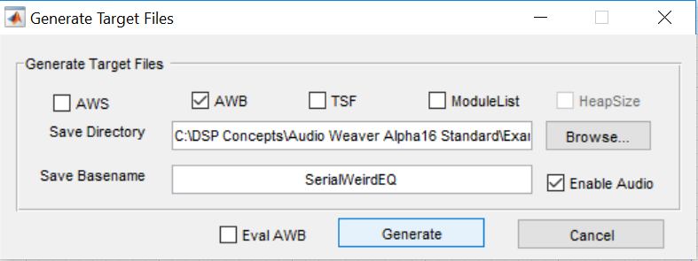
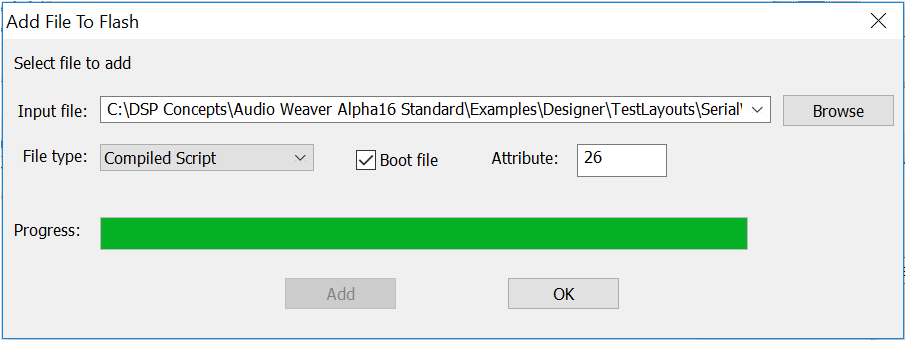

# Flash Manager Guide

## Overview

The Flash Manager tool, which is delivered as part of the AWE Server, enables users to easily add and remove Audio Weaver Binary files \(\*.awb\) on targets that support flash file systems. Once added to flash, the .awb file will be loaded by the AWE Core at boot-time and the target can run in stand-alone operation. See the next section ‘_Using the Flash Manager’_ for instructions on how to do this.

Note that another alternative for stand-alone operation is to store the .awb contents in a C array and compile it into an application directly. This method can be used on targets with or without a flash file system. For more information on this, see section 2.3.2 of the ‘AWE Core – Integration Guide.pdf’ available at [https://dspconcepts.com/support](https://dspconcepts.com/support).

## Using the Flash Manager

1. Generate an .awb file for your desired Audio Weaver design \(.awd\) in Designer by going to ‘_Tools -&gt; Generate Target Files_’.

1. Select ‘AWB’ target file type and choose the directory to which the .awb file will be saved. Change the ‘Save Basename’ field to a name that is less the 16 characters, then hit the “Generate” button. It will then start compiling the system for creation of the .awb file.

1. Once the .awb file has been successfully generated, the following window will appear:

1. In AWE Server, select ‘_Target -&gt; Change Connection_’ and connect to your target with the appropriate option.
2. In AWE Server, select _‘Flash -&gt; Flash Manager’_. Then press “Add File” button.
3. Browse to the previously-created .awb file and select it as the input file. Ensure that the file type is “Compiled Script” and check the box next to “Boot file” to designate this file to be used at boot-up \(attribute = 26\). Click the “Add” button to load the file into memory.

1. Once the progress completes, click “OK”.

1. After the file has been added, it will show up in the list “Flash file system on target” in the Flash Manager window. When you reset your target hardware and reconnect AWE Server to it, you should see a non-zero CPU % and heap allocated in the AWE Server, which indicates that the layout is indeed running.

